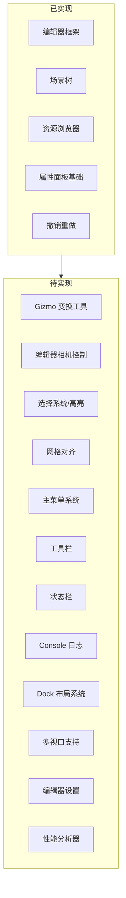
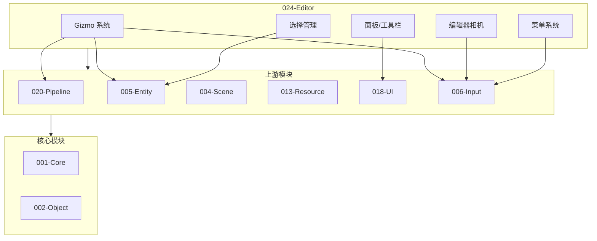

# TenEngine 024-Editor 模块完善计划

## 一、现状分析

### 1.1 已实现的功能


| 功能模块           | 实现状态          | 代码位置                                                                                             |
| -------------- | ------------- | ------------------------------------------------------------------------------------------------ |
| 编辑器主框架         | ✅ 已实现         | [Editor.cpp](Engine/TenEngine-024-editor/src/Editor.cpp)                                         |
| 场景树面板          | ✅ 已实现         | [SceneViewImpl.cpp](Engine/TenEngine-024-editor/src/SceneViewImpl.cpp)                           |
| 资源浏览器          | ✅ 已实现         | [ResourceViewImpl.cpp](Engine/TenEngine-024-editor/src/ResourceViewImpl.cpp)                     |
| 属性面板           | ✅ 基础实现        | [PropertyPanelImpl.cpp](Engine/TenEngine-024-editor/src/PropertyPanelImpl.cpp)                   |
| 视口接口           | ⚠️ 占位实现       | [RenderViewportImpl.cpp](Engine/TenEngine-024-editor/src/RenderViewportImpl.cpp)                 |
| 撤销/重做          | ✅ 已实现         | [UndoSystemImpl.cpp](Engine/TenEngine-024-editor/src/UndoSystemImpl.cpp)                         |
| 渲染设置面板         | ✅ 已实现         | [RenderingSettingsPanelImpl.cpp](Engine/TenEngine-024-editor/src/RenderingSettingsPanelImpl.cpp) |
| ImGui 后端       | ✅ Win32+D3D11 | [ImGuiBackend.cpp](Engine/TenEngine-024-editor/src/ImGuiBackend.cpp)                             |
| 场景启动器          | ✅ 已实现         | Editor.cpp Launcher UI                                                                           |
| Level 创建/打开/保存 | ✅ 已实现         | Editor.cpp                                                                                       |


### 1.2 缺失的核心功能（对比 Unity/Unreal）




## 二、功能完善清单

### 2.1 高优先级（核心交互）

#### P0-1: Gizmo 变换工具系统

- **新建文件**: `include/te/editor/Gizmo.h`, `src/GizmoImpl.cpp`
- **接口**:
  ```cpp
  class IGizmo {
  public:
    enum class Mode { Translate, Rotate, Scale };
    virtual void SetMode(Mode mode) = 0;
    virtual Mode GetMode() const = 0;
    virtual void SetTarget(IEntity* entity) = 0;
    virtual bool OnMouseDown(int x, int y) = 0;
    virtual void OnMouseMove(int x, int y, float dx, float dy) = 0;
    virtual void OnMouseUp() = 0;
    virtual void OnDraw() = 0;  // 绘制 Gizmo
    virtual bool IsHovered() const = 0;
    virtual bool IsActive() const = 0;
  };
  ```
- **依赖**: Pipeline 渲染、Input

#### P0-2: 编辑器相机控制

- **新建文件**: `include/te/editor/EditorCamera.h`, `src/EditorCamera.cpp`
- **功能**:
  - 飞行模式 (WASD + 鼠标右键)
  - 轨道模式 (Alt + 左键拖动)
  - 缩放 (滚轮)
  - Focus 选中物体 (F 键)
  - 相机书签 (Ctrl+1~9)
- **接口**:
  ```cpp
  class IEditorCamera {
  public:
    virtual void SetViewportSize(int w, int h) = 0;
    virtual void OnInput(float deltaTime) = 0;
    virtual te::math::Mat4 GetViewMatrix() const = 0;
    virtual te::math::Mat4 GetProjectionMatrix() const = 0;
    virtual void FocusOn(te::math::Vec3 const& point) = 0;
    virtual void ResetView() = 0;
  };
  ```

#### P0-3: 选择高亮系统

- **新建文件**: `include/te/editor/SelectionManager.h`, `src/SelectionManager.cpp`
- **功能**:
  - 多选支持 (Ctrl+点击)
  - 框选支持
  - 选中物体高亮轮廓渲染
  - 选择变化事件回调
- **接口**:
  ```cpp
  class ISelectionManager {
  public:
    virtual void Select(te::entity::EntityId id) = 0;
    virtual void SelectMultiple(std::vector<te::entity::EntityId> const& ids) = 0;
    virtual void Deselect(te::entity::EntityId id) = 0;
    virtual void ClearSelection() = 0;
    virtual bool IsSelected(te::entity::EntityId id) const = 0;
    virtual std::vector<te::entity::EntityId> const& GetSelection() const = 0;
    virtual void SetOnSelectionChanged(std::function<void()> cb) = 0;
  };
  ```

### 2.2 中优先级（UI 增强）

#### P1-1: 主菜单系统

- **新建文件**: `include/te/editor/MainMenu.h`, `src/MainMenuImpl.cpp`
- **菜单结构**:
  ```
  File: New Scene, Open, Save, Save As, Recent, Exit
  Edit: Undo, Redo, Cut, Copy, Paste, Duplicate, Delete, Select All
  View: Camera, Layout, Panels (toggle)
  GameObject: Create Empty, 3D Object, Light, Camera, Audio
  Tools: Reimport All, Project Settings
  Help: About, Documentation
  ```
- **快捷键绑定**

#### P1-2: 工具栏

- **新建文件**: `include/te/editor/Toolbar.h`, `src/ToolbarImpl.cpp`
- **功能**:
  - 变换工具切换 (Translate/Rotate/Scale)
  - Play/Pause/Stop 按钮
  - 网格对齐开关
  - 视图模式切换 (Shaded/Wireframe/Shaded+Wireframe)

#### P1-3: 状态栏

- **新建文件**: `include/te/editor/StatusBar.h`, `src/StatusBarImpl.cpp`
- **显示内容**:
  - 当前 Level 名称
  - 选中物体数量
  - FPS/帧时间
  - 内存使用（可选）
  - 后台任务进度

#### P1-4: Console 日志面板

- **新建文件**: `include/te/editor/ConsolePanel.h`, `src/ConsolePanelImpl.cpp`
- **功能**:
  - 日志级别过滤 (Info/Warning/Error)
  - 关键字搜索
  - 时间戳显示
  - 清空日志
  - 日志条数统计

### 2.3 低优先级（高级功能）

#### P2-1: 网格对齐系统

- **新建文件**: `include/te/editor/SnapSettings.h`, `src/SnapSettings.cpp`
- **功能**:
  - 位置网格对齐 (Grid Snap)
  - 旋转角度对齐 (Rotation Snap)
  - 缩放增量对齐 (Scale Snap)
  - 对齐到表面 (Surface Snap)
- **接口**:
  ```cpp
  struct SnapSettings {
    bool gridSnapEnabled = true;
    float gridSize = 1.0f;
    bool rotationSnapEnabled = false;
    float rotationSnapAngle = 15.0f;
    bool scaleSnapEnabled = false;
    float scaleSnapIncrement = 0.1f;
  };
  ```

#### P2-2: Dock 布局系统

- **扩展现有**: `EditorPanel.h`
- **功能**:
  - 面板停靠/浮动
  - 布局保存/加载
  - 预设布局 (Default, 2D, 3D, Wide)
  - 重置布局

#### P2-3: 多视口支持

- **扩展文件**: `Viewport.h`, `RenderViewportImpl.cpp`
- **功能**:
  - 四视口布局 (Perspective + Top/Front/Right)
  - 单视口/四视口切换
  - 各视口独立相机

#### P2-4: 编辑器设置/偏好

- **新建文件**: `include/te/editor/EditorPreferences.h`, `src/EditorPreferences.cpp`
- **设置项**:
  - 主题 (Dark/Light)
  - 字体大小
  - 快捷键映射
  - 自动保存间隔
  - 视口设置 (FOV, 远近裁剪面)

#### P2-5: 性能分析器面板

- **新建文件**: `include/te/editor/ProfilerPanel.h`, `src/ProfilerPanelImpl.cpp`
- **功能**:
  - CPU/GPU 帧时间
  - Draw Call 统计
  - 三角形/顶点数
  - 内存使用
  - 简单 Timeline 视图

#### P2-6: 场景统计面板

- **新建文件**: `include/te/editor/StatisticsPanel.h`, `src/StatisticsPanelImpl.cpp`
- **统计内容**:
  - Entity 数量
  - 各类型 Component 数量
  - 场景边界

## 三、文件结构规划

```
Engine/TenEngine-024-editor/
├── include/te/editor/
│   ├── Editor.h              ✅ 已有
│   ├── EditorPanel.h         ✅ 已有
│   ├── Viewport.h            ✅ 已有 (待扩展)
│   ├── SceneView.h           ✅ 已有
│   ├── ResourceView.h        ✅ 已有
│   ├── PropertyPanel.h       ✅ 已有 (待扩展)
│   ├── UndoSystem.h          ✅ 已有
│   ├── RenderingSettingsPanel.h ✅ 已有
│   ├── RenderingConfig.h     ✅ 已有
│   ├── EntityAdapter.h       ✅ 已有
│   ├── FileDialog.h          ✅ 已有
│   ├── ImGuiBackend.h        ✅ 已有
│   │
│   │  === 新增文件 ===
│   ├── Gizmo.h               🆕 Gizmo 变换工具
│   ├── EditorCamera.h        🆕 编辑器相机
│   ├── SelectionManager.h    🆕 选择管理器
│   ├── MainMenu.h            🆕 主菜单
│   ├── Toolbar.h             🆕 工具栏
│   ├── StatusBar.h           🆕 状态栏
│   ├── ConsolePanel.h        🆕 Console 日志面板
│   ├── SnapSettings.h        🆕 对齐设置
│   ├── EditorPreferences.h   🆕 编辑器偏好设置
│   ├── ProfilerPanel.h       🆕 性能分析器
│   ├── StatisticsPanel.h     🆕 场景统计面板
│   ├── LayoutManager.h       🆕 布局管理器
│   └── EditorTypes.h         🆕 通用类型定义
│
└── src/
    ├── Editor.cpp            ✅ 已有
    ├── SceneViewImpl.cpp     ✅ 已有
    ├── ResourceViewImpl.cpp  ✅ 已有
    ├── PropertyPanelImpl.cpp ✅ 已有
    ├── RenderViewportImpl.cpp✅ 已有 (待完善)
    ├── UndoSystemImpl.cpp    ✅ 已有
    ├── RenderingSettingsPanelImpl.cpp ✅ 已有
    ├── EntityAdapter.cpp     ✅ 已有
    ├── FileDialog.cpp        ✅ 已有
    ├── ImGuiBackend.cpp      ✅ 已有
    │
    │  === 新增文件 ===
    ├── GizmoImpl.cpp         🆕
    ├── EditorCamera.cpp      🆕
    ├── SelectionManager.cpp  🆕
    ├── MainMenuImpl.cpp      🆕
    ├── ToolbarImpl.cpp       🆕
    ├── StatusBarImpl.cpp     🆕
    ├── ConsolePanelImpl.cpp  🆕
    ├── SnapSettings.cpp      🆕
    ├── EditorPreferences.cpp 🆕
    ├── ProfilerPanelImpl.cpp 🆕
    ├── StatisticsPanelImpl.cpp 🆕
    └── LayoutManager.cpp     🆕
```

## 四、接口设计概要

### 4.1 IEditor 扩展

```cpp
class IEditor {
public:
  // === 已有接口 ===
  virtual void Run(EditorContext const& ctx) = 0;
  virtual ISceneView* GetSceneView() = 0;
  virtual IResourceView* GetResourceView() = 0;
  virtual IPropertyPanel* GetPropertyPanel() = 0;
  virtual IViewport* GetRenderViewport() = 0;
  virtual IRenderingSettingsPanel* GetRenderingSettingsPanel() = 0;
  
  // === 新增接口 ===
  virtual IGizmo* GetGizmo() = 0;
  virtual IEditorCamera* GetEditorCamera() = 0;
  virtual ISelectionManager* GetSelectionManager() = 0;
  virtual IMainMenu* GetMainMenu() = 0;
  virtual IToolbar* GetToolbar() = 0;
  virtual IStatusBar* GetStatusBar() = 0;
  virtual IConsolePanel* GetConsolePanel() = 0;
  virtual SnapSettings& GetSnapSettings() = 0;
  virtual EditorPreferences& GetPreferences() = 0;
  
  // 布局
  virtual void SaveLayout(char const* path) = 0;
  virtual void LoadLayout(char const* path) = 0;
  virtual void ResetLayout() = 0;
};
```

### 4.2 视口交互扩展

```cpp
class IViewport {
public:
  // === 已有接口 ===
  virtual IEntity* PickInViewport(int x, int y) const = 0;
  virtual void DropFromResourceManager(te::resource::ResourceId const& resourceId, int x, int y) = 0;
  virtual int GetWidth() const = 0;
  virtual int GetHeight() const = 0;
  virtual void SetSize(int w, int h) = 0;
  
  // === 新增接口 ===
  virtual void Render() = 0;  // 渲染视口内容
  virtual te::math::Ray ScreenPointToRay(int x, int y) const = 0;
  virtual te::math::Vec3 ScreenToWorld(int x, int y) const = 0;
  virtual te::math::Vec2 WorldToScreen(te::math::Vec3 const& worldPos) const = 0;
  virtual void SetViewportMode(ViewportMode mode) = 0;  // Shaded/Wireframe/etc
  virtual void ShowGrid(bool show) = 0;
};
```

## 五、依赖关系




## 六、实现建议

1. **渐进式实现**: 按 P0 → P1 → P2 优先级顺序实现
2. **预留依赖接口**: 视口渲染等依赖 Pipeline 的部分先留空，定义接口框架
3. **契约同步**: 新增接口需同步更新 `specs/_contracts/024-editor-ABI.md` 和 `specs/_contracts/024-editor-public-api.md`
4. **用户故事补充**: 新增功能应添加对应的用户故事文档到 `specs/user-stories/domains/editor/`

