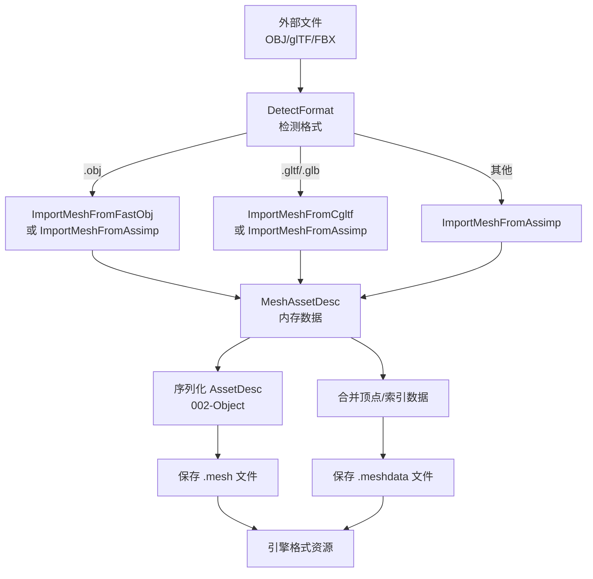
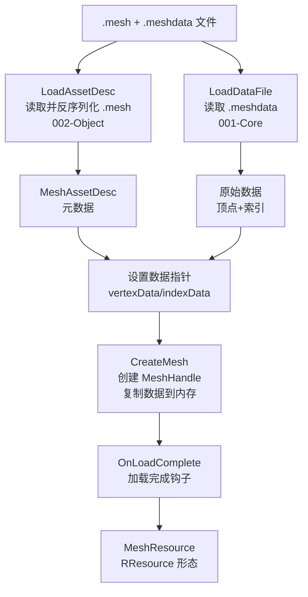
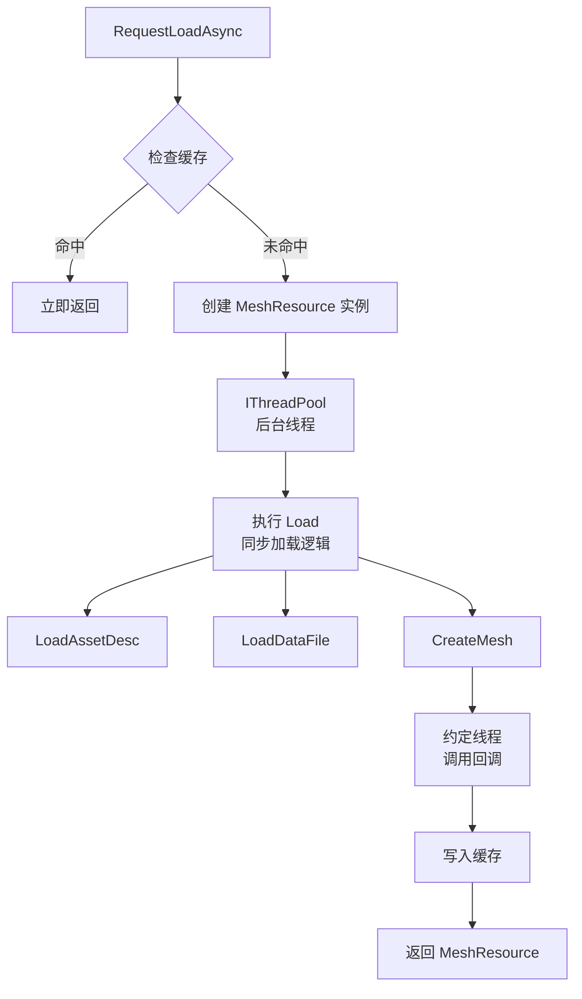
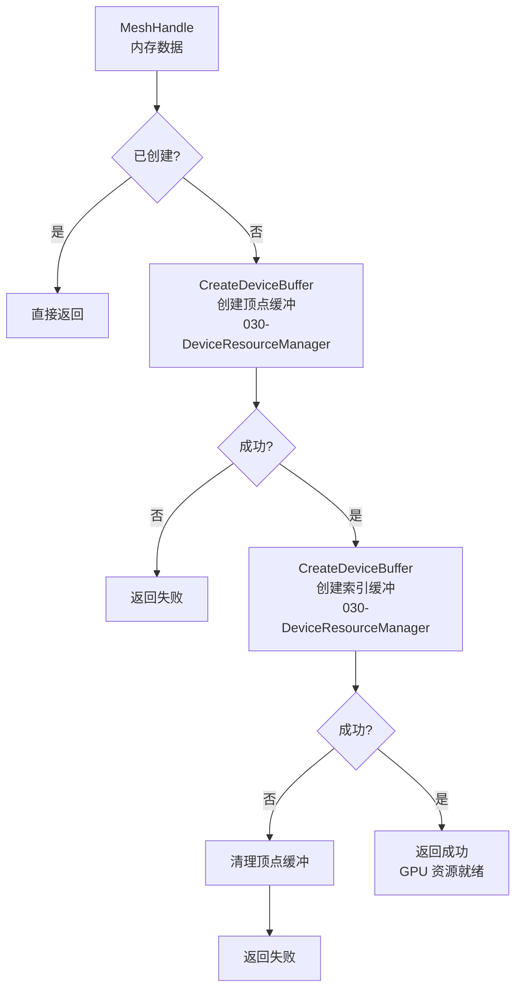
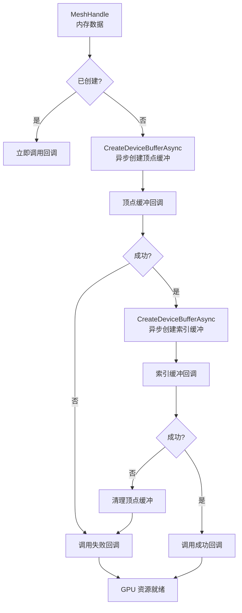
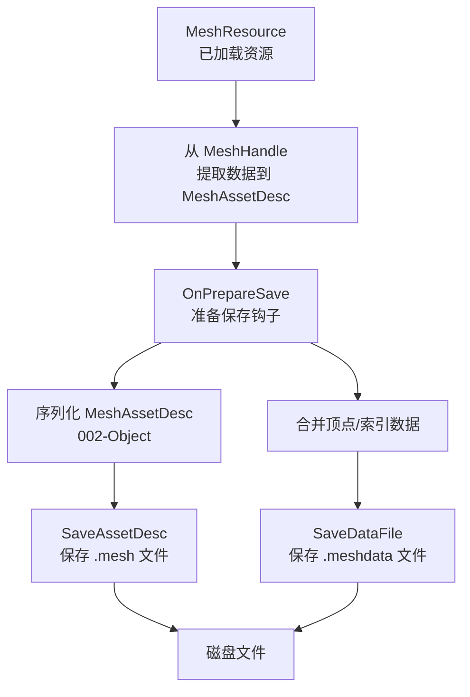

# Mesh 模块接口与数据流文档

## 1. 核心接口概览

### 1.1 资源创建接口

#### CreateMesh（内存创建）
- **头文件**: `te/mesh/MeshFactory.h`
- **函数签名**: `MeshHandle CreateMesh(MeshAssetDesc const* desc)`
- **说明**: 从 MeshAssetDesc 创建网格句柄（仅内存，不创建 GPU 资源）
- **参数**: 
  - `desc`: MeshAssetDesc 指针，包含顶点/索引数据、格式、子网格等信息
- **返回**: MeshHandle（不透明句柄），失败返回 nullptr
- **生命周期**: 创建后需调用 ReleaseMesh 释放

#### ReleaseMesh（释放）
- **头文件**: `te/mesh/MeshFactory.h`
- **函数签名**: `void ReleaseMesh(MeshHandle h)`
- **说明**: 释放网格句柄及其内存数据（不包括 GPU 资源）
- **参数**: `h`: MeshHandle 句柄

### 1.2 资源导入接口

#### Import（导入外部格式）
- **头文件**: `te/mesh/MeshResource.h`
- **类**: `MeshResource`
- **函数签名**: `bool Import(char const* sourcePath, resource::IResourceManager* manager)`
- **说明**: 从外部格式文件（OBJ、glTF、FBX 等）导入并转换为引擎格式
- **支持的格式**:
  - `.obj` → 使用 fast_obj 或 Assimp
  - `.gltf` / `.glb` → 使用 cgltf 或 Assimp
  - 其他格式 → 使用 Assimp
- **数据流**:
  1. 检测文件格式（DetectFormat）
  2. 调用对应的导入器（ImportMeshFromFastObj/Assimp/Cgltf）
  3. 生成 MeshAssetDesc
  4. 保存为 `.mesh`（AssetDesc）和 `.meshdata`（数据文件）

#### 导入器函数
- **fast_obj**: `bool ImportMeshFromFastObj(char const* sourcePath, MeshAssetDesc* outDesc)`
- **Assimp**: `bool ImportMeshFromAssimp(char const* sourcePath, MeshAssetDesc* outDesc)`
- **cgltf**: `bool ImportMeshFromCgltf(char const* sourcePath, MeshAssetDesc* outDesc)`

### 1.3 资源加载接口

#### Load（同步加载）
- **头文件**: `te/mesh/MeshResource.h`
- **类**: `MeshResource`
- **函数签名**: `bool Load(char const* path, resource::IResourceManager* manager)`
- **说明**: 同步加载引擎格式的网格资源
- **数据流**:
  1. 加载 `.mesh` 文件（AssetDesc），通过 002-Object 反序列化
  2. 加载 `.meshdata` 文件（顶点/索引数据）
  3. 创建 MeshHandle（调用 CreateMesh）
  4. 调用 OnLoadComplete 钩子

#### LoadAsync（异步加载）
- **头文件**: `te/mesh/MeshResource.h`
- **类**: `MeshResource`
- **函数签名**: `bool LoadAsync(char const* path, resource::IResourceManager* manager, resource::LoadCompleteCallback on_done, void* user_data)`
- **说明**: 异步加载网格资源，在后台线程执行，完成后在约定线程调用回调
- **实现**: 使用基类默认实现（IThreadPool）

### 1.4 资源保存接口

#### Save（保存）
- **头文件**: `te/mesh/MeshResource.h`
- **类**: `MeshResource`
- **函数签名**: `bool Save(char const* path, resource::IResourceManager* manager)`
- **说明**: 保存网格资源到磁盘
- **数据流**:
  1. 从 MeshHandle 提取数据到 MeshAssetDesc
  2. 调用 OnPrepareSave 钩子
  3. 保存 `.mesh` 文件（AssetDesc），通过 002-Object 序列化
  4. 保存 `.meshdata` 文件（顶点/索引数据）

### 1.5 GPU 资源创建接口

#### EnsureDeviceResources（同步创建）
- **头文件**: `te/mesh/MeshDevice.h`
- **函数签名**: `bool EnsureDeviceResources(MeshHandle h, rhi::IDevice* device)`
- **说明**: 同步创建 GPU 顶点和索引缓冲
- **数据流**:
  1. 检查是否已创建
  2. 创建顶点缓冲（通过 030-DeviceResourceManager::CreateDeviceBuffer）
  3. 创建索引缓冲（通过 030-DeviceResourceManager::CreateDeviceBuffer）
  4. 返回成功/失败

#### EnsureDeviceResourcesAsync（异步创建）
- **头文件**: `te/mesh/MeshDevice.h`
- **函数签名**: `void EnsureDeviceResourcesAsync(MeshHandle h, rhi::IDevice* device, void (*on_done)(void*), void* user_data)`
- **说明**: 异步创建 GPU 顶点和索引缓冲
- **数据流**:
  1. 检查是否已创建
  2. 异步创建顶点缓冲（通过 030-DeviceResourceManager::CreateDeviceBufferAsync）
  3. 顶点缓冲创建完成后，异步创建索引缓冲
  4. 索引缓冲创建完成后，调用完成回调

#### MeshResource::EnsureDeviceResources（同步）
- **头文件**: `te/mesh/MeshResource.h`
- **类**: `MeshResource`
- **函数签名**: `void EnsureDeviceResources() override`
- **说明**: 同步创建 GPU 资源（内部调用 MeshDevice::EnsureDeviceResources）

#### MeshResource::EnsureDeviceResourcesAsync（异步）
- **头文件**: `te/mesh/MeshResource.h`
- **类**: `MeshResource`
- **函数签名**: `void EnsureDeviceResourcesAsync(void (*on_done)(void*), void* user_data) override`
- **说明**: 异步创建 GPU 资源（内部调用 MeshDevice::EnsureDeviceResourcesAsync）

### 1.6 查询接口

#### GetVertexBufferHandle / GetIndexBufferHandle
- **头文件**: `te/mesh/MeshDevice.h`
- **函数签名**: 
  - `rhi::IBuffer* GetVertexBufferHandle(MeshHandle h)`
  - `rhi::IBuffer* GetIndexBufferHandle(MeshHandle h)`
- **说明**: 获取 GPU 缓冲句柄（EnsureDeviceResources 后可用）

#### GetSubmeshCount / GetSubmesh
- **头文件**: `te/mesh/Mesh.h`
- **函数签名**: 
  - `uint32_t GetSubmeshCount(MeshHandle h)`
  - `SubmeshDesc const* GetSubmesh(MeshHandle h, uint32_t index)`

#### GetLODCount / SelectLOD
- **头文件**: `te/mesh/Mesh.h`
- **函数签名**: 
  - `uint32_t GetLODCount(MeshHandle h)`
  - `uint32_t SelectLOD(MeshHandle h, float distanceOrScreenSize)`

#### GetSkinningData
- **头文件**: `te/mesh/Mesh.h`
- **函数签名**: `SkinningData const* GetSkinningData(MeshHandle h)`

## 2. 数据流图

### 2.1 导入流程



### 2.2 加载流程（同步）



### 2.3 加载流程（异步）



### 2.4 GPU 资源创建流程（同步）



### 2.5 GPU 资源创建流程（异步）



### 2.6 保存流程



## 3. 数据形态转换

### 3.1 资源三态

| 形态 | 名称 | 存储位置 | 数据内容 | 转换接口 |
|------|------|----------|----------|----------|
| **FResource** | 硬盘形态 | `.mesh` + `.meshdata` | MeshAssetDesc（序列化）+ 二进制数据 | Import / Save |
| **RResource** | 内存形态 | MeshResource 对象 | MeshHandle + MeshAssetDesc | Load / CreateMesh |
| **DResource** | GPU 形态 | GPU 显存 | IBuffer* (顶点/索引) | EnsureDeviceResources |

### 3.2 数据流转换链

```
外部格式文件 (OBJ/glTF/FBX)
    ↓ Import
MeshAssetDesc (内存) + 原始数据
    ↓ Save
引擎格式文件 (.mesh + .meshdata)
    ↓ Load
MeshAssetDesc (内存) + 数据指针
    ↓ CreateMesh
MeshHandle (内存，包含复制的数据)
    ↓ EnsureDeviceResources
GPU 缓冲 (IBuffer*)
```

## 4. 关键数据结构

### 4.1 MeshAssetDesc
```cpp
struct MeshAssetDesc {
  uint32_t formatVersion;
  std::string debugDescription;
  rendercore::VertexFormat vertexLayout;
  void* vertexData;           // 指针（序列化时不保存）
  size_t vertexDataSize;
  void* indexData;            // 指针（序列化时不保存）
  size_t indexDataSize;
  rendercore::IndexFormat indexFormat;
  std::vector<SubmeshDesc> submeshes;
  std::vector<LODLevel> lodLevels;
  SkinningData* skinningData; // 可选
};
```

### 4.2 MeshHandle（内部）
- **类型**: `detail::MeshData*`（不透明句柄）
- **包含**:
  - 顶点/索引数据（unique_ptr，使用 Core Alloc）
  - 顶点/索引格式
  - 子网格列表
  - LOD 级别列表
  - 蒙皮数据（可选）
  - GPU 缓冲句柄（IBuffer*）

## 5. 文件格式

### 5.1 .mesh 文件（AssetDesc）
- **格式**: 二进制序列化（002-Object）
- **内容**: MeshAssetDesc（不包含 vertexData/indexData 指针）
- **用途**: 元数据、格式信息、子网格描述

### 5.2 .meshdata 文件（数据）
- **格式**: 二进制
- **布局**: 
  ```
  [顶点数据] (vertexDataSize 字节)
  [索引数据] (indexDataSize 字节)
  ```
- **用途**: 存储实际的顶点和索引数据

## 6. 依赖关系

### 6.1 上游依赖
- **001-Core**: 内存分配（Alloc/Free）、文件 I/O
- **002-Object**: 类型注册、序列化/反序列化
- **008-RHI**: GPU 设备、缓冲创建接口
- **009-RenderCore**: 顶点格式、索引格式定义
- **013-Resource**: 资源管理、加载/保存流程
- **030-DeviceResourceManager**: GPU 资源创建（同步/异步）

### 6.2 下游使用
- **020-Pipeline**: 渲染时使用 MeshHandle 和 GPU 缓冲
- **023-Terrain**: 地形网格数据
- **015-Animation**: 蒙皮数据对接
- **013-Resource**: 通过 MeshResourceLoader 创建资源

## 7. 使用示例

### 7.1 导入外部格式
```cpp
MeshResource resource;
resource.Import("model.obj", manager);
// 生成 model.mesh 和 model.meshdata
```

### 7.2 加载资源
```cpp
// 同步加载
MeshResource* mesh = static_cast<MeshResource*>(
  manager->LoadSync("model.mesh", ResourceType::Mesh));

// 异步加载
LoadRequestId id = manager->RequestLoadAsync(
  "model.mesh", ResourceType::Mesh,
  [](IResource* res, LoadResult result, void* user_data) {
    if (result == LoadResult::Ok) {
      MeshResource* mesh = static_cast<MeshResource*>(res);
      // 使用 mesh
    }
  },
  nullptr);
```

### 7.3 创建 GPU 资源
```cpp
// 同步创建
mesh->SetDevice(device);
mesh->EnsureDeviceResources();
rhi::IBuffer* vb = mesh->GetDeviceVertexBuffer();
rhi::IBuffer* ib = mesh->GetDeviceIndexBuffer();

// 异步创建
mesh->EnsureDeviceResourcesAsync(
  [](void* user_data) {
    // GPU 资源创建完成
  },
  nullptr);
```

### 7.4 保存资源
```cpp
mesh->Save("output.mesh", manager);
// 保存 output.mesh 和 output.meshdata
```
