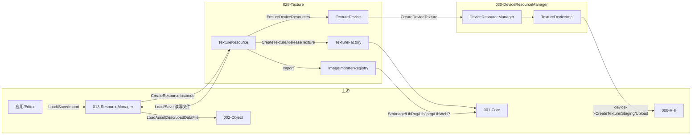

# 028-Texture 模块：加载 / 导入 / 保存与 GPU 资源创建流程

## 一、总体数据流与模块关系

- **入口**：所有“加载 / 保存 / 导入”的调用方是 **013-Resource（ResourceManager）**；应用或编辑器只对 013 调用 `Load(path, ResourceType::Texture)`、`Save`、`Import`。
- **028 职责**：提供 `TextureResource` 实现（Load/Save/Import）、`CreateTexture`/`ReleaseTexture`、以及通过 030 创建/销毁 GPU 纹理（EnsureDeviceResources / DestroyDeviceTexture）。
- **030 职责**：接收像素数据 + RHI 描述，调用 **008-RHI**（`device->CreateTexture`、Staging 缓冲、CommandList 上传）完成真正的 GPU 资源创建与上传。

---

## 二、加载（Load）流程

**调用链**：应用/Editor → `IResourceManager::Load(path, ResourceType::Texture)` → 013 用已注册的 **ResourceFactory** 创建 `TextureResource` → `resource->Load(path, manager)`。

1. **013-ResourceManager**（[ResourceManager.cpp](../Engine/TenEngine-013-resource/src/ResourceManager.cpp)）
   - `Load(path, type)`：`CreateResourceInstance(ResourceType::Texture)` → 得到 `TextureResource*`（由 028 在 `InitializeTextureModule` 时通过 `RegisterResourceFactory(ResourceType::Texture, CreateTextureResource)` 注册）。
   - 调用 `resource->Load(path, this)`，成功后 `CacheResource`。

2. **028-TextureResource::Load**（[TextureResource.cpp](../Engine/TenEngine-028-texture/src/TextureResource.cpp) 94–118）
   - `LoadAssetDesc<TextureAssetDesc>(path)`：经 013 基类用 **002-Object** 反序列化 `.texture` 文件，得到元数据（format、width、height、mipLevels、pixelDataSize 等）；**不包含像素数据**（pixelData 为指针，不序列化）。
   - `MakeTexdataPath(path)`：将 `xxx.texture` 转为 `xxx.texdata`。
   - `LoadDataFile(dataPath, &dataFileBuffer, &dataFileSize)`：经 013 读入 `.texdata` 二进制像素数据（001-Core 分配，028 内 `te::core::Free`）。
   - 校验 `dataFileSize >= desc->pixelDataSize`，将 `desc->pixelData = dataFileBuffer`。
   - `CreateTexture(desc.get())`：028 内部拷贝像素到 `detail::TextureData` 并返回 `TextureHandle`；随后立即 `Free(dataFileBuffer)`。
   - `OnLoadComplete()`，返回 true。

3. **028-TextureFactory::CreateTexture**（[TextureFactory.cpp](../Engine/TenEngine-028-texture/src/TextureFactory.cpp)）
   - 校验 `desc->IsValid()` 且 `pixelData`/`pixelDataSize` 非空。
   - 分配 `detail::TextureData`，拷贝 width/height/depth/format/mipLevels/isHDR/pixelDataSize，并用 **001-Core Alloc** 拷贝像素数据到内部 `std::unique_ptr<uint8_t[], CoreAllocDeleter>`。
   - 返回 `TextureHandle`（即 `TextureData*`）；**此时仅有 CPU 侧数据，无 GPU 纹理**。

**小结**：Load = 读 `.texture`（002 反序列化）+ 读 `.texdata`（013 LoadDataFile）+ CreateTexture（028 拷贝到内部结构）。上游：013、002、001；下游无。

---

## 三、导入（Import）流程

**调用链**：应用/Editor → `IResourceManager::Import(path, ResourceType::Texture)` → 013 创建 `TextureResource` → `resource->Import(sourcePath, this)`。

1. **013-ResourceManager::Import**（[ResourceManager.cpp](../Engine/TenEngine-013-resource/src/ResourceManager.cpp) 438–459）
   - `CreateResourceInstance(ResourceType::Texture)` → `TextureResource*`。
   - `resource->Import(path, this)`；成功则 `CacheResource`。

2. **028-TextureResource::Import**（[TextureResource.cpp](../Engine/TenEngine-028-texture/src/TextureResource.cpp) 164–217）
   - `ImageImporterRegistry::GetInstance().ImportImage(sourcePath, result)`：
     - Registry 按 **priority 从高到低** 遍历已注册的 `IImageImporter`（LibPng/LibJpegTurbo/LibWebP priority=10，StbImageImporter priority=0 兜底）。
     - 第一个 `CanImport(path)` 为 true 的 importer 执行 `Import(path, result)`；成功则得到 `ImageImportResult`（pixelData 由 importer 用 `te::core::Alloc` 分配，调用方负责 `te::core::Free`）。
   - 校验 result（pixelData、size、width、height）。
   - 输出路径：将源扩展名替换为 `.texture`（如 `a.png` → `a.texture`）；texdata 路径为 `MakeTexdataPath(outputPath)`。
   - `ImageFormatToTextureFormat(result.format, result.isHDR)` 得到 009-RenderCore 的 `TextureFormat`。
   - 构造 `TextureAssetDesc`（pixelData 指向 result.pixelData），`SaveAssetDesc` 写 `.texture`（desc 里 pixelData 置 nullptr 再序列化），`SaveDataFile` 写 `.texdata`。
   - `CreateTexture(&desc)` 创建逻辑贴图句柄，然后 `te::core::Free(result.pixelData)`。

**小结**：Import = ImageImporterRegistry 解码源图 → 写 `.texture` + `.texdata` → CreateTexture。上游：013、002、001、可选 stb/libpng/libjpeg-turbo/libwebp；下游无。

---

## 四、保存（Save）流程

**调用链**：应用/Editor → 对已加载的 `IResource*`（实为 TextureResource）调用 `Save(path, manager)`（013 或直接持有 manager）。

1. **028-TextureResource::Save**（[TextureResource.cpp](../Engine/TenEngine-028-texture/src/TextureResource.cpp) 125–162）
   - 要求 `m_textureHandle` 非空。
   - `OnPrepareSave()`。
   - 从 `detail::TextureData` 填 `TextureAssetDesc`（pixelData 置 nullptr，仅写 pixelDataSize）。
   - `SaveAssetDesc<TextureAssetDesc>(path, &desc)`：经 013 基类用 002 序列化到 `.texture`。
   - `MakeTexdataPath(path)` 得到 `.texdata` 路径；`GetPixelDataSize` + `SerializeTextureToBuffer` 得到像素缓冲，`SaveDataFile(dataPath, buffer, written)` 写 `.texdata`（013 提供写文件能力）。

**小结**：Save = 从 TextureHandle 写出 `.texture`（002 序列化）+ `.texdata`（像素二进制）。上游：013、002、001；下游无。

---

## 五、GPU 资源创建（EnsureDeviceResources）流程

**调用链**：渲染/管线侧在需要 GPU 纹理时，对已加载的 `ITextureResource*` 调用 `SetDevice(device)` 后调用 `EnsureDeviceResources()` 或 `EnsureDeviceResourcesAsync(...)`。

1. **028-TextureResource::EnsureDeviceResources**（[TextureResource.cpp](../Engine/TenEngine-028-texture/src/TextureResource.cpp) 219–223）
   - 若已有 `GetTextureHandle(m_textureHandle)`（即已创建过 GPU 纹理），直接返回。
   - 否则调用 **028** 的 `texture::EnsureDeviceResources(m_textureHandle, m_device)`。

2. **028-TextureDevice::EnsureDeviceResources**（[TextureDevice.cpp](../Engine/TenEngine-028-texture/src/TextureDevice.cpp) 60–90）
   - 从 `detail::TextureData*` 取 pixelData、pixelDataSize、width、height、depth、format。
   - `TextureFormatToRHI(format)` 转为 008-RHI 的 format。
   - 调用 **030**：`deviceresource::DeviceResourceManager::CreateDeviceTexture(pixels, size, rhiDesc, device)`。
   - 返回的 `rhi::ITexture*` 写入 `data->deviceTexture`。

3. **030-DeviceResourceManager::CreateDeviceTexture**（[DeviceResourceManager.cpp](../Engine/TenEngine-030-device-resource-manager/src/DeviceResourceManager.cpp) 77–94）
   - 参数校验后调用内部 `internal::CreateDeviceTextureSync(pixelData, pixelDataSize, textureDesc, device, deviceResources)`。

4. **030-internal::CreateDeviceTextureSync**（[TextureDeviceImpl.cpp](../Engine/TenEngine-030-device-resource-manager/src/internal/TextureDeviceImpl.cpp) 30–101）
   - `device->CreateTexture(textureDesc)`：**008-RHI** 创建 GPU 纹理。
   - `AllocateAndCopyStagingBuffer`：用 030 的 StagingBufferManager 分配并拷贝 CPU 像素到 staging buffer。
   - `device->CreateCommandList()`，Barrier：Common → CopyDst，CopyBufferToTexture，Barrier：CopyDst → ShaderResource，Submit 同步。
   - 释放 CommandList 与 StagingBuffer，返回 `rhi::ITexture*`。

**小结**：EnsureDeviceResources = 028 取像素与描述 → 030 用 008 创建纹理 + Staging 上传。上游：028 提供数据；028 调 030；030 调 008、001（分配）。下游：渲染/管线通过 `GetDeviceTexture()` 拿到 `rhi::ITexture*` 使用。

---

## 六、上下游汇总表

| 阶段 | 谁调用谁 | 说明 |
|------|----------|------|
| 初始化 | 应用/引擎 | 调用 `InitializeTextureModule(manager)`，028 向 013 注册 `ResourceType::Texture` 的 Factory，向 002 注册 `TextureAssetDesc` 类型；向 ImageImporterRegistry 注册各 Importer（Stb + 可选 LibPng/LibJpegTurbo/LibWebP）。 |
| Load | 013 → 028 | 013 根据 type 创建 TextureResource，调用 `Load(path, manager)`；028 用 013 的 LoadAssetDesc/LoadDataFile、002 反序列化、001 分配，最后 CreateTexture。 |
| Import | 013 → 028 | 013 创建 TextureResource，调用 `Import(path, manager)`；028 用 ImageImporterRegistry 解码，013 SaveAssetDesc/SaveDataFile 写 .texture/.texdata，再 CreateTexture。 |
| Save | 调用方 → 028 | 对 TextureResource 调用 `Save(path, manager)`；028 用 013 的 SaveAssetDesc/SaveDataFile、002 序列化写 .texture 与 .texdata。 |
| EnsureDeviceResources | 管线/渲染 → 028 → 030 → 008 | 对 TextureResource 设 SetDevice 后调用 EnsureDeviceResources；028 调 030::CreateDeviceTexture；030 用 008 的 device->CreateTexture + Staging + CommandList 上传。 |
| 销毁 GPU 纹理 | 028 | TextureResource 析构或显式清理时调用 `DestroyDeviceTexture(handle, device)`，028 内部调 030::DestroyDeviceTexture，030 调 008::DestroyTexture。 |

---

## 七、关键文件索引

- 028 资源与设备：[TextureResource.cpp](../Engine/TenEngine-028-texture/src/TextureResource.cpp)、[TextureDevice.cpp](../Engine/TenEngine-028-texture/src/TextureDevice.cpp)、[TextureFactory.cpp](../Engine/TenEngine-028-texture/src/TextureFactory.cpp)
- 028 导入：[ImageImporterRegistry.cpp](../Engine/TenEngine-028-texture/src/import/ImageImporterRegistry.cpp)、[TextureModuleInit.cpp](../Engine/TenEngine-028-texture/src/TextureModuleInit.cpp)
- 013 入口与工厂：[ResourceManager.cpp](../Engine/TenEngine-013-resource/src/ResourceManager.cpp)（Load/Import、CreateResourceInstance、RegisterResourceFactory）
- 013 基类能力：[Resource.h](../Engine/TenEngine-013-resource/include/te/resource/Resource.h)（LoadAssetDesc、SaveAssetDesc、LoadDataFile、SaveDataFile）
- 030 创建 GPU 纹理：[DeviceResourceManager.cpp](../Engine/TenEngine-030-device-resource-manager/src/DeviceResourceManager.cpp)、[TextureDeviceImpl.cpp](../Engine/TenEngine-030-device-resource-manager/src/internal/TextureDeviceImpl.cpp)

以上内容可直接用于文档或评审，无需改代码即可理解“贴图如何加载、导入、保存以及如何创建 GPU 资源”的流程与上下游关系。
