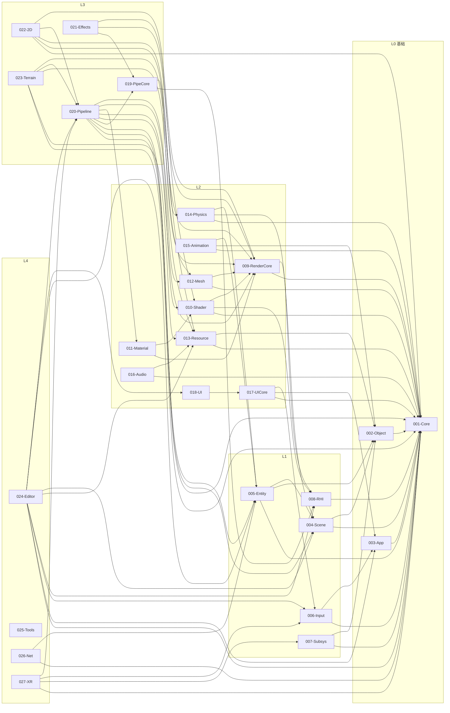
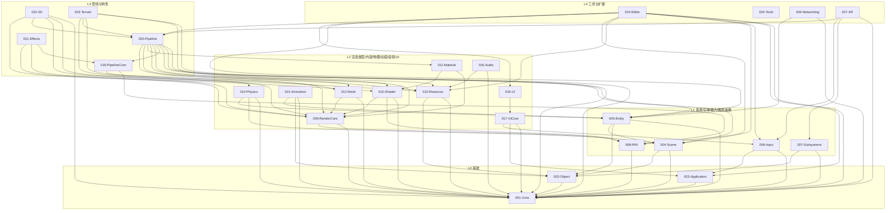
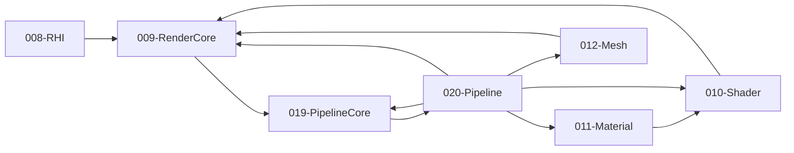

# TenEngine 完整依赖关系图

本文档给出 **27 模块全功能规格** 的完整依赖关系图，便于查阅与评审。箭头方向：**A → B** 表示 A 依赖 B（A 为下游，B 为上游）。

**如何得到一张图**：用 VS Code 的 Mermaid 预览、[Mermaid Live](https://mermaid.live) 粘贴下方代码块，或 GitHub 预览本文件，即可渲染；在 Mermaid Live 中可导出 PNG/SVG。

---

## 〇、完整依赖总览（单图从左到右）

按层级从左到右：L0 → L1 → L2 → L3 → L4，箭头表示“依赖”（指向被依赖的上游）。



---

## 一、Mermaid 图（可渲染）

在支持 Mermaid 的 Markdown 预览（如 GitHub、VS Code 插件）中可直接渲染。

### 1.1 按层级分组的依赖图



### 1.2 仅渲染链（RHI → RenderCore → PipelineCore → Pipeline）



---

## 二、完整依赖矩阵（下游 → 上游）

行 = 下游模块，列 = 上游模块；✓ = 直接依赖。

| 下游 \ 上游 | 001 | 002 | 003 | 004 | 005 | 006 | 007 | 008 | 009 | 010 | 011 | 012 | 013 | 014 | 015 | 016 | 017 | 018 | 019 | 020 | 021 | 022 | 023 | 024 | 025 | 026 | 027 |
|-------------|-----|-----|-----|-----|-----|-----|-----|-----|-----|-----|-----|-----|-----|-----|-----|-----|-----|-----|-----|-----|-----|-----|-----|-----|-----|-----|-----|
| 001-Core    | —   |     |     |     |     |     |     |     |     |     |     |     |     |     |     |     |     |     |     |     |     |     |     |     |     |     |     |     |
| 002-Object  | ✓   | —   |     |     |     |     |     |     |     |     |     |     |     |     |     |     |     |     |     |     |     |     |     |     |     |     |     |     |
| 003-App     | ✓   |     | —   |     |     |     |     |     |     |     |     |     |     |     |     |     |     |     |     |     |     |     |     |     |     |     |     |     |     |
| 004-Scene   | ✓   | ✓   |     | —   |     |     |     |     |     |     |     |     |     |     |     |     |     |     |     |     |     |     |     |     |     |     |     |     |     |
| 005-Entity  | ✓   | ✓   |     | ✓   | —   |     |     |     |     |     |     |     |     |     |     |     |     |     |     |     |     |     |     |     |     |     |     |     |     |
| 006-Input   | ✓   |     | ✓   |     |     | —   |     |     |     |     |     |     |     |     |     |     |     |     |     |     |     |     |     |     |     |     |     |     |     |     |
| 007-Subsys  | ✓   | ✓   |     |     |     |     | —   |     |     |     |     |     |     |     |     |     |     |     |     |     |     |     |     |     |     |     |     |     |     |     |
| 008-RHI     | ✓   |     |     |     |     |     |     | —   |     |     |     |     |     |     |     |     |     |     |     |     |     |     |     |     |     |     |     |     |     |     |
| 009-RenderC | ✓   |     |     |     |     |     |     | ✓   | —   |     |     |     |     |     |     |     |     |     |     |     |     |     |     |     |     |     |     |     |     |
| 010-Shader  | ✓   |     |     |     |     |     |     | ✓   | ✓   | —   |     |     |     |     |     |     |     |     |     |     |     |     |     |     |     |     |     |     |     |
| 011-Material|     |     |     |     |     |     |     |     | ✓   | ✓   | —   |     |     |     |     |     |     |     |     |     |     |     |     |     |     |     |     |     |     |
| 012-Mesh    | ✓   |     |     |     |     |     |     |     | ✓   |     |     | —   |     |     |     |     |     |     |     |     |     |     |     |     |     |     |     |     |     |     |
| 013-Resource| ✓   | ✓   |     |     |     |     |     |     |     |     |     |     | —   |     |     |     |     |     |     |     |     |     |     |     |     |     |     |     |     |     |
| 014-Physics | ✓   |     |     | ✓   | ✓   |     |     |     |     |     |     |     |     |     | —   |     |     |     |     |     |     |     |     |     |     |     |     |     |     |     |
| 015-Animation| ✓  | ✓   |     |     | ✓   |     |     |     |     |     |     |     |     |     |     | —   |     |     |     |     |     |     |     |     |     |     |     |     |     |     |
| 016-Audio   | ✓   |     |     |     |     |     |     |     |     |     |     |     |     | ✓   |     |     | —   |     |     |     |     |     |     |     |     |     |     |     |     |     |     |
| 017-UICore  | ✓   |     | ✓   |     |     | ✓   |     |     |     |     |     |     |     |     |     |     |     |     | —   |     |     |     |     |     |     |     |     |     |     |     |     |
| 018-UI      |     |     |     |     |     |     |     |     |     |     |     |     |     |     |     |     |     |     | ✓   | —   |     |     |     |     |     |     |     |     |     |     |
| 019-PipeCore|     |     |     |     |     |     |     |     | ✓   | ✓   |     |     |     |     |     |     |     |     |     |     | —   |     |     |     |     |     |     |     |     |     |
| 020-Pipeline| ✓   |     |     | ✓   | ✓   |     |     |     | ✓   | ✓   | ✓   | ✓   | ✓   |     |     |     |     |     |     | ✓   | —   |     |     |     |     |     |     |     |     |     |
| 021-Effects |     |     |     |     |     |     |     |     |     | ✓   | ✓   |     |     |     |     |     |     |     |     |     | ✓   |     | —   |     |     |     |     |     |     |     |
| 022-2D      | ✓   |     |     |     |     |     |     |     |     | ✓   |     |     |     | ✓   | ✓   |     |     |     |     |     |     | ✓   |     | —   |     |     |     |     |     |     |
| 023-Terrain | ✓   |     |     |     |     |     |     |     |     | ✓   |     |     | ✓   | ✓   |     |     |     |     |     |     |     | ✓   |     |     | —   |     |     |     |     |     |
| 024-Editor  | ✓   |     | ✓   |     |     | ✓   |     | ✓   |     |     |     |     |     | ✓   |     |     |     |     |     |     |     |     | ✓   |     |     |     | —   |     |     |     |     |
| 025-Tools   |     |     |     |     |     |     |     |     |     |     |     |     |     |     |     |     |     |     |     |     |     |     |     |     |     |     |     | —   |     |     |     |
| 026-Networking| ✓  |     |     |     |     |     |     |     |     |     |     |     |     |     |     | ✓   |     |     |     |     |     |     |     |     |     |     |     |     | —   |     |     |
| 027-XR      | ✓   |     |     |     |     |     |     | ✓   |     |     |     |     |     |     |     |     |     |     |     |     |     |     | ✓   |     |     |     |     |     |     | —   |     |

---

## 三、ASCII 完整依赖图（分层 + 全边）

### 3.1 L0 与 L1

```
L0:
    001-Core ◄─────────────────────────────────────────────────────────── 根（无依赖）
        ▲
        │ 002-Object
        │ 003-Application
        │
L1:     │ 004-Scene ◄── 002-Object
        │    ▲
        │    │ 005-Entity
        │    │
        ├────┼──── 006-Input ◄── 003-Application
        │    │
        │    │ 007-Subsystems ◄── 002-Object
        │    │
        └────┴──── 008-RHI
```

### 3.2 L2（仅画出主要依赖，避免交叉过多）

```
         001-Core  002-Object  003-App  006-Input  008-RHI
             │         │          │         │         │
             │         │          │         │         ▼
             │         │          │         │    009-RenderCore ◄── 001-Core
             │         │          │         │         │
             │         │          │         │         ├──► 010-Shader
             │         │          │         │         ├──► 011-Material ◄── 010-Shader
             │         │          │         │         └──► 012-Mesh
             │         │          │         │
             │         ▼          │         │    013-Resource
             │    004-Scene       │         │
             │         │          │         │    014-Physics ◄── 005-Entity
             │    005-Entity      │         │
             │         │          │         │    015-Animation ◄── 005-Entity, 002-Object
             │         │          ▼         │
             │         │    016-Audio ◄── 013-Resource
             │         │         │
             │         │         │    017-UICore ◄── 003-App, 006-Input
             │         │         │         │
             │         │         │         └──► 018-UI
```

### 3.3 L3 与 L4（渲染链 + 管线消费）

```
    008-RHI ──────┬──────────────────────────────────────────────┐
                  │                                                │
    009-RenderCore┼────► 019-PipelineCore                         │
                  │            │                                  │
                  │            ▼                                  │
                  │    020-Pipeline ◄── 004-Scene, 005-Entity,     │
                  │            │       010-Shader, 011-Material,  │
                  │            │       012-Mesh, 013-Resource     │
                  │            │                                  │
                  │            ├──► 021-Effects                   │
                  │            ├──► 022-2D ◄── 013-Resource,      │
                  │            │     014-Physics, 009-RenderCore   │
                  │            └──► 023-Terrain ◄── 013-Resource, │
                  │                  012-Mesh, 009-RenderCore      │
                  │                                                │
L4:               │    024-Editor ◄── 001,003,006,008,013,        │
                  │        004,005,020,018 (Core,App,Input,RHI,   │
                  │        Resource,Scene,Entity,Pipeline,UI)       │
                  │                                                │
                  │    026-Networking ◄── 001-Core, 005-Entity    │
                  │                                                │
                  └──── 027-XR ◄── 007-Subsystems, 006-Input, 020-Pipeline
```

### 3.4 单根展开（从 Core 出发的传递依赖，仅列直接上游）

```
                        001-Core
                           │
        ┌──────────────────┼──────────────────┐
        ▼                  ▼                  ▼
    002-Object        003-Application     008-RHI
        │                  │                  │
        ├──► 004-Scene     ├──► 006-Input      └──► 009-RenderCore
        │        │         │        │                  │
        │        └──► 005-Entity     └──► 017-UICore    ├──► 010-Shader
        │                                        │           │
        ├──► 007-Subsystems                     └──► 018-UI  └──► 011-Material
        │                                                                  │
        ├──► 013-Resource                                              012-Mesh
        │        │                                                       │
        │        └──► 016-Audio                                         │
        │                                                               │
        └──► 015-Animation ◄── 005-Entity                   019-PipelineCore
                                                                  │
        004-Scene + 005-Entity ──► 014-Physics                        │
                                                                     ▼
        020-Pipeline ◄── 019, 009, 010, 011, 012, 013, 004, 005     ...
```

---

## 四、边列表（便于脚本/工具解析）

每行一条边：`下游模块 直接依赖 上游模块`。

```
002-Object        001-Core
003-Application  001-Core
004-Scene        001-Core 002-Object
005-Entity       001-Core 002-Object 004-Scene
006-Input        001-Core 003-Application
007-Subsystems   001-Core 002-Object
008-RHI          001-Core
009-RenderCore   001-Core 008-RHI
010-Shader       001-Core 008-RHI 009-RenderCore
011-Material     009-RenderCore 010-Shader
012-Mesh         001-Core 009-RenderCore
013-Resource     001-Core 002-Object
014-Physics      001-Core 004-Scene 005-Entity
015-Animation    001-Core 002-Object 005-Entity
016-Audio        001-Core 013-Resource
017-UICore       001-Core 003-Application 006-Input
018-UI           017-UICore
019-PipelineCore 008-RHI 009-RenderCore
020-Pipeline     001-Core 004-Scene 005-Entity 019-PipelineCore 009-RenderCore 010-Shader 011-Material 012-Mesh 013-Resource
021-Effects      019-PipelineCore 009-RenderCore 010-Shader
022-2D           001-Core 013-Resource 014-Physics 020-Pipeline 009-RenderCore
023-Terrain      001-Core 013-Resource 012-Mesh 020-Pipeline 009-RenderCore
024-Editor        001-Core 003-Application 006-Input 008-RHI 013-Resource 004-Scene 005-Entity 020-Pipeline 018-UI
026-Networking   001-Core 005-Entity
027-XR           001-Core 007-Subsystems 006-Input 020-Pipeline
```

---

以上图、矩阵与边列表均与 `docs/tenengine-full-module-spec.md` 中的依赖表一致；若规格中依赖有变更，请同步更新本文档。

---

## 五、如何得到一张完整依赖图（PNG/SVG）

1. **VS Code**：安装 “Markdown Preview Mermaid Support” 或 “Mermaid” 插件，打开本文件并预览，可右键/菜单导出为图片（视插件而定）。
2. **Mermaid Live**：打开 [mermaid.live](https://mermaid.live)，将本文档中任一 ` ```mermaid ` 代码块内容粘贴进去，即可渲染并导出 PNG/SVG。
3. **GitHub**：在本仓库中打开本文件，GitHub 会自动渲染 Mermaid 图；截图即可得到一张完整依赖关系图。
