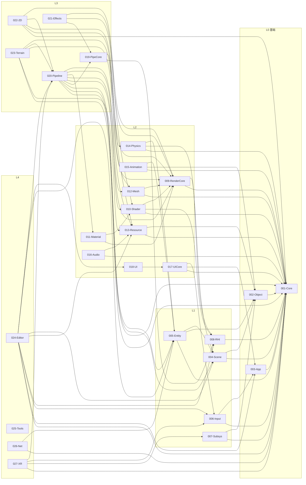
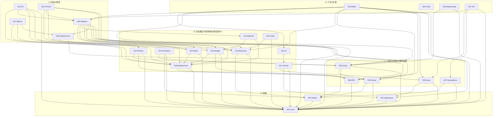
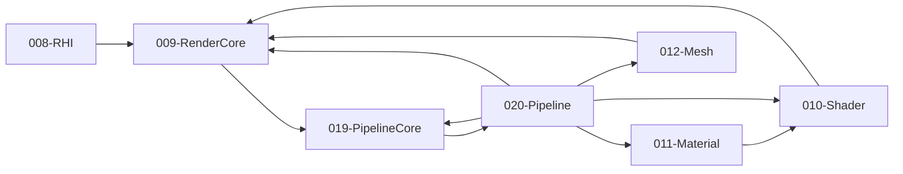

# TenEngine 完整模块与基础架构

本文档描述 TenEngine 的**完整模块划分、层级、依赖关系及依赖图**，覆盖 Unity 与 Unreal 的主要功能域。模块边界清晰、依赖单向、可并行开发。

**如何得到一张图**：用 VS Code 的 Mermaid 预览、[Mermaid Live](https://mermaid.live) 粘贴下方 Mermaid 代码块，或 GitHub 预览本文件，即可渲染；在 Mermaid Live 中可导出 PNG/SVG。详见 **八、如何导出依赖图**。

---

## 〇、概述

- **27 模块**，按 **L0～L4** 分层；L0 基础无业务依赖，L4 工具与扩展可依赖所有运行时模块。
- **渲染链单向**：RHI ← RenderCore ← PipelineCore ← Pipeline；Resource 与渲染解耦。
- **契约**：每模块对应 `specs/_contracts/NNN-modulename-public-api.md`；边界契约 `pipeline-to-rci`。详见 **六、契约文件建议**。
- **详细规格**：各模块的详细功能、实现难度、子模块、上下游见 **`docs/module-specs/`**（如 `001-core.md` … `027-xr.md`）。

---

## 一、Unity / Unreal 功能域与 TenEngine 模块映射

| 功能域 | Unreal 对应 | Unity 对应 | TenEngine 模块 |
|--------|-------------|------------|----------------|
| **基础/平台** | Core | Engine Core (Native) | Core |
| **对象/反射/序列化** | CoreUObject | 序列化/反射 | Object |
| **应用/窗口/主循环** | ApplicationCore | Application | Application |
| **场景/关卡/层次** | Engine (World/Level) | Scene, GameObject 层次 | Scene |
| **实体/组件/ECS** | Engine (Actor/Component), 可选 ECS | GameObject/Component, Entities | Entity |
| **输入** | InputCore | Input System, Subsystems (Input) | Input |
| **可插拔子系统** | 部分在 Engine | Subsystems (Display, XR…) | Subsystems |
| **图形 API 抽象** | RHI, RHICore | 底层图形封装 | RHI |
| **渲染类型/Pass 协议** | RenderCore | SRP Core | RenderCore |
| **Shader/材质** | RenderCore + 材质系统 | Shader Graph, 内置 Shader | Shader, Material |
| **网格/几何** | StaticMesh, SkeletalMesh | Mesh, SkinnedMesh | Mesh |
| **资源/资产** | 资源系统, Asset Registry | Addressables, Asset Bundle, 导入 | Resource |
| **物理** | Chaos, PhysX | Physics, Physics2D, Havok | Physics |
| **动画** | Animation, ControlRig, Sequencer | Animation, Timeline, Animator | Animation |
| **音频** | Audio | Audio, Audio Mixer | Audio |
| **UI 核心** | SlateCore | Canvas, 布局 | UICore |
| **UI 控件** | Slate | uGUI, UI Toolkit | UI |
| **管线协议/命令缓冲** | RDG 协议 | SRP Core (管线协议) | PipelineCore |
| **渲染管线实现** | Renderer (RDG 使用) | URP, HDRP | Pipeline |
| **后处理/特效** | PostProcess, Niagara 部分 | Post Processing, VFX Graph | Effects |
| **2D** | Paper2D, 2D 相关 | 2D Sprite, Tilemap, 2D Physics | 2D |
| **地形** | Landscape | Terrain, Terrain Tools | Terrain |
| **编辑器** | UnrealEd, Slate, LevelEditor | Editor, 各编辑器窗口 | Editor |
| **构建/包管理** | UBT, 插件 | Scriptable Build Pipeline, Package Manager | Tools |
| **网络** | NetDriver, 复制 | Netcode, MLAPI | Networking |
| **XR/AR** | XR 插件 | XR, AR Foundation | XR |

---

## 二、模块列表与层级

### 2.1 层级定义

- **L0 基础**：无业务依赖；所有模块最终依赖于此。
- **L1 平台/场景/抽象**：依赖 L0；应用、场景、实体、输入、子系统、RHI。
- **L2 内容与能力**：依赖 L0–L1；渲染类型、Shader、网格、资源、物理、动画、音频、UI。
- **L3 管线与特性**：依赖 L0–L2；管线协议、管线实现、特效、2D、地形。
- **L4 工具与扩展**：依赖 L0–L3；编辑器、工具、网络、XR。

### 2.2 模块清单（按层级）

#### L0 基础层

| 编号 | 模块名 | 功能（覆盖 UE/Unity） | 直接依赖 |
|------|--------|------------------------|----------|
| 001 | **Core** | 内存、线程、平台（文件/时间/环境）、日志、数学、容器、模块加载；无反射无 ECS | — |
| 002 | **Object** | 反射、序列化、属性系统、类型注册（CoreUObject / Unity 序列化） | Core |
| 003 | **Application** | 应用生命周期、窗口、消息循环、主循环（ApplicationCore / Application） | Core |

#### L1 场景 / 实体 / 输入 / 图形抽象

| 编号 | 模块名 | 功能（覆盖 UE/Unity） | 直接依赖 |
|------|--------|------------------------|----------|
| 004 | **Scene** | 场景图、层级、World/Level、激活/禁用（Engine World/Level / Unity Scene） | Core, Object |
| 005 | **Entity** | 实体/组件模型或 ECS；Actor/Component 或 GameObject/Component / Entities | Core, Object, Scene |
| 006 | **Input** | 输入抽象、键鼠/手柄/触摸、原始输入（InputCore / Input System） | Core, Application |
| 007 | **Subsystems** | 可插拔子系统：描述符、注册、Start/Stop（Display, XR 等）（Unity Subsystems） | Core, Object |
| 008 | **RHI** | 图形 API 抽象（Vulkan/D3D12/Metal）；命令列表、资源、PSO、多后端 | Core |

#### L2 渲染类型 / 内容 / 物理 / 动画 / 音频 / UI

| 编号 | 模块名 | 功能（覆盖 UE/Unity） | 直接依赖 |
|------|--------|------------------------|----------|
| 009 | **RenderCore** | Shader 参数结构、渲染资源描述、Pass 参数协议、Uniform Buffer（RenderCore / SRP Core） | Core, RHI |
| 010 | **Shader** | Shader 编译、变体、预编译、Shader Graph 式编辑（RenderCore+材质 / Shader Graph） | Core, RHI, RenderCore |
| 011 | **Material** | 材质定义、参数、与 Shader 绑定、材质实例（Material / Material） | RenderCore, Shader |
| 012 | **Mesh** | 网格数据、LOD、蒙皮、顶点/索引（StaticMesh/SkeletalMesh / Mesh） | Core, RenderCore |
| 013 | **Resource** | 资源导入、同步/异步加载、卸载、流式、可寻址（Asset / Addressables, Asset Bundle） | Core, Object |
| 014 | **Physics** | 碰撞、刚体、查询、2D/3D（Chaos/PhysX / Physics, Physics2D） | Core, Scene, Entity |
| 015 | **Animation** | 动画剪辑、骨骼动画、Timeline、状态机（Animation/Sequencer / Animation, Timeline） | Core, Object, Entity |
| 016 | **Audio** | 音源、监听、混音、空间音效（Audio / Audio, Audio Mixer） | Core, Resource |
| 017 | **UICore** | UI 布局、绘制、输入路由（SlateCore / Canvas 布局） | Core, Application, Input |
| 018 | **UI** | 控件、画布、事件（Slate / uGUI, UI Toolkit） | UICore |

#### L3 管线与特性

| 编号 | 模块名 | 功能（覆盖 UE/Unity） | 直接依赖 |
|------|--------|------------------------|----------|
| 019 | **PipelineCore** | 命令缓冲格式、Pass 图协议（RDG 风格）、与 RHI 提交约定（RDG 协议 / SRP Core 管线协议） | RHI, RenderCore |
| 020 | **Pipeline** | 场景收集、剔除、DrawCall、命令缓冲生成、提交（Renderer / URP, HDRP） | Core, Scene, Entity, PipelineCore, RenderCore, Shader, Material, Mesh, Resource |
| 021 | **Effects** | 后处理、粒子/VFX、光照后处理（PostProcess, Niagara 部分 / Post Processing, VFX Graph） | PipelineCore, RenderCore, Shader |
| 022 | **2D** | 精灵、Tilemap、2D 物理、2D 渲染（Paper2D / 2D Sprite, Tilemap） | Core, Resource, Physics, Pipeline, RenderCore |
| 023 | **Terrain** | 地形数据、LOD、绘制/刷（Landscape / Terrain, Terrain Tools） | Core, Resource, Mesh, Pipeline, RenderCore |

#### L4 工具与扩展

| 编号 | 模块名 | 功能（覆盖 UE/Unity） | 直接依赖 |
|------|--------|------------------------|----------|
| 024 | **Editor** | 视口、场景树、属性面板、资源编辑、菜单（UnrealEd, Slate, LevelEditor / Editor） | Core, Application, Input, RHI, Resource, Scene, Entity, Pipeline, UI |
| 025 | **Tools** | 构建、批处理、CLI、插件/包管理（UBT, 插件 / Scriptable Build Pipeline, Package Manager） | 按需 |
| 026 | **Networking** | 复制、RPC、客户端/服务端（NetDriver / Netcode） | Core, Entity |
| 027 | **XR** | AR/VR 子系统、头显、手柄（XR 插件 / XR, AR Foundation） | Core, Subsystems, Input, Pipeline |

---

## 三、依赖关系总表与规则

### 3.1 下游 → 上游（直接依赖）

| 模块 | 直接依赖 |
|------|----------|
| 001-Core | — |
| 002-Object | Core |
| 003-Application | Core |
| 004-Scene | Core, Object |
| 005-Entity | Core, Object, Scene |
| 006-Input | Core, Application |
| 007-Subsystems | Core, Object |
| 008-RHI | Core |
| 009-RenderCore | Core, RHI |
| 010-Shader | Core, RHI, RenderCore |
| 011-Material | RenderCore, Shader |
| 012-Mesh | Core, RenderCore |
| 013-Resource | Core, Object |
| 014-Physics | Core, Scene, Entity |
| 015-Animation | Core, Object, Entity |
| 016-Audio | Core, Resource |
| 017-UICore | Core, Application, Input |
| 018-UI | UICore |
| 019-PipelineCore | RHI, RenderCore |
| 020-Pipeline | Core, Scene, Entity, PipelineCore, RenderCore, Shader, Material, Mesh, Resource |
| 021-Effects | PipelineCore, RenderCore, Shader |
| 022-2D | Core, Resource, Physics, Pipeline, RenderCore |
| 023-Terrain | Core, Resource, Mesh, Pipeline, RenderCore |
| 024-Editor | Core, Application, Input, RHI, Resource, Scene, Entity, Pipeline, UI |
| 025-Tools | 按需 |
| 026-Networking | Core, Entity |
| 027-XR | Core, Subsystems, Input, Pipeline |

### 3.2 依赖规则（强制）

1. **L0 无依赖**：Core 无依赖；Object、Application 仅依赖 Core。
2. **L1 仅依赖 L0**：Scene、Entity、Input、Subsystems、RHI 不依赖 L2–L4。
3. **L2 仅依赖 L0–L1**：RenderCore、Shader、Material、Mesh、Resource、Physics、Animation、Audio、UICore、UI 不依赖 L3–L4。
4. **L3 仅依赖 L0–L2**：PipelineCore、Pipeline、Effects、2D、Terrain 不依赖 L4。
5. **L4 可依赖 L0–L3**：Editor、Tools、Networking、XR 可依赖所有运行时模块；运行时模块不依赖 L4。
6. **渲染链单向**：RHI ← RenderCore ← PipelineCore ← Pipeline；Pipeline 产出命令缓冲，RHI 执行。
7. **Resource 与渲染解耦**：Resource 不依赖 RHI/RenderCore/Pipeline；管线通过资源句柄/描述使用资源。

若依赖有变更，请同步更新 **`specs/_contracts/000-module-dependency-map.md`** 与本文档。

---

## 四、依赖图

### 4.1 ASCII 分层简化图

```
L4  ┌─────────┬─────────┬─────────────┬─────┐
    │ Editor  │ Tools   │ Networking  │ XR  │
    └────┬────┴────┬────┴──────┬──────┴──┬──┘
         │         │           │         │
L3       │    ┌────┴────┬──────┴──┬──────┴────┐
         │    │ Pipeline│ Effects │ 2D Terrain│
         │    └────┬────┴────┬────┴─────┬─────┘
         │         │         │          │
         │    ┌────┴─────────┴──────────┘
         │    │ PipelineCore
         │    └────┬──────────────────────────┐
L2       │    ┌───┴───┬────┬────┬────┬────┬───┴───┬────┬────┐
         │    │RenderC│Shad│Mat │Mesh│Res │Physics│Anim│Aud │UICore UI
         │    │ore    │er  │erial│    │ource│      │    │io  │
         │    └───┬───┴──┬─┴──┬─┴──┬─┴──┬─┴──┬───┴──┬─┴──┬─┴──────┘
         │        │      │    │    │    │    │      │    │
L1       │   ┌────┴──────┴────┴────┴────┴────┴──────┴────┴──────┐
         │   │ RHI  │ Scene │ Entity │ Input │ Subsystems         │
         │   └────┬┴───────┬┴───────┴───────┴─────────────────────┘
         │        │        │
L0       │   ┌────┴────────┴────┐
         └──►│ Application      │
             │ Object           │
             │ Core             │
             └──────────────────┘
```

### 4.2 Mermaid 完整依赖总览（L0→L4 从左到右）



### 4.3 Mermaid 按层级分组（自上而下）



### 4.4 Mermaid 仅渲染链（RHI → RenderCore → PipelineCore → Pipeline）



### 4.5 完整依赖矩阵（下游 → 上游）

行 = 下游模块，列 = 上游模块；✓ = 直接依赖。

| 下游 \ 上游 | 001 | 002 | 003 | 004 | 005 | 006 | 007 | 008 | 009 | 010 | 011 | 012 | 013 | 014 | 015 | 016 | 017 | 018 | 019 | 020 | 021 | 022 | 023 | 024 | 025 | 026 | 027 |
|-------------|-----|-----|-----|-----|-----|-----|-----|-----|-----|-----|-----|-----|-----|-----|-----|-----|-----|-----|-----|-----|-----|-----|-----|-----|-----|-----|-----|
| 001-Core    | —   |     |     |     |     |     |     |     |     |     |     |     |     |     |     |     |     |     |     |     |     |     |     |     |     |     |     |     |
| 002-Object  | ✓   | —   |     |     |     |     |     |     |     |     |     |     |     |     |     |     |     |     |     |     |     |     |     |     |     |     |     |     |
| 003-App     | ✓   |     | —   |     |     |     |     |     |     |     |     |     |     |     |     |     |     |     |     |     |     |     |     |     |     |     |     |     |
| 004-Scene   | ✓   | ✓   |     | —   |     |     |     |     |     |     |     |     |     |     |     |     |     |     |     |     |     |     |     |     |     |     |     |     |
| 005-Entity  | ✓   | ✓   |     | ✓   | —   |     |     |     |     |     |     |     |     |     |     |     |     |     |     |     |     |     |     |     |     |     |     |     |
| 006-Input   | ✓   |     | ✓   |     |     | —   |     |     |     |     |     |     |     |     |     |     |     |     |     |     |     |     |     |     |     |     |     |     |
| 007-Subsys  | ✓   | ✓   |     |     |     |     | —   |     |     |     |     |     |     |     |     |     |     |     |     |     |     |     |     |     |     |     |     |     |
| 008-RHI     | ✓   |     |     |     |     |     |     | —   |     |     |     |     |     |     |     |     |     |     |     |     |     |     |     |     |     |     |     |     |
| 009-RenderC | ✓   |     |     |     |     |     |     | ✓   | —   |     |     |     |     |     |     |     |     |     |     |     |     |     |     |     |     |     |     |     |
| 010-Shader  | ✓   |     |     |     |     |     |     | ✓   | ✓   | —   |     |     |     |     |     |     |     |     |     |     |     |     |     |     |     |     |     |     |
| 011-Material|     |     |     |     |     |     |     |     | ✓   | ✓   | —   |     |     |     |     |     |     |     |     |     |     |     |     |     |     |     |     |     |
| 012-Mesh    | ✓   |     |     |     |     |     |     |     | ✓   |     |     | —   |     |     |     |     |     |     |     |     |     |     |     |     |     |     |     |     |
| 013-Resource| ✓   | ✓   |     |     |     |     |     |     |     |     |     |     | —   |     |     |     |     |     |     |     |     |     |     |     |     |     |     |     |
| 014-Physics | ✓   |     |     | ✓   | ✓   |     |     |     |     |     |     |     |     | —   |     |     |     |     |     |     |     |     |     |     |     |     |     |     |
| 015-Animation| ✓  | ✓   |     |     | ✓   |     |     |     |     |     |     |     |     |     | —   |     |     |     |     |     |     |     |     |     |     |     |     |     |
| 016-Audio   | ✓   |     |     |     |     |     |     |     |     |     |     |     |     | ✓   |     |     | —   |     |     |     |     |     |     |     |     |     |     |     |
| 017-UICore  | ✓   |     | ✓   |     |     | ✓   |     |     |     |     |     |     |     |     |     |     |     | —   |     |     |     |     |     |     |     |     |     |     |
| 018-UI      |     |     |     |     |     |     |     |     |     |     |     |     |     |     |     |     |     | ✓   | —   |     |     |     |     |     |     |     |     |     |
| 019-PipeCore|     |     |     |     |     |     |     | ✓   | ✓   |     |     |     |     |     |     |     |     |     |     | —   |     |     |     |     |     |     |     |     |
| 020-Pipeline| ✓   |     |     | ✓   | ✓   |     |     |     | ✓   | ✓   | ✓   | ✓   | ✓   |     |     |     |     |     |     | ✓   | —   |     |     |     |     |     |     |     |
| 021-Effects |     |     |     |     |     |     |     |     |     | ✓   | ✓   |     |     |     |     |     |     |     |     |     | ✓   | —   |     |     |     |     |     |     |
| 022-2D      | ✓   |     |     |     |     |     |     |     |     | ✓   |     |     |     | ✓   | ✓   |     |     |     |     |     | ✓   |     | —   |     |     |     |     |     |
| 023-Terrain | ✓   |     |     |     |     |     |     |     |     | ✓   |     |     | ✓   | ✓   |     |     |     |     |     |     |     | ✓   |     |     | —   |     |     |     |
| 024-Editor  | ✓   |     | ✓   |     |     | ✓   |     | ✓   |     |     |     |     |     | ✓   |     |     |     |     |     |     |     |     | ✓   |     |     | —   |     |     |     |
| 025-Tools   |     |     |     |     |     |     |     |     |     |     |     |     |     |     |     |     |     |     |     |     |     |     |     |     |     | —   |     |     |
| 026-Networking| ✓  |     |     |     |     |     |     |     |     |     |     |     |     |     | ✓   |     |     |     |     |     |     |     |     |     |     |     | —   |     |
| 027-XR      | ✓   |     |     |     |     |     |     | ✓   |     |     |     |     |     |     |     |     |     |     |     |     |     |     | ✓   |     |     |     |     | —   |

### 4.6 边列表（便于脚本/工具解析）

每行一条边：`下游模块 直接依赖 上游模块`。

```
002-Object        001-Core
003-Application  001-Core
004-Scene        001-Core 002-Object
005-Entity       001-Core 002-Object 004-Scene
006-Input        001-Core 003-Application
007-Subsystems   001-Core 002-Object
008-RHI          001-Core
009-RenderCore   001-Core 008-RHI
010-Shader       001-Core 008-RHI 009-RenderCore
011-Material     009-RenderCore 010-Shader
012-Mesh         001-Core 009-RenderCore
013-Resource     001-Core 002-Object
014-Physics      001-Core 004-Scene 005-Entity
015-Animation    001-Core 002-Object 005-Entity
016-Audio        001-Core 013-Resource
017-UICore       001-Core 003-Application 006-Input
018-UI           017-UICore
019-PipelineCore 008-RHI 009-RenderCore
020-Pipeline     001-Core 004-Scene 005-Entity 019-PipelineCore 009-RenderCore 010-Shader 011-Material 012-Mesh 013-Resource
021-Effects      019-PipelineCore 009-RenderCore 010-Shader
022-2D           001-Core 013-Resource 014-Physics 020-Pipeline 009-RenderCore
023-Terrain      001-Core 013-Resource 012-Mesh 020-Pipeline 009-RenderCore
024-Editor       001-Core 003-Application 006-Input 008-RHI 013-Resource 004-Scene 005-Entity 020-Pipeline 018-UI
026-Networking   001-Core 005-Entity
027-XR           001-Core 007-Subsystems 006-Input 020-Pipeline
```

---

## 五、可选模块与最小集

- **必选（最小可运行）**：Core, Object, Application, Scene, Entity, RHI, RenderCore, Shader, Material, Mesh, Resource, PipelineCore, Pipeline。
- **可选按需**：Input, Subsystems, Physics, Animation, Audio, UICore, UI, Effects, 2D, Terrain, Editor, Tools, Networking, XR。
- 实施时可先实现 L0 + L1（含 RHI）+ L2（RenderCore, Shader, Material, Mesh, Resource）+ L3（PipelineCore, Pipeline），再按需增加 2D、Terrain、Effects、Editor 等。

---

## 六、契约文件建议（与模块对应）

| 模块 | 建议契约 |
|------|----------|
| 001-Core | 001-core-public-api |
| 002-Object | 002-object-public-api |
| 003-Application | 003-application-public-api |
| 004-Scene | 004-scene-public-api |
| 005-Entity | 005-entity-public-api |
| 006-Input | 006-input-public-api |
| 007-Subsystems | 007-subsystems-public-api |
| 008-RHI | 008-rhi-public-api |
| 009-RenderCore | 009-rendercore-public-api |
| 010-Shader | 010-shader-public-api |
| 011-Material | 011-material-public-api |
| 012-Mesh | 012-mesh-public-api |
| 013-Resource | 013-resource-public-api |
| 014-Physics | 014-physics-public-api |
| 015-Animation | 015-animation-public-api |
| 016-Audio | 016-audio-public-api |
| 017-UICore | 017-uicore-public-api |
| 018-UI | 018-ui-public-api |
| 019-PipelineCore | 019-pipelinecore-public-api |
| 020-Pipeline | 020-pipeline-public-api；与 008 边界见 pipeline-to-rci |
| 021-Effects | 021-effects-public-api |
| 022-2D | 022-2d-public-api |
| 023-Terrain | 023-terrain-public-api |
| 024-Editor | 024-editor-public-api |
| 025-Tools | 025-tools-public-api（按需） |
| 026-Networking | 026-networking-public-api |
| 027-XR | 027-xr-public-api |

契约文件位于 `specs/_contracts/`，命名 `NNN-modulename-public-api.md`。边界契约 `pipeline-to-rci` 见同目录。

---

## 七、与现有 TenEngine 规格的对应

| 现有 spec | 本规格模块 | 说明 |
|-----------|------------|------|
| 001-engine-core-module | 001-Core + 002-Object + 003-Application | 拆分为纯基础、对象、应用 |
| 002-rendering-rci-interface | 008-RHI | 一致 |
| 003-editor-system | 024-Editor + 017-UICore + 018-UI | 编辑器 + UI 拆分 |
| 004-resource-system | 013-Resource | 一致 |
| 005-shader-system | 010-Shader + 011-Material | Shader 与 Material 可分可合 |
| 006-render-pipeline-system | 019-PipelineCore + 020-Pipeline | 协议与实现拆分 |
| 006-thirdparty-integration-tool | 025-Tools | 一致 |
| — | 004–007, 009–012, 014–016, 021–023, 026–027 | 新增，覆盖 UE/Unity 全功能 |

本规格为**目标架构**；现有 `specs/001–006` 可保留并逐步向本表靠拢，或按本表新建 spec 与契约。

**按模块的详细规格**（含模块简要说明、详细功能、实现难度、资源类型、子模块、上下游与外部依赖）见 **`docs/module-specs/`**，文件名如 `001-core.md` … `027-xr.md`。

---

## 八、如何导出依赖图（PNG/SVG）

1. **VS Code**：安装 “Markdown Preview Mermaid Support” 或 “Mermaid” 插件，打开本文件并预览，可右键/菜单导出为图片（视插件而定）。
2. **Mermaid Live**：打开 [mermaid.live](https://mermaid.live)，将本文档中任一 ` ```mermaid ` 代码块内容粘贴进去，即可渲染并导出 PNG/SVG。
3. **GitHub**：在本仓库中打开本文件，GitHub 会自动渲染 Mermaid 图；截图即可得到完整依赖关系图。
