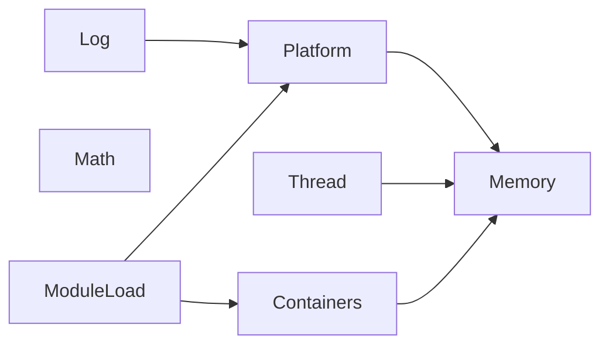
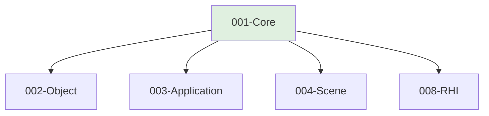

# 001-Core 模块描述

## 1. 模块简要说明

Core 是 TenEngine 的**基础层根模块**，不依赖任何其他引擎模块。提供内存、线程、平台抽象、日志、数学、容器与模块加载等基础设施，对应 Unreal 的 **Core**、Unity 的 **Engine Core (Native)**，不包含反射与 ECS。

## 2. 详细功能描述

- **内存**：分配器抽象、默认堆分配、对齐分配、内存池、调试分配与泄漏追踪。
- **线程**：线程创建与管理、TLS、原子类型、Mutex/ConditionVariable、任务队列骨架。
- **平台**：引擎支持 **Android、iOS** 等平台；文件 I/O、目录枚举、时间与高精度计时、环境变量、路径规范化、平台检测（Windows/Linux/macOS/Android/iOS 等）。**可以通过宏来判断执行哪一段代码**（如 `TE_PLATFORM_ANDROID`、`TE_PLATFORM_IOS`、`TE_PLATFORM_WIN` 等），编译时选择平台相关实现路径。
- **日志**：分级日志、输出通道、断言、崩溃报告钩子。
- **数学**：标量/向量/矩阵/四元数、AABB、射线、插值及常用数学函数（与渲染无关的纯数学）。
- **容器**：动态数组、哈希表、字符串、智能指针（无反射、无 ECS）。
- **模块加载**：动态库加载/卸载/符号解析、模块依赖顺序、初始化与关闭回调。

## 3. 实现难度

**中**。平台抽象与多后端（Win/Linux/macOS）需统一接口；内存与线程需兼顾性能与调试能力；不引入反射/ECS 可降低复杂度。

## 4. 操作的资源类型

- **内存**：堆、池、对齐块。
- **文件句柄**：文件读写、目录枚举。
- **系统资源**：线程句柄、TLS 槽、互斥/条件变量、动态库句柄。
- **无 GPU 资源**：本模块不直接操作显存或图形 API。

## 5. 是否有子模块

有。Core 在实现上可拆分为以下逻辑子模块。

### 5.1 子模块说明

| 子模块 | 职责 |
|--------|------|
| Memory | 分配器抽象、堆/池/对齐、调试与泄漏追踪 |
| Thread | 线程、TLS、原子、同步原语、任务队列骨架 |
| Platform | 文件/目录/时间/环境/路径、平台宏与检测（Android/iOS/Win/Linux/macOS）；**通过宏选择平台代码路径** |
| Log | 日志级别、输出通道、断言、崩溃钩子 |
| Math | 向量/矩阵/四元数、AABB、射线、插值 |
| Containers | 动态数组、哈希表、字符串、智能指针 |
| ModuleLoad | 动态库加载、符号解析、模块生命周期 |

### 5.2 具体功能

- **Memory**：Allocator 接口、DefaultAllocator、AlignedAlloc、PoolAllocator、DebugAllocator/LeakTracker。
- **Thread**：Thread、TLS、Atomic、Mutex、ConditionVariable、TaskQueue 骨架。
- **Platform**：FileRead/Write、DirectoryEnumerate、Time/HighResolutionTimer、GetEnv、PathNormalize、平台宏。
- **Log**：LogLevel、LogSink、Assert、CrashHandler。
- **Math**：Vector2/3/4、Matrix3/4、Quaternion、AABB、Ray、Lerp 等。
- **Containers**：Array、Map、String、UniquePtr、SharedPtr。
- **ModuleLoad**：LoadLibrary、UnloadLibrary、GetSymbol、ModuleInit/Shutdown 回调。

### 5.3 子模块依赖图

## 6. 模块上下游

### 6.1 和上下游交互、传递的数据类型

- **上游**：无。Core 为根模块。
- **下游**：所有模块均直接或间接依赖 Core。向下游提供：
  - **类型**：基础类型（uint8/16/32/64、float、double）、容器（Array、Map、String）、数学类型（Vector、Matrix、Quaternion）、智能指针、原子类型。
  - **接口**：分配器、文件 I/O、时间、日志、线程/同步、模块加载 API。

### 6.2 上下游依赖图

（仅示意直接下游；Object、Application、Scene、Entity、Input、Subsystems、RHI、RenderCore、Shader、Mesh、Resource、Physics、Animation、Audio、UICore、Pipeline、2D、Terrain、Editor、Networking、XR 等均依赖 Core。）

## 7. 依赖的外部内容

| 类别 | 内容 |
|------|------|
| **技术/标准** | C++17 或以上（std::filesystem、std::atomic、std::thread 等） |
| **平台 API** | Win32（文件、线程、动态库、高精度计时）；POSIX（pthread、dlopen、clock_gettime）；macOS（Mach 线程、dyld） |
| **外部库（可选）** | EASTL、jemalloc/tcmalloc、spdlog 等；需通过 Core 抽象对外统一接口，避免上层直接依赖 |
| **构建工具** | CMake/Meson 等，与 ModuleLoad 配合用于按模块编译与加载 |
| **协议** | 无业务协议依赖 |
