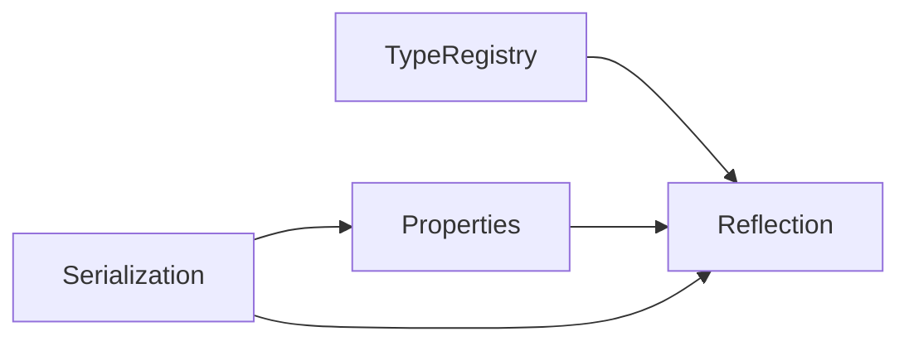
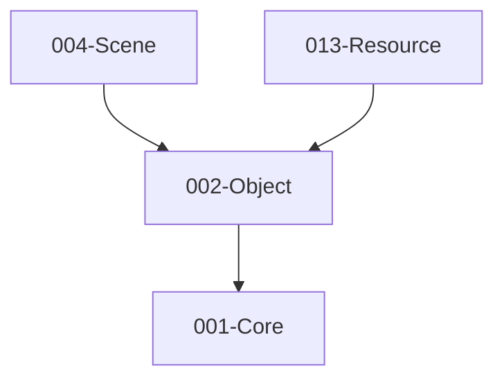

# 002-Object 模块描述

## 1. 模块简要说明

Object 提供**对象模型与元数据**，是反射、序列化与属性系统的基础，对应 Unreal 的 **CoreUObject**、Unity 的序列化/反射体系。仅依赖 Core。

## 2. 详细功能描述

- **反射**：类型注册、类型信息查询、属性/方法枚举、基类链（契约：GetTypeByName/ById、TypeDescriptor 含属性/方法列表与基类链）；RTTI 扩展为可选实现手段。
- **序列化**：二进制/文本序列化、版本化、对象引用与 GUID 解析（契约：版本迁移、ObjectRef/GUID）；引用解析与默认值与契约能力列表一致。
- **属性系统**：可序列化字段、元数据、编辑器可见/可编辑、范围与枚举约束。
- **类型注册**：启动时或按模块注册类型、基类/派生关系、类型工厂创建。

## 3. 实现难度

**中高**。反射与序列化需与类型系统、资源引用（GUID）协同；若支持代码生成（类似 UHT/Unity）可降低运行时开销但增加工具链复杂度。

## 4. 操作的资源类型

- **内存**：类型描述符、属性表、序列化缓冲。
- **无文件/GPU 直接操作**：通过抽象层与 Resource 等模块配合完成资源引用与元数据。

## 5. 是否有子模块

有。

### 5.1 子模块说明

| 子模块 | 职责 |
|--------|------|
| Reflection | 类型描述符、属性/方法列表、基类链、类型名/ID 解析 |
| Serialization | 序列化器抽象、二进制/文本格式、版本迁移、对象引用与 GUID 解析 |
| Properties | 属性描述、元数据、默认值、范围/枚举约束 |
| TypeRegistry | 注册表、按模块注册、类型工厂、生命周期 |

### 5.2 具体功能

Reflection：TypeDescriptor、Property/Method 枚举、BaseClass 链、GetTypeByName/ById。  
Serialization：Serializer 接口、Binary/Text 格式、VersionMigration、ObjectRef、GUID 解析。  
Properties：PropertyDescriptor、Metadata、DefaultValue、Range/Enum。  
TypeRegistry：RegisterType、CreateInstance、Module 边界。

### 5.3 子模块依赖图

## 6. 模块上下游

### 6.1 和上下游交互、传递的数据类型

- **上游**：Core。依赖基础类型、容器、字符串、内存分配。
- **下游**：Scene、Entity、Subsystems、Resource、Animation、Pipeline、Editor 等。向它们提供：TypeId、TypeDescriptor、SerializedBuffer、ObjectRef、GUID、PropertyBag。

### 6.2 上下游依赖图

## 7. 依赖的外部内容

| 类别 | 内容 |
|------|------|
| **技术/标准** | C++ RTTI 可选；自定义类型 ID 与类型名表 |
| **序列化格式** | 自定义二进制协议或 JSON/YAML 等（通过抽象层接入） |
| **代码生成（可选）** | 反射/序列化代码生成器（类似 UHT/Unity） |
| **工具** | 与 Editor 配合用于属性编辑；与 Resource 配合用于资源元数据与引用解析 |
| **协议** | 无网络协议；序列化格式即数据协议 |

## 待办

- **待办**：需随 `001-Core` 契约变更做适配（契约变更日期：2026-01-29；变更摘要：契约由 plan 001-core-fullversion-001 同步，完整 7 子模块声明）。
