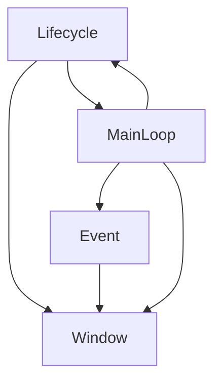
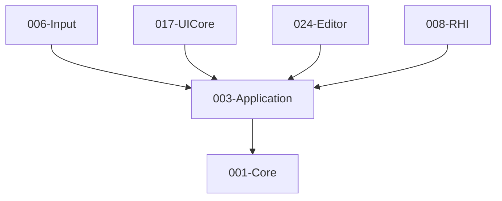

# 003-Application 模块描述

## 1. 模块简要说明

Application 负责**应用生命周期、窗口管理、事件处理与主循环**，对应 Unreal 的 **ApplicationCore**、Unity 的 **Application**。仅依赖 Core。提供跨平台的应用框架抽象，支持多窗口、灵活的事件系统、可配置的主循环策略。

## 2. 详细功能描述

### 2.1 应用生命周期
- **初始化**：应用启动、参数解析、子系统准备
- **运行状态**：运行中、暂停、恢复、后台运行
- **退出管理**：优雅退出、退出码、清理顺序
- **模式支持**：编辑器模式、游戏模式、无头模式（Headless）

### 2.2 窗口管理
- **窗口创建与销毁**：主窗口、子窗口、多窗口支持
- **窗口属性**：标题、尺寸、位置、最小/最大尺寸、可调整大小、边框、置顶
- **窗口状态**：显示/隐藏、最小化/最大化、全屏/窗口化、焦点管理
- **多显示器支持**：显示器枚举、DPI感知、窗口跨显示器移动
- **平台句柄**：获取原生窗口句柄（HWND/X11 Window/NSWindow）

### 2.3 事件系统
- **事件泵**：平台消息轮询、事件队列管理
- **事件类型**：窗口事件（创建/销毁/调整大小/焦点）、输入事件（键盘/鼠标/触摸）、系统事件（挂起/恢复/退出）
- **事件分发**：事件过滤、事件订阅、事件优先级
- **与Input解耦**：事件源抽象，Input模块可选择性消费

### 2.4 主循环
- **循环策略**：固定时间步、可变时间步、混合模式
- **帧率控制**：目标FPS、垂直同步、帧率限制
- **时间管理**：DeltaTime、总运行时间、帧计数
- **Tick调度**：Tick回调注册、优先级、多阶段Tick（Early/Update/Late）

## 3. 实现难度

**中高**。需要：
- 抽象多平台窗口与消息API（Win32/X11/Cocoa/Android/iOS）
- 设计灵活的事件系统，支持过滤和订阅
- 实现可配置的主循环策略，平衡性能和精度
- 处理多窗口、多显示器、DPI感知等复杂场景
- 确保线程安全和资源管理正确性

## 4. 操作的资源类型

- **系统资源**：窗口句柄、显示/显示器信息、事件队列
- **无 GPU 资源**：本模块不直接操作图形 API，但提供窗口句柄供RHI使用
- **内存资源**：事件队列、窗口列表、回调注册表

## 5. 是否有子模块

有。

### 5.1 子模块说明

| 子模块 | 职责 |
|--------|------|
| **Lifecycle** | 应用初始化/运行/关闭、状态管理（运行/暂停/恢复）、退出码、模式切换 |
| **Window** | 窗口创建/销毁/配置、窗口属性管理、多窗口支持、多显示器、DPI感知、平台句柄 |
| **Event** | 事件队列、事件泵、事件分发、事件过滤、事件订阅、平台消息转换 |
| **MainLoop** | 主循环驱动、时间步管理、帧率控制、Tick调度、回调管理 |

### 5.2 具体功能

**Lifecycle**：
- `Initialize()`：初始化应用，解析参数，准备子系统
- `Run()`：进入主循环，直到退出
- `Pause()` / `Resume()`：暂停/恢复应用运行
- `RequestExit(exitCode)`：请求退出，设置退出码
- `GetExitCode()`：获取退出码
- `GetRunMode()`：获取当前运行模式（Editor/Game/Headless）
- `SetRunMode(mode)`：切换运行模式

**Window**：
- `CreateWindow(desc)`：创建窗口，返回窗口ID
- `DestroyWindow(windowId)`：销毁窗口
- `GetMainWindow()`：获取主窗口ID
- `SetWindowTitle(windowId, title)`：设置窗口标题
- `SetWindowSize(windowId, width, height)`：设置窗口尺寸
- `SetWindowPosition(windowId, x, y)`：设置窗口位置
- `SetFullscreen(windowId, fullscreen)`：切换全屏
- `GetNativeHandle(windowId)`：获取平台原生句柄
- `GetDisplayInfo(displayIndex)`：获取显示器信息（分辨率、DPI、刷新率）
- `EnumerateDisplays()`：枚举所有显示器
- `SetWindowCallback(windowId, callback)`：设置窗口事件回调

**Event**：
- `PumpEvents()`：轮询并处理平台消息
- `PushEvent(event)`：手动推送事件到队列（可选）
- `GetEventQueue()`：获取事件队列（供Input模块直接消费）
- 简化设计：事件队列直接暴露，减少复杂的订阅机制

**MainLoop**：
- `Run()`：进入主循环（内部调用）
- `GetDeltaTime()`：获取上一帧的DeltaTime
- `GetTotalTime()`：获取总运行时间
- `GetFrameCount()`：获取帧计数
- `SetTargetFPS(fps)`：设置目标帧率
- `SetTimeStepMode(mode)`：设置时间步模式（Fixed/Variable/Mixed）
- `RegisterTickCallback(callback, priority)`：注册Tick回调（简化：支持优先级但不强制阶段）
- `UnregisterTickCallback(callbackId)`：取消注册

### 5.3 子模块依赖图

## 6. 模块上下游

### 6.1 和上下游交互、传递的数据类型

**上游依赖**：
- **001-Core**：平台抽象（窗口API、消息API）、时间管理（HighResolutionTimer）、日志（Log）、内存（Allocator）、线程（Thread、Mutex）

**向下游提供**：
- **WindowHandle**：窗口句柄（不透明类型，可通过GetNativeHandle获取平台句柄）
- **WindowId**：窗口ID（用于多窗口管理）
- **DisplayInfo**：显示器信息（分辨率、DPI、刷新率、位置）
- **Event**：事件结构（窗口事件、输入事件、系统事件）
- **DeltaTime**：帧间隔时间（float，秒）
- **TickCallback**：Tick回调函数类型
- **RunMode**：运行模式枚举（Editor/Game/Headless）
- **TimeStepMode**：时间步模式枚举（Fixed/Variable/Mixed）

**下游消费者**：
- **006-Input**：消费窗口事件和输入事件，获取窗口句柄
- **017-UICore**：使用窗口和消息循环，处理UI事件
- **024-Editor**：编辑器窗口管理，主循环控制
- **008-RHI**：获取窗口句柄用于创建SwapChain

### 6.2 上下游依赖图

## 7. 设计原则与约束

### 7.1 设计原则

1. **接口整合**：窗口管理、事件处理、主循环功能整合到IApplication接口中，参考Core模块的Allocator设计模式（单一接口，功能完整）
2. **平台抽象**：所有平台相关代码封装在实现层，公共API完全跨平台
3. **事件简化**：事件系统简化订阅机制，直接暴露事件队列供Input模块消费，减少中间层
4. **灵活配置**：主循环策略、窗口属性、事件处理均可配置
5. **线程安全**：窗口操作和事件处理考虑多线程场景
6. **资源管理**：窗口和事件资源明确的生命周期管理
7. **命名规范**：与Core模块对齐，使用PascalCase命名（CreateWindow、PumpEvents、GetDeltaTime），命名空间te::application

### 7.2 约束

- 必须在Core初始化之后使用
- 窗口操作必须在主线程执行（平台限制）
- 事件泵必须在主循环中定期调用
- 多窗口支持为可选功能，单窗口场景必须支持
- 主循环必须支持至少一种时间步模式（Variable为默认）

## 8. 依赖的外部内容

| 类别 | 内容 |
|------|------|
| **平台 API** | Win32 (Windows) / X11 (Linux) / Cocoa (macOS) / Android (ANativeWindow) / iOS (UIWindow) |
| **跨平台封装（可选）** | GLFW、SDL2、Qt（若编辑器基于Qt）等，通过Application抽象对外统一 |
| **构建** | 与平台宏配合（TE_PLATFORM_*），按平台编译不同窗口/事件实现 |
| **协议** | 无 |

## 9. 实现建议

### 9.1 平台抽象层

采用**平台抽象层（Platform Abstraction Layer）**设计：
- **IWindowPlatform**：统一的窗口平台抽象接口（CreateNativeWindow、DestroyNativeWindow、SetWindowTitle等）
- **IEventPumpPlatform**：统一的事件泵平台抽象接口（PollEvent、ConvertToEngineEvent、IsQuitEvent）
- 各平台实现具体类（WindowsWindowPlatform、X11WindowPlatform、CocoaWindowPlatform等）
- 通过工厂函数创建平台特定实现（CreateWindowPlatform、CreateEventPumpPlatform）
- 使用TE_PLATFORM_*宏进行平台检测和代码选择
- 平台特定代码完全隔离在platform/子目录中

### 9.2 事件系统设计

- **事件队列**：使用线程安全的队列存储事件，直接暴露给Input模块消费
- **事件类型**：使用枚举标识事件类型
- **简化设计**：减少复杂的订阅机制，事件队列直接访问，更直观高效
- **窗口事件回调**：保留简单的窗口事件回调注册（用于窗口特定事件）

### 9.3 主循环设计

- **时间步模式**：
  - Fixed：固定时间步，适合物理模拟
  - Variable：可变时间步，适合游戏逻辑（默认）
  - Mixed：固定时间步更新，可变时间步渲染
- **帧率控制**：使用高精度计时器控制帧率
- **Tick回调**：简化设计，支持优先级但不强制阶段划分，更灵活

## 10. 详细设计文档

详细的接口设计、类结构、实现架构和代码示例请参考：
- **[003-application-design.md](./003-application-design.md)**：包含完整的接口定义、类结构、实现架构、主循环示例、事件系统实现、线程安全考虑、资源管理、错误处理、测试策略等。

## 11. 变更记录

| 日期 | 变更说明 |
|------|----------|
| T0 初始 | Application模块初始设计 |
| 2026-02-06 | 重新设计：增强窗口管理（多窗口、窗口属性）、改进事件系统（事件队列、订阅机制）、完善主循环（多种时间步模式、帧率控制）、明确生命周期管理；新增详细设计文档 |
| 2026-02-06 | **接口整合优化**：将窗口、事件、主循环功能整合到IApplication接口中，简化事件系统（直接暴露事件队列），优化主循环（简化Tick阶段为优先级），与Core模块设计风格对齐（PascalCase命名） |
| 2026-02-06 | **平台抽象层重新设计**：新增IWindowPlatform和IEventPumpPlatform接口，清晰的平台抽象层设计，改进跨平台兼容性；优化WindowDesc结构（添加IsValid验证），改进EventQueue API（添加Clear方法），统一注释风格对齐Core模块 |
