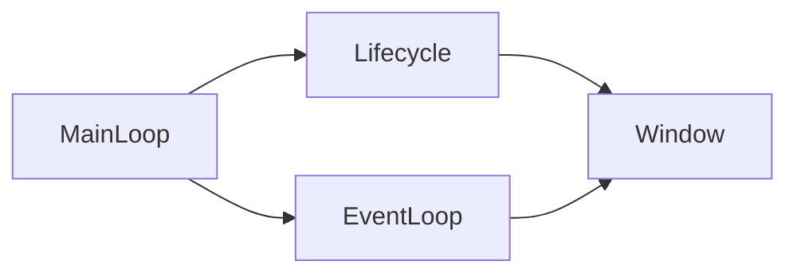
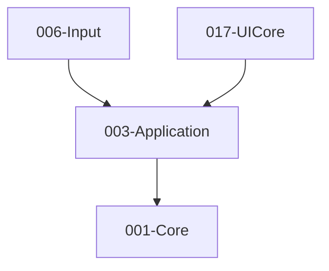

# 003-Application 模块描述

## 1. 模块简要说明

Application 负责**应用生命周期、窗口与主循环**，对应 Unreal 的 **ApplicationCore**、Unity 的 **Application**。仅依赖 Core。

## 2. 详细功能描述

- **应用生命周期**：初始化、主循环、暂停/恢复、退出、退出码。
- **窗口**：窗口创建/销毁、尺寸与全屏、多窗口（可选）、与平台窗口句柄对接。
- **消息循环**：事件泵、与 Input 解耦的事件源（可由 Input 消费）。
- **主循环**：帧驱动、固定/可变时间步、与引擎各子系统 Tick 的调度接口。

## 3. 实现难度

**中**。需抽象多平台窗口与消息 API；主循环与各子系统 Tick 的挂接点需清晰约定。

## 4. 操作的资源类型

- **系统资源**：窗口句柄、显示/显示器信息。
- **无 GPU 资源**：本模块不直接操作图形 API。

## 5. 是否有子模块

有。

### 5.1 子模块说明

| 子模块 | 职责 |
|--------|------|
| Lifecycle | Init/Run/Shutdown、暂停/恢复、退出请求与退出码 |
| Window | 窗口创建/配置、尺寸/全屏/DPI、平台句柄、多显示器 |
| EventLoop | 平台消息泵、事件队列、与 Window 和 Input 桥接 |
| MainLoop | 帧循环、DeltaTime、固定步长 Tick、引擎 Tick 挂接点 |

### 5.2 具体功能

Lifecycle：Initialize、Run、Pause、Resume、RequestExit、GetExitCode。  
Window：CreateWindow、DestroyWindow、SetSize、SetFullscreen、GetNativeHandle、GetDisplayInfo。  
EventLoop：PumpEvents、PushEvent、与 Input 的事件桥接。  
MainLoop：Tick、GetDeltaTime、RegisterTickCallback。

### 5.3 子模块依赖图

## 6. 模块上下游

### 6.1 和上下游交互、传递的数据类型

- **上游**：Core。依赖平台、时间、日志、内存。
- **下游**：Input（窗口与事件源）、UICore（窗口与消息循环）、Editor（编辑器窗口与主循环）。向下游提供：WindowHandle、DisplayInfo、Event、DeltaTime、TickCallback 接口。

### 6.2 上下游依赖图

## 7. 依赖的外部内容

| 类别 | 内容 |
|------|------|
| **平台 API** | Win32 / X11 / Cocoa 等窗口与消息 API |
| **跨平台封装（可选）** | GLFW、SDL2、Qt（若编辑器基于 Qt）等，通过 Application 抽象对外统一 |
| **构建** | 与平台宏配合，按平台编译不同窗口/事件实现 |
| **协议** | 无 |

## 待办

- **待办**：需随 `001-Core` 契约变更做适配（契约变更日期：2026-01-29；变更摘要：契约由 plan 001-core-fullversion-001 同步，完整 7 子模块声明）。
