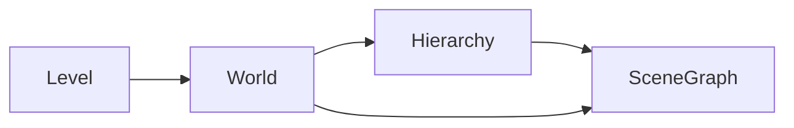
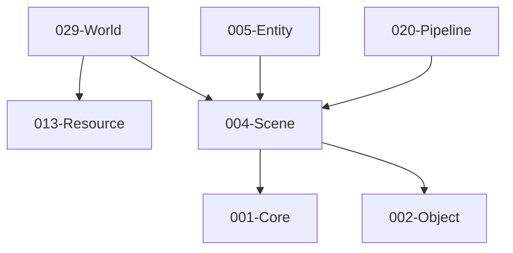

# 004-Scene 模块描述

## 1. 模块简要说明

Scene 提供**逻辑场景管理**：场景图、层级遍历、World/Level 容器、激活/禁用，对应 Unreal 的 **Engine (World/Level)**、Unity 的 **Scene 与 GameObject 层次**。**不持有资源、不依赖 Resource**；Level 实际资源引用与加载由 **029-World** 模块负责，World 底层依赖本模块进行场景管理。依赖 Core、Object。

## 2. 详细功能描述

- **场景图**：场景根、节点树、父子关系、局部/世界变换、脏标记与变换更新。
- **层级**：层级遍历、按名/按类型查找、层级 ID 或路径、激活/禁用子树。**场景遍历入口由本模块提供**（GetCurrentWorld、GetRootNodes、Traverse、GetChildren 等），由 Pipeline、Editor、Physics 等下游调用。
- **World/Level**：多场景/关卡容器、当前活动场景、场景切换；**004 不发起资源加载**；**029-World** 在 Level 加载时将 013 的 LevelAssetDesc 转为 **004 定义的 SceneDesc** 后调用 004 **CreateSceneFromDesc**(SceneDesc, …) 初始化场景图；**节点挂不透明句柄**（004 不解析、不依赖 029/013 类型），004 不持有、不可见 IResource*；渲染时由 Pipeline 经 Resource/World 解析。
- **激活/禁用**：节点与子树是否参与更新/渲染的开关。

## 3. 实现难度

**中**。变换层级与脏标记需保证一致性；多 World/Level 与 Resource 的边界需清晰。

## 4. 操作的资源类型

- **内存**：场景图节点、变换缓存、层级索引。
- **无直接文件/GPU**：关卡数据通过 Resource 加载，本模块消费场景/节点描述与引用。

## 5. 是否有子模块

有。

### 5.1 子模块说明

| 子模块 | 职责 |
|--------|------|
| SceneGraph | 节点树、父子关系、局部/世界变换、脏标记与变换更新 |
| Hierarchy | 遍历、按名/按类型查找、路径、层级 ID、激活/禁用状态 |
| World | 场景容器、当前活动场景、多 World（可选）、与 Entity 挂接 |
| Level | 关卡粒度、接收 CreateSceneFromDesc 入参；加载/卸载边界与资源引用由 **029-World** 负责 |

### 5.2 具体功能

SceneGraph：Node、Parent/Children、LocalTransform、WorldTransform、SetDirty、UpdateTransforms。  
Hierarchy：Traverse、FindByName/ByType、GetPath、GetId、SetActive。  
World：GetCurrentWorld、SetActiveWorld、AddWorld、与 Entity 的根实体挂接。  
Level：CreateSceneFromDesc（入参为 **004 定义的 SceneDesc** 与按节点的不透明句柄，**不引用 029/013 类型**；由 **029-World** 将 LevelAssetDesc 转换后调用，004 仅存不透明句柄、不存 IResource*）、UnloadScene、SceneRef；004 不提供 LoadLevel 入口，关卡加载与 Level 资源句柄由 World 负责。

### 5.3 子模块依赖图

### 5.4 Level（关卡）与 World 的职责划分

**场景拆分为 004-Scene（逻辑场景管理）与 029-World（场景资源管理）**：004 不依赖 Resource，满足 L1 仅依赖 L0；Level 实际资源引用与加载由 **029-World** 负责，World 底层依赖 004-Scene 进行场景管理。

- **加载入口**：**013-Resource** 为 Level 资源的**唯一加载入口**。下游调用 013 `Load(levelGuid)`；013 读入 .level、反序列化得到 **LevelAssetDesc**、加载依赖后，通过 **029-World** 创建 Level 实例；**World** 将 LevelAssetDesc 转为 **004 定义的 SceneDesc** 与按节点的不透明句柄后，再调用 004 **CreateSceneFromDesc**(SceneDesc, …) 初始化场景图。
- **004 子模块 Level 职责**：仅提供 **CreateSceneFromDesc**（入参为 004 定义的 SceneDesc，**不引用 029/013 类型**，避免 004 依赖 L2）、**UnloadScene**、SceneRef 等；由 World 传入已转换的 SceneDesc 与不透明句柄；**不发起资源加载**、不读 .level。
- **029-World 职责**：持有关卡资源句柄、与 013 协作完成 Level 加载、**将 LevelAssetDesc 转为 004 的 SceneDesc 后**调用 004 CreateSceneFromDesc 并持有 SceneRef。
- **数据归属**：**SceneDesc** 由 004 定义（或 Core/Object 通用类型）；**LevelAssetDesc** 归属 029/013；029 负责转换后交 004 使用。

## 6. 模块上下游

### 6.1 和上下游交互、传递的数据类型

- **上游**：Core（数学、容器、内存）、Object（序列化、类型信息）。Level 数据由 **029-World** 转换为 004 的 SceneDesc 后传入，004 不依赖 013/029 类型。
- **下游**：Entity、Physics、Pipeline、2D、Editor、**World**。向下游提供：SceneRef、NodeId、WorldRef、Transform、HierarchyIterator、Active 状态、Node 上的不透明句柄（004 不解析、对 IResource 不可见）。

### 6.2 上下游依赖图

## 7. 依赖的外部内容

| 类别 | 内容 |
|------|------|
| **技术** | 变换矩阵、四元数（Core.Math 或共用数学库） |
| **Object** | 场景节点可序列化、反射与属性编辑 |
| **World（029）** | Level 加载时由 World 将 LevelAssetDesc 转为 004 的 SceneDesc 后调用 004 CreateSceneFromDesc；004 不依赖 029/013 类型 |
| **协议** | 无 |

## 待办

- **待办**：需随 `001-Core` 契约变更做适配（契约变更日期：2026-01-29；变更摘要：契约由 plan 001-core-fullversion-001 同步，完整 7 子模块声明）。
