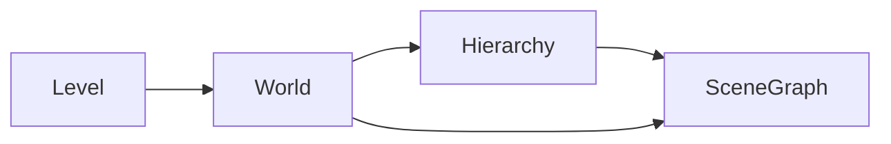
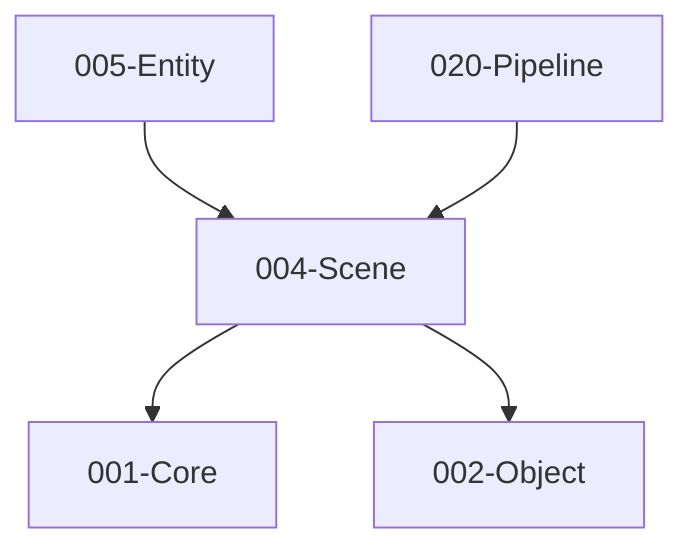

# 004-Scene 模块描述

## 1. 模块简要说明

Scene 提供**场景/关卡与层次结构**：场景图、层级遍历、World/Level、激活/禁用，对应 Unreal 的 **Engine (World/Level)**、Unity 的 **Scene 与 GameObject 层次**。依赖 Core、Object。

## 2. 详细功能描述

- **场景图**：场景根、节点树、父子关系、局部/世界变换、脏标记与变换更新。
- **层级**：层级遍历、按名/按类型查找、层级 ID 或路径、激活/禁用子树。
- **World/Level**：多场景/关卡加载、当前活动场景、场景切换（与 Resource 配合加载）。
- **激活/禁用**：节点与子树是否参与更新/渲染的开关。

## 3. 实现难度

**中**。变换层级与脏标记需保证一致性；多 World/Level 与 Resource 的边界需清晰。

## 4. 操作的资源类型

- **内存**：场景图节点、变换缓存、层级索引。
- **无直接文件/GPU**：关卡数据通过 Resource 加载，本模块消费场景/节点描述与引用。

## 5. 是否有子模块

有。

### 5.1 子模块说明

| 子模块 | 职责 |
|--------|------|
| SceneGraph | 节点树、父子关系、局部/世界变换、脏标记与变换更新 |
| Hierarchy | 遍历、按名/按类型查找、路径、层级 ID、激活/禁用状态 |
| World | 场景容器、当前活动场景、多 World（可选）、与 Entity 挂接 |
| Level | 关卡粒度、加载/卸载边界、与 Resource 的关卡资源引用 |

### 5.2 具体功能

SceneGraph：Node、Parent/Children、LocalTransform、WorldTransform、SetDirty、UpdateTransforms。  
Hierarchy：Traverse、FindByName/ByType、GetPath、GetId、SetActive。  
World：GetCurrentWorld、SetActiveWorld、AddWorld、与 Entity 的根实体挂接。  
Level：LoadLevel、UnloadLevel、Level 资源句柄。

### 5.3 子模块依赖图

## 6. 模块上下游

### 6.1 和上下游交互、传递的数据类型

- **上游**：Core（数学、容器、内存）、Object（序列化、类型信息）。  
- **下游**：Entity、Physics、Pipeline、2D、Editor。向下游提供：SceneRef、NodeId、WorldRef、Transform、HierarchyIterator、Active 状态。

### 6.2 上下游依赖图

## 7. 依赖的外部内容

| 类别 | 内容 |
|------|------|
| **技术** | 变换矩阵、四元数（Core.Math 或共用数学库） |
| **Object** | 场景节点可序列化、反射与属性编辑 |
| **Resource** | 关卡/场景资源加载与引用（通过句柄/ID 接口解耦） |
| **协议** | 无 |

## 待办

- **待办**：需随 `001-Core` 契约变更做适配（契约变更日期：2026-01-29；变更摘要：契约由 plan 001-core-fullversion-001 同步，完整 7 子模块声明）。
- **待办**：需随 `002-object` 契约变更做适配（契约变更日期：2026-01-29；变更摘要：API 雏形由 plan 002-object-minimal 同步（类型注册 + 简单序列化），及 plan 002-object-fullversion-001 同步（完整功能集））。
