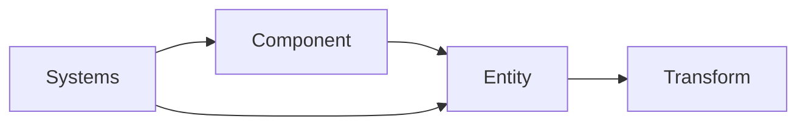
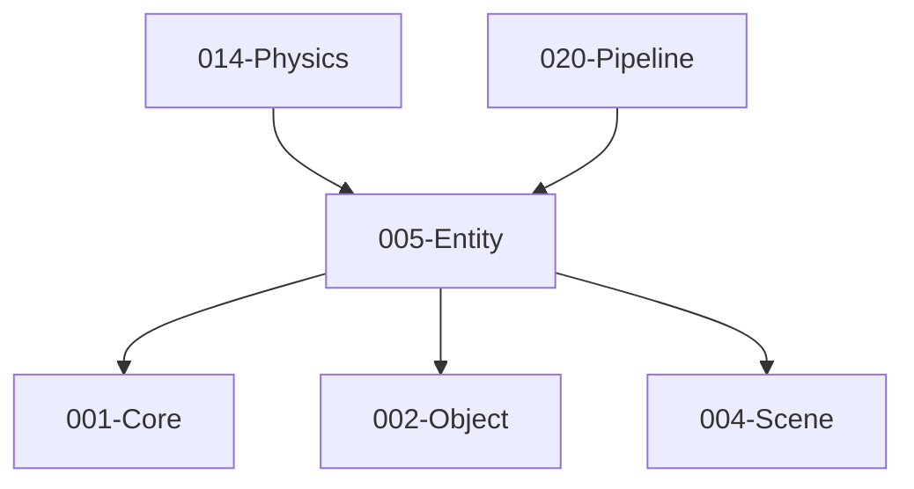

# 005-Entity 模块描述

## 1. 模块简要说明

Entity 提供**实体与组件模型**（或可选 ECS 风格），对应 Unreal 的 **Actor/Component**、Unity 的 **GameObject/Component** 与 **Entities (DOTS)**。依赖 Core、Object、Scene。

## 2. 详细功能描述

- **实体**：与场景节点绑定或独立的实体 ID、生命周期、启用/禁用。
- **组件**：组件挂载、组件查询、依赖 Entity 与 Scene 的变换与层级。
- **可选 ECS**：Entity-Component-System 架构、Archetype、System 调度，可与传统组件模型并存或二选一。

## 3. 实现难度

**中高**。组件与反射/序列化联动；若支持 ECS 需与 Scene/组件模型统一或明确边界。

## 4. 操作的资源类型

- **内存**：实体表、组件表、Archetype（若 ECS）。
- **无直接文件/GPU**：实体/组件数据可序列化（Object），渲染数据由 Pipeline 等消费。

## 5. 是否有子模块

有。

### 5.1 子模块说明

| 子模块 | 职责 |
|--------|------|
| Entity | 实体 ID、与 Scene 节点关联、生命周期、启用/禁用 |
| Component | 组件注册、挂载/卸载、组件类型查询、与 Object 反射联动 |
| Transform | 与 Scene 节点共用的变换或实体专用变换组件 |
| Systems（可选） | ECS System 注册、执行顺序、与主循环 Tick 集成 |

### 5.2 具体功能

Entity：CreateEntity、DestroyEntity、GetSceneNode、SetEnabled。  
Component：RegisterComponentType、AddComponent、RemoveComponent、GetComponent、与 Object 类型联动。  
Transform：GetLocalTransform、SetLocalTransform、GetWorldTransform。  
Systems：RegisterSystem、ExecutionOrder、Tick 集成。

### 5.3 子模块依赖图

## 6. 模块上下游

### 6.1 和上下游交互、传递的数据类型

- **上游**：Core、Object（类型/序列化）、Scene（节点、变换、层级）。  
- **下游**：Physics、Animation、Pipeline、Networking、Editor、XR。向下游提供：EntityId、ComponentHandle、Transform、ComponentQuery 接口。

### 6.2 上下游依赖图

## 7. 依赖的外部内容

| 类别 | 内容 |
|------|------|
| **Object** | 组件类型反射、序列化、属性编辑 |
| **Scene** | 实体与场景节点一一对应或映射关系 |
| **可选 ECS 库** | Flecs、EnTT 等，通过 Entity 模块抽象对外，保持上层 API 稳定 |
| **协议** | 无 |

## 待办

- **待办**：需随 `001-Core` 契约变更做适配（契约变更日期：2026-01-29；变更摘要：API 雏形由 plan 001-core-fullversion-001 同步，完整 7 子模块声明）。
