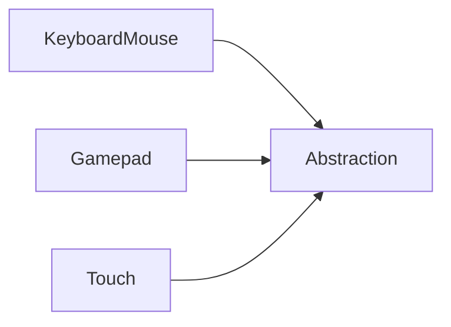
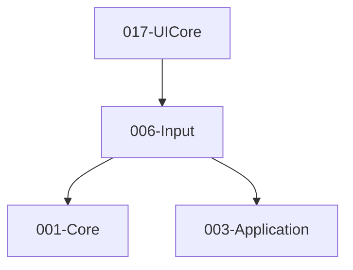

# 006-Input 模块描述

## 1. 模块简要说明

Input 提供**输入抽象与设备映射**：动作/轴抽象、键鼠/手柄/触摸，对应 Unreal 的 **InputCore**、Unity 的 **Input System** 与 Subsystems (Input)。依赖 Core、Application。

## 2. 详细功能描述

- **输入抽象**：动作/轴 ID、绑定表、与物理设备解耦、配置加载。
- **键鼠**：键盘状态、鼠标位置/增量/按钮、捕获与焦点。
- **手柄**：标准手柄按钮/摇杆/扳机、多手柄、震动（可选）。
- **触摸**：触摸点、多点触控、与平台触摸事件对接。

## 3. 实现难度

**中**。多设备与多平台需统一抽象；与 Application 事件泵的对接需清晰。

## 4. 操作的资源类型

- **系统资源**：输入设备句柄、焦点状态。
- **无 GPU 资源**：本模块不直接操作图形 API。

## 5. 是否有子模块

有。

### 5.1 子模块说明

| 子模块 | 职责 |
|--------|------|
| Abstraction | 动作/轴 ID、绑定表、与物理设备映射、配置加载 |
| KeyboardMouse | 键盘键状态、鼠标位置/增量/按钮、捕获、焦点 |
| Gamepad | 手柄枚举、按钮/摇杆/扳机、震动、多手柄 ID |
| Touch | 触摸点列表、ID、位置、阶段（Begin/Move/End）|

### 5.2 具体功能

Abstraction：ActionId、AxisId、BindingTable、MapDevice、LoadConfig。  
KeyboardMouse：GetKey、GetMousePosition、GetMouseDelta、SetCapture、Focus。  
Gamepad：GetGamepadCount、GetButton、GetAxis、SetVibration、DeviceId。  
Touch：GetTouchCount、GetTouch(id)、Phase。

### 5.3 子模块依赖图

## 6. 模块上下游

### 6.1 和上下游交互、传递的数据类型

- **上游**：Core（平台、容器）、Application（窗口、事件泵）。  
- **下游**：UICore、Editor、XR。向下游提供：ActionState、AxisValue、KeyCode、MouseState、GamepadState、TouchState。

### 6.2 上下游依赖图

## 7. 依赖的外部内容

| 类别 | 内容 |
|------|------|
| **平台 API** | 各平台输入 API |
| **跨平台（可选）** | SDL2 GameController、XInput（Windows）等，通过 Input 统一抽象 |
| **配置** | 键位/手柄映射可序列化（Object）或从配置文件加载（Core.Platform） |
| **协议** | 无 |
