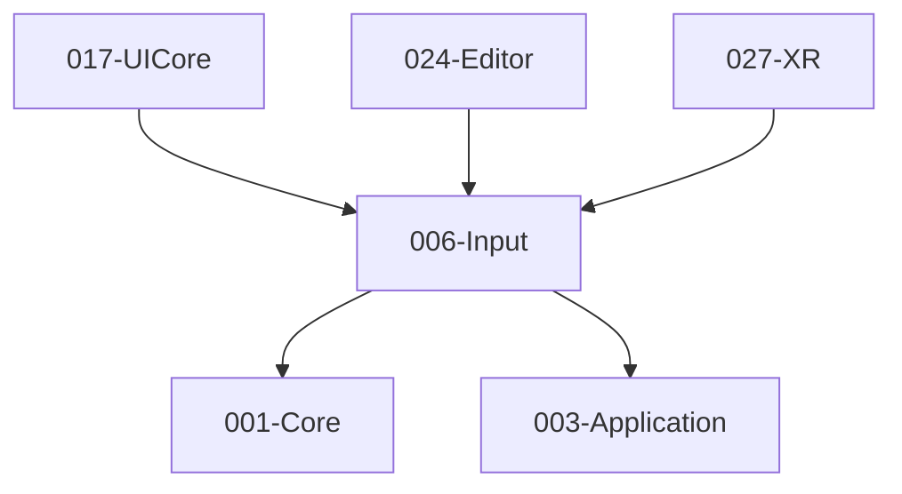
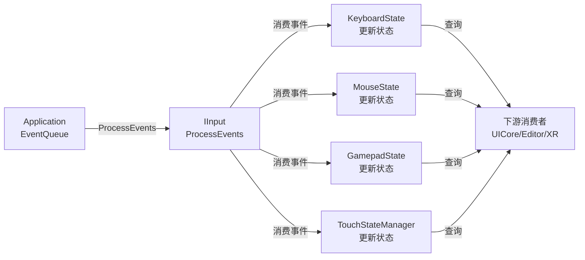

# 006-Input 模块描述

## 1. 模块简要说明

Input 提供**输入抽象与设备映射**：动作/轴抽象、键鼠/手柄/触摸，对应 Unreal 的 **InputCore**、Unity 的 **Input System** 与 Subsystems (Input)。依赖 Core、Application。

## 2. 详细功能描述

- **输入抽象**：动作/轴 ID、绑定表、与物理设备解耦、配置加载。
- **键鼠**：键盘状态、鼠标位置/增量/按钮、捕获与焦点。
- **手柄**：标准手柄按钮/摇杆/扳机、多手柄、震动（可选）。
- **触摸**：触摸点、多点触控、与平台触摸事件对接。

## 3. 实现难度

**中**。多设备与多平台需统一抽象；与 Application 事件泵的对接需清晰。

## 4. 操作的资源类型

- **系统资源**：输入设备句柄、焦点状态。
- **无 GPU 资源**：本模块不直接操作图形 API。

## 5. 是否有子模块

无。本模块采用单一接口设计（IInput），整合所有输入功能，类似 Application 模块的 IApplication 设计模式。

## 6. 模块上下游

### 6.1 和上下游交互、传递的数据类型

- **上游**：Core（平台、容器、线程）、Application（窗口、事件泵、EventQueue）。  
- **下游**：UICore、Editor、XR。向下游提供：ActionState、AxisValue、KeyCode、MouseState、GamepadState、TouchState。

### 6.2 上下游依赖图



## 7. 设计原则

### 7.1 接口整合

- 参考 Application 模块的 IApplication 设计，将所有输入功能整合到`IInput`接口
- 移除单例模式`GetInputService`，改为工厂函数`CreateInput`
- 整合键盘、鼠标、手柄、触摸、输入抽象到单一接口

### 7.2 事件集成方式

- **主要方式**：从 Application 的 EventQueue 直接消费事件（`ProcessEvents`方法）
- **可选方式**：通过 Application 的 TickCallback 注册，每帧自动处理
- 提供`ProcessEvents`方法，消费 Application 的 EventQueue 并更新内部状态

### 7.3 命名规范

- 使用 PascalCase 命名（与 Application 和 Core 模块对齐）
- 命名空间：`te::input`
- 所有方法添加`per contract`注释

### 7.4 简化设计

- 移除复杂的单例模式
- 简化输入抽象的实现（保留 Action/Axis 但简化绑定表）
- 直接暴露状态查询接口，减少中间层

## 8. 接口设计

### 8.1 核心接口：IInput

IInput 接口整合所有输入功能：
- 事件处理：`ProcessEvents(EventQueue const&)`
- 键盘输入：`GetKey`、`GetKeyDown`、`GetKeyUp`
- 鼠标输入：`GetMouseButton`、`GetMouseButtonDown`、`GetMouseButtonUp`、`GetMousePosition`、`GetMouseDelta`、`SetMouseCapture`、`SetFocusWindow`
- 手柄输入：`GetGamepadCount`、`GetGamepadButton`、`GetGamepadAxis`、`SetGamepadVibration`
- 触摸输入：`GetTouchCount`、`GetTouch`
- 输入抽象：`GetActionState`、`GetAxisValue`、`RegisterAction`、`RegisterAxis`、`BindActionToKey`、`BindAxisToKey`、`BindAxisToGamepadAxis`、`LoadBindingConfig`

### 8.2 工厂函数

- `IInput* CreateInput();`：创建输入实例
- `IInput* CreateInput(IApplication* application);`：创建输入实例并关联 Application（可选自动事件处理）

### 8.3 类型定义

**InputTypes.h**:
- `KeyCode`枚举：键盘键码（与物理设备解耦）
- `MouseButton`枚举：鼠标按钮（Left/Right/Middle等）
- `GamepadButton`枚举：手柄按钮（A/B/X/Y/Shoulder等）
- `GamepadAxis`枚举：手柄轴（LeftStickX/Y、RightStickX/Y、Trigger等）
- `TouchPhase`枚举：触摸阶段（Begin/Move/End/Cancel）
- `TouchState`结构：触摸点状态（id、position、phase）
- `ActionId`类型：动作ID（uint32_t）
- `AxisId`类型：轴ID（uint32_t）

## 9. 实现架构

### 9.1 类结构

```
IInput (主接口，整合所有输入功能)
├── 事件处理（ProcessEvents）
├── 键盘输入（GetKey/GetKeyDown/GetKeyUp）
├── 鼠标输入（GetMouseButton/GetMousePosition/SetCapture等）
├── 手柄输入（GetGamepadCount/GetButton/GetAxis/SetVibration）
├── 触摸输入（GetTouchCount/GetTouch）
└── 输入抽象（Action/Axis绑定）

Input (IInput实现)
├── KeyboardState (键盘状态管理)
│   ├── 当前帧按键状态
│   ├── 上一帧按键状态（用于GetKeyDown/GetKeyUp）
│   └── 按键映射（KeyCode -> 状态）
├── MouseState (鼠标状态管理)
│   ├── 按钮状态
│   ├── 位置和增量
│   └── 捕获状态
├── GamepadState (手柄状态管理)
│   ├── 多手柄状态数组
│   └── 手柄枚举和更新
├── TouchStateManager (触摸状态管理)
│   └── 触摸点列表
└── InputBinding (输入绑定管理)
    ├── Action绑定表
    ├── Axis绑定表
    └── 配置加载
```

### 9.2 事件处理流程



## 10. 与Application集成

### 10.1 方式1：直接消费EventQueue（推荐）

```cpp
// 在主循环中
auto* app = te::application::CreateApplication();
auto* input = te::input::CreateInput(app);

app->Run({
    .windowTitle = "Game",
    .windowWidth = 1280,
    .windowHeight = 720,
    .tickCallback = [&](float deltaTime) {
        // 每帧处理事件
        input->ProcessEvents(app->GetEventQueue());
        
        // 查询输入状态
        if (input->GetKeyDown(KeyCode::Space)) {
            // 处理跳跃
        }
    }
});
```

### 10.2 方式2：TickCallback自动处理（可选）

```cpp
// Input内部可以注册TickCallback自动处理
class Input : public IInput {
    void Initialize(te::application::IApplication* app) {
        m_app = app;
        m_tickCallbackId = app->RegisterTickCallback(
            [this](float deltaTime) {
                ProcessEvents(m_app->GetEventQueue());
            },
            100  // 高优先级，确保在其他系统之前处理
        );
    }
};
```

## 11. 主要变更（2026-02-06重新设计）

### 11.1 接口整合
- **移除**：`IInputService`单例模式，`GetInputService()`
- **新增**：`IInput`接口，`CreateInput()`工厂函数
- **整合**：所有输入功能到单一接口

### 11.2 事件处理
- **新增**：`ProcessEvents(EventQueue const&)`方法
- **改进**：直接从 Application 的 EventQueue 消费事件
- **简化**：移除复杂的事件订阅机制

### 11.3 状态查询
- **改进**：添加`GetKeyDown`/`GetKeyUp`方法（基于上一帧状态）
- **改进**：添加`GetMouseButtonDown`/`GetMouseButtonUp`方法（基于上一帧状态）
- **改进**：鼠标增量计算（基于上一帧位置）
- **统一**：所有状态查询方法使用 PascalCase 命名

### 11.4 输入抽象
- **保留**：Action/Axis 抽象功能
- **简化**：绑定表实现，减少复杂性
- **改进**：绑定方法使用更清晰的 API

### 11.5 命名和注释
- **统一**：所有方法使用 PascalCase（GetKey、GetMousePosition等）
- **注释**：所有方法添加`per contract`标注
- **命名空间**：`te::input`

## 12. 注意事项

- 所有错误处理使用 Core 模块的`te::core::Log`和`CheckError`
- 遵循 ABI 契约，确保接口签名与文档一致
- 线程安全：状态查询方法应该是线程安全的（使用 mutex 保护）
- 资源管理：使用 RAII，确保资源正确释放
- 与 Application 集成：通过 EventQueue 消费事件，不直接访问 Application 内部
- 命名规范：使用 PascalCase，对齐 Core 和 Application 模块风格
