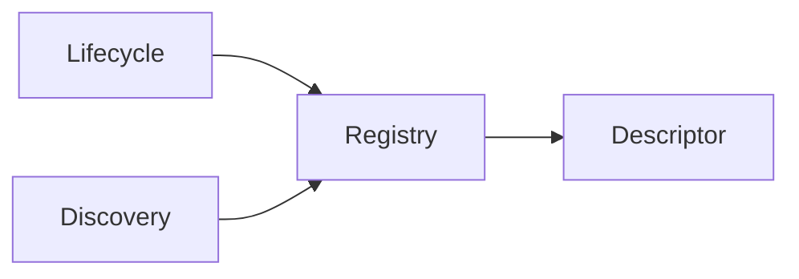
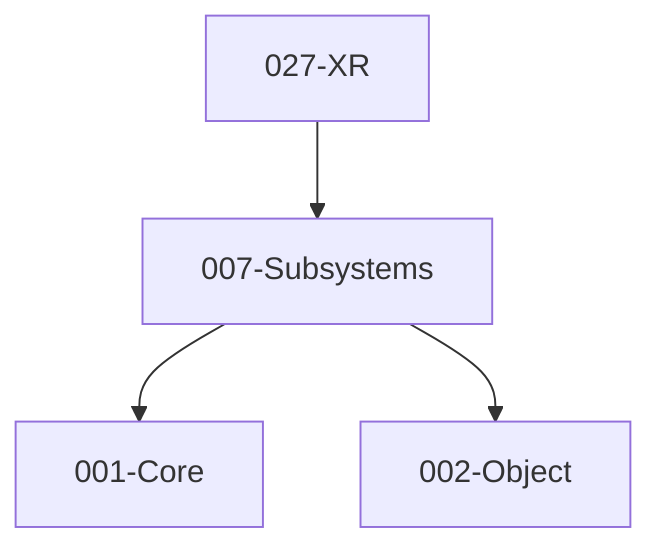

# 007-Subsystems 模块描述

## 1. 模块简要说明

Subsystems 提供**可插拔子系统**的注册与生命周期：描述符、注册、Initialize/Start/Stop/Shutdown，对应 Unreal 中部分 **Engine** 子系统、Unity 的 **Subsystems**（Display、XR 等）。依赖 Core、Object。

## 2. 详细功能描述

- **描述符**：子系统类型、依赖、启动顺序、可选平台/配置条件。
- **注册**：启动时或按模块注册子系统、按类型/按接口查询。
- **生命周期**：Initialize / Start / Stop / Shutdown、与主循环或按需调用。
- **典型用途**：Display、XR、Input 扩展、音频设备等可插拔能力。

## 3. 实现难度

**中**。依赖顺序与生命周期需与 ModuleLoad、主循环协调；发现插件中的子系统需约定接口。

## 4. 操作的资源类型

- **内存**：描述符表、注册表、实例句柄。
- **无直接文件/GPU**：部分子系统内部可能使用平台或 GPU（如 XR），由具体实现负责。

## 5. 是否有子模块

有。

### 5.1 子模块说明

| 子模块 | 职责 |
|--------|------|
| Descriptor | 子系统元数据、依赖列表、优先级、平台过滤 |
| Registry | 注册表、按类型查询、单例或按实例管理 |
| Lifecycle | Initialize/Start/Stop/Shutdown 调用顺序、依赖顺序保证 |
| Discovery | 可选：运行时发现插件中的子系统并注册 |

### 5.2 具体功能

Descriptor：SubsystemDescriptor、Dependencies、Priority、PlatformFilter。  
Registry：Register、GetSubsystem<T>、Unregister。  
Lifecycle：InitializeAll、StartAll、StopAll、ShutdownAll、依赖拓扑排序。  
Discovery：ScanPlugins、RegisterFromPlugin。

### 5.3 子模块依赖图

## 6. 模块上下游

### 6.1 和上下游交互、传递的数据类型

- **上游**：Core（模块加载、内存）、Object（描述符可序列化、反射）。  
- **下游**：XR（作为子系统挂接）、Editor（子系统列表与开关）。向下游提供：ISubsystem、GetSubsystem<T>、Descriptor 元数据。

### 6.2 上下游依赖图

## 7. 依赖的外部内容

| 类别 | 内容 |
|------|------|
| **Object** | 子系统描述符可序列化、反射类型信息 |
| **Core.ModuleLoad** | 插件中子系统通过动态库发现与注册 |
| **平台** | 部分子系统依赖平台能力（Display、XR 运行时） |
| **协议** | 无 |

## 待办

- **待办**：需随 `001-Core` 契约变更做适配（契约变更日期：2026-01-29；变更摘要：API 雏形由 plan 001-core-fullversion-001 同步，完整 7 子模块声明）。
- **待办**：需随 `002-object` 契约变更做适配（契约变更日期：2026-01-29；变更摘要：API 雏形由 plan 002-object-minimal 同步（类型注册 + 简单序列化），及 plan 002-object-fullversion-001 同步（完整功能集））。
