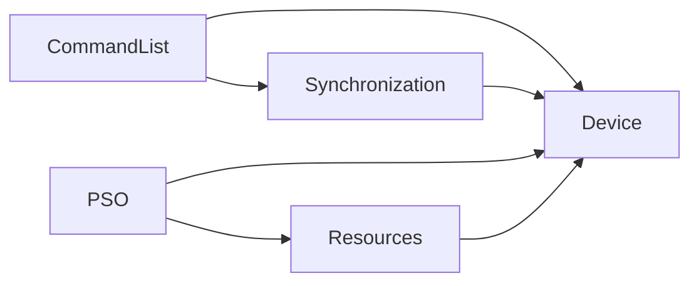
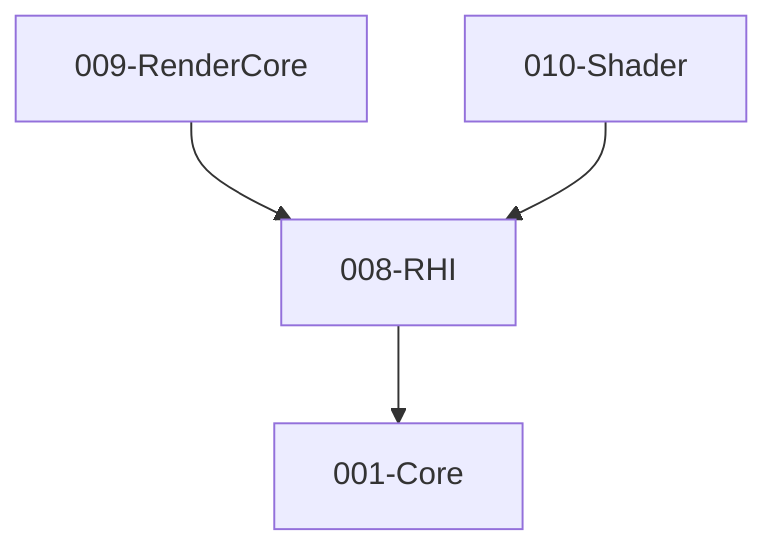

# 008-RHI 模块描述

## 1. 模块简要说明

RHI（Render Hardware Interface）提供**图形 API 抽象**，屏蔽 Vulkan/D3D12/Metal 等后端差异，对应 Unreal 的 **RHI/RHICore**、Unity 的底层图形封装。仅依赖 Core。

## 2. 详细功能描述

- **命令列表**：录制绘制/计算/拷贝命令、资源屏障、提交到队列。
- **资源**：缓冲、纹理、采样器、资源视图（SRV/UAV/RTV/DSV 等概念）、内存管理与生命周期。
- **PSO**：管线状态对象（着色器、混合、深度、光栅化等）、与 RenderCore/Shader 对接。
- **多后端与接口**：支持 **Vulkan**、**Metal（MTL）**、**D3D12/DXIL** 等图形接口；Shader 字节码/源码涉及 **GLSL**、**HLSL/DXIL**、**MSL** 等（与 010-Shader 对接）。运行时或**编译期**选择后端；**可以通过宏来判断执行哪一段代码**（如 `TE_RHI_VULKAN`、`TE_RHI_METAL`、`TE_RHI_D3D12` 等），编译时选择后端相关实现路径，统一接口。
- **渲染资源显式控制位置**：**准备/创建/更新 GPU 资源**（**CreateDeviceResource**、**UpdateDeviceResource**）由本模块提供；**提交到实际 GPU Command**（**SubmitCommandBuffer**）即 executeLogicalCommandBuffer、submitCommandList。创建逻辑渲染资源、CollectCommandBuffer、PrepareRenderMaterial/Mesh 见 019-PipelineCore/020-Pipeline。
- **同步**：Fence、Semaphore、资源屏障、多队列同步。

## 3. 实现难度

**高**。多后端需统一抽象且兼顾各 API 特性；PSO 与资源生命周期、同步容易出错；需配合调试层与工具链。

## 4. 操作的资源类型

- **GPU 资源**：Buffer、Texture、Sampler、RenderTarget、DepthStencil、ShaderModule、PSO。
- **系统资源**：Device、Queue、Fence、CommandPool/CommandBuffer。
- **内存**：上传/下载暂存缓冲、描述符池。

## 5. 是否有子模块

有。

### 5.1 子模块说明

| 子模块 | 职责 |
|--------|------|
| Device | 设备创建、队列、特性检测、后端选择 |
| CommandList | 命令缓冲录制、Draw/Dispatch/Copy、资源屏障、提交 |
| Resources | Buffer、Texture、Sampler 创建与视图、内存管理、生命周期 |
| PSO | 管线状态对象、与 Shader 字节码/模块绑定、缓存与编译 |
| Synchronization | Fence、Semaphore、资源屏障、多队列同步 |

### 5.2 具体功能

Device：CreateDevice、GetQueue、GetFeatures、SelectBackend。  
CommandList：Begin/End、Draw、Dispatch、Copy、ResourceBarrier、Submit。  
Resources：CreateBuffer、CreateTexture、CreateSampler、CreateView、Destroy。  
PSO：CreateGraphicsPSO、CreateComputePSO、SetShader、Cache。  
Synchronization：CreateFence、CreateSemaphore、Wait、Signal、DestroyFence、DestroySemaphore、ResourceBarrier。

### 5.3 子模块依赖图

## 6. 模块上下游

### 6.1 和上下游交互、传递的数据类型

- **上游**：Core（内存、平台、日志）。  
- **下游**：RenderCore、Shader、PipelineCore、Pipeline、Editor、XR。向下游提供：IDevice、ICommandList、IBuffer、ITexture、IPSO、Fence、描述符与句柄（不暴露后端类型）。

### 6.2 上下游依赖图

## 7. 依赖的外部内容

| 类别 | 内容 |
|------|------|
| **图形 API** | **Vulkan**、**D3D11**、**D3D12/DXIL**、**Metal（MTL）**（及 **GLSL**、**HLSL/DXIL**、**MSL** 等 Shader 接口，与 010-Shader 对接） |
| **第三方** | 见 `specs/_contracts/008-rhi-public-api.md`「第三方依赖」小节。 |
| **可选封装** | DXGI（D3D11/D3D12）、MoltenVK（Vulkan on Metal）等 |
| **调试** | Validation Layer（Vulkan）、D3D12 Debug Layer、RenderDoc、PIX |
| **构建** | 按平台/后端**宏**条件编译（如 TE_RHI_VULKAN、TE_RHI_METAL、TE_RHI_D3D12）；**可通过宏选择执行哪一段代码**；着色器编译与 PSO 缓存管线（可与 Shader 模块联动） |
| **协议** | 无业务协议；API 约定即契约 |

## 8. 后端与光追（008-rhi-fullmodule-004）

- **D3D11 后端**：支持 `Backend::D3D11`（`TE_RHI_D3D11` 且 WIN32）。单队列（Graphics）；`ResourceBarrier` 为 no-op（D3D11 无显式资源转换）；BeginRenderPass/CopyBuffer* 等为 API 占位，与 D3D12/Vulkan 行为一致。线程约束见 FR-007（单线程录制或按后端文档）。
- **光追（DXR）**：类型与接口见 `te/rhi/raytracing.hpp`（`BuildAccelerationStructure`、`DispatchRays`）。**仅 D3D12 后端**在 SDK 支持时可实现；Vulkan/Metal/D3D11 调用为 no-op。

## 待办

- **待办**：需随 `001-Core` 契约变更做适配（契约变更日期：2026-01-29；变更摘要：契约由 plan 001-core-fullversion-001 同步，完整 7 子模块声明）。
