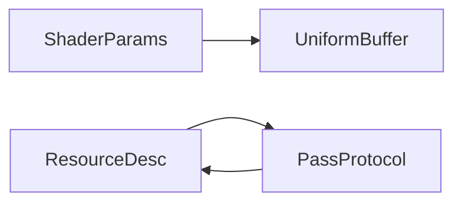
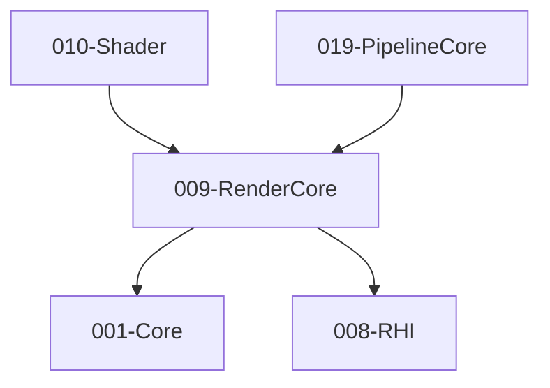

# 009-RenderCore 模块描述

## 1. 模块简要说明

RenderCore 提供**渲染类型与 Pass 协议**，介于 RHI 与管线之间：Shader 参数结构、渲染资源描述、Pass 参数协议、Uniform Buffer，对应 Unreal 的 **RenderCore**、Unity 的 **SRP Core** 中的渲染类型部分。依赖 Core、RHI。

## 2. 详细功能描述

- **Shader 参数结构**：Uniform Buffer 布局、常量块、与 Shader 的绑定约定。
- **渲染资源描述**：顶点/索引格式、纹理/缓冲描述、与 RHI 资源的桥接。
- **Pass 参数协议**：Pass 输入/输出资源声明、与 PipelineCore 的 RDG 风格协议对接。
- **Uniform Buffer**：布局定义、与 Shader 模块的接口、多帧/多 Pass 更新策略。

## 3. 实现难度

**中高**。与 RHI、Shader、PipelineCore 的接口需一致；Uniform 布局与反射或手写约定需统一。

## 4. 操作的资源类型

- **逻辑资源**：Uniform 布局描述、顶点/索引格式描述、Pass 资源声明（句柄，非 GPU 资源本身）。
- **与 RHI 桥接**：创建缓冲/纹理时使用本模块的描述；不直接持有 GPU 资源。

## 5. 是否有子模块

有。

### 5.1 子模块说明

| 子模块 | 职责 |
|--------|------|
| ShaderParams | Uniform 布局、常量块、与 Shader 反射或手写布局对接 |
| ResourceDesc | 顶点/索引格式、纹理/缓冲描述、与 RHI 创建参数对接 |
| PassProtocol | Pass 输入/输出声明、资源生命周期、与 PipelineCore 的图协议 |
| UniformBuffer | 布局、更新、多帧环缓冲、与 RHI 缓冲绑定 |

### 5.2 具体功能

ShaderParams：DefineLayout、GetOffset、与 Shader 名称/类型一致。  
ResourceDesc：VertexFormat、IndexFormat、TextureDesc、BufferDesc、与 RHI 对接。  
PassProtocol：DeclareRead、DeclareWrite、ResourceLifetime、与 PipelineCore RDG 对接。  
UniformBuffer：CreateLayout、Update、RingBuffer、Bind。

### 5.3 子模块依赖图

## 6. 模块上下游

### 6.1 和上下游交互、传递的数据类型

- **上游**：Core（内存、数学）、RHI（Buffer、Texture、PSO 句柄）。  
- **下游**：Shader、Material、Mesh、PipelineCore、Pipeline、Effects、2D、Terrain。向下游提供：UniformLayout、VertexFormat、PassResourceDecl、UniformBufferHandle。

### 6.2 上下游依赖图

## 7. 依赖的外部内容

| 类别 | 内容 |
|------|------|
| **RHI** | 缓冲/纹理创建、绑定槽位、与后端格式映射 |
| **Shader** | 反射或约定好的 Uniform 名称/布局，与 RenderCore 布局一致 |
| **可选** | 着色器反射工具（SPIR-V 解析等）用于自动生成布局 |
| **协议** | 无 |
