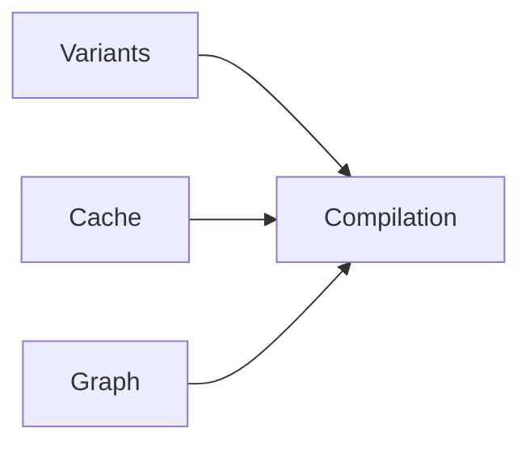
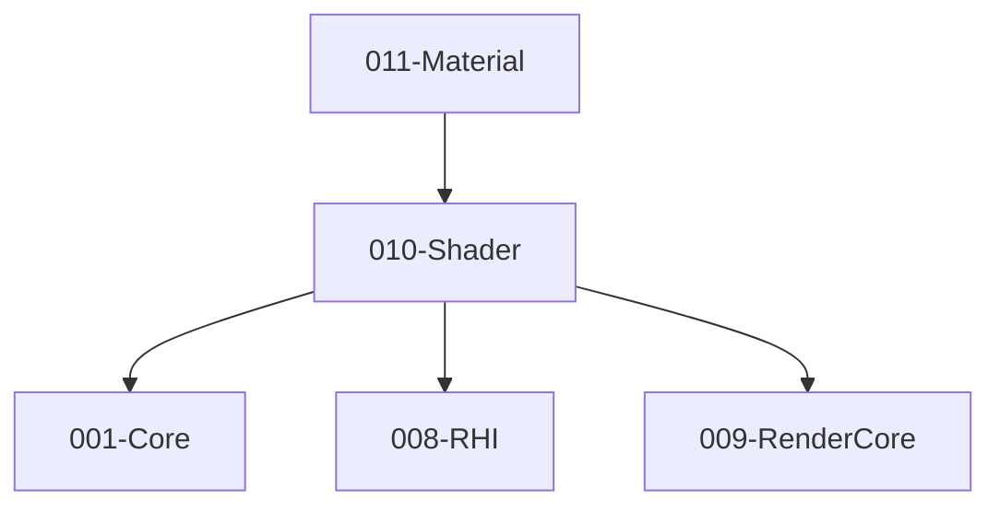

# 010-Shader 模块描述

## 1. 模块简要说明

Shader 提供**着色器编译、变体与预编译**（可选 Shader Graph 式编辑），对应 Unreal 的 **RenderCore + 材质系统** 中的 Shader 部分、Unity 的 **Shader Graph** 与内置 Shader。依赖 Core、RHI、RenderCore。

## 2. 详细功能描述

- **Shader 编译**：源码/HLSL 等编译、多后端（SPIR-V/DXIL/MSL）产出、编译选项与错误报告。
- **变体**：关键字/宏变体、变体集合、按需或预编译。
- **预编译**：离线编译、缓存、与资源管线集成。
- **Shader Graph 式编辑（可选）**：节点图编辑、导出为 Shader 源码或中间表示。

## 3. 实现难度

**高**。多后端编译与变体管理复杂；与 RenderCore Uniform 布局、RHI PSO 的对接需严格；可选 Graph 增加工具链与运行时复杂度。

## 4. 操作的资源类型

- **文件/内存**：源码、中间表示、编译产物（字节码）、变体键与缓存。
- **与 RHI 对接**：ShaderModule/PSO 创建时使用本模块产出的字节码；不直接持有 GPU 资源。

## 5. 是否有子模块

有。

### 5.1 子模块说明

| 子模块 | 职责 |
|--------|------|
| Compilation | 源码/HLSL 等编译、多后端目标、编译选项与错误报告 |
| Variants | 关键字/宏、变体枚举、变体键与缓存 |
| Cache | 预编译缓存、磁盘/资源管线、增量编译 |
| Graph（可选） | 节点图、导出 Shader 或 IR、与 Material 联动 |

### 5.2 具体功能

Compilation：Compile、GetBytecode、TargetBackend、ErrorReport。  
Variants：DefineKeyword、GetVariantKey、EnumerateVariants、Precompile。  
Cache：LoadCache、SaveCache、Invalidate、与 Resource 集成。  
Graph：NodeGraph、ExportSource/IR、与 Material 联动。

### 5.3 子模块依赖图

## 6. 模块上下游

### 6.1 和上下游交互、传递的数据类型

- **上游**：Core（文件、字符串）、RHI（后端类型、提交字节码）、RenderCore（Uniform 布局约定）。  
- **下游**：Material、Pipeline、Effects。向下游提供：ShaderHandle、VariantKey、Bytecode、Reflection（可选）。

### 6.2 上下游依赖图

## 7. 依赖的外部内容

| 类别 | 内容 |
|------|------|
| **编译器** | glslang、ShaderConductor、DXC、Xcode Metal 编译器，或引擎自研编译器 |
| **中间格式** | SPIR-V、DXIL、MSL，与 RHI 后端一一对应 |
| **可选** | Shader 反射（SPIR-V 解析）用于 Uniform 布局、RenderDoc 等调试工具 |
| **协议** | 无 |

## 待办

- **待办**：需随 `001-Core` 契约变更做适配（契约变更日期：2026-01-29；变更摘要：API 雏形由 plan 001-core-fullversion-001 同步，完整 7 子模块声明）。
