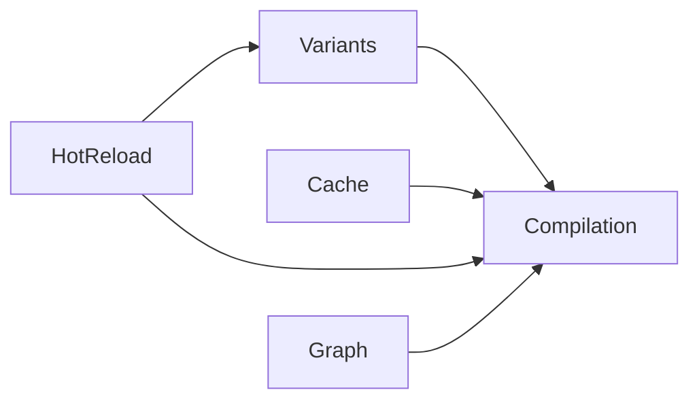
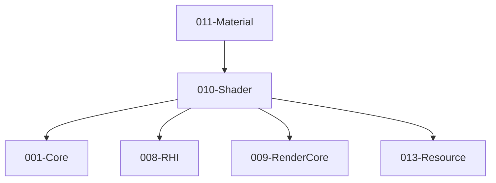

# 010-Shader 模块描述

## 1. 模块简要说明

Shader 提供**着色器编译、变体与预编译**（可选 Shader Graph 式编辑），对应 Unreal 的 **RenderCore + 材质系统** 中的 Shader 部分、Unity 的 **Shader Graph** 与内置 Shader。依赖 Core、RHI、RenderCore、**Resource**。**Shader 作为资产**由 013-Resource 统一加载；013 读 .shader、反序列化后以**仅内存**交本模块 **CreateShader**/Compile，010 不读文件、不发起加载，对 IResource 不可见。

## 2. 详细功能描述

- **源码格式**：支持加载 **HLSL**、**GLSL** 两种源码格式；按扩展名或显式类型识别，统一编译为后端字节码（SPIR-V/DXIL/MSL）。
- **Shader 编译**：源码（HLSL/GLSL）编译、多后端（SPIR-V/DXIL/MSL）产出、编译选项与错误报告。
- **变体与宏**：支持**宏**切换代码路径；关键字/宏变体、变体集合、按需或预编译；**游戏中可动态切换宏**，按新宏组合重新选择或编译变体并生效。
- **预编译**：离线编译、缓存、与资源管线集成。
- **实时更新**：支持 **Shader 热重载**；源码或宏变更后可**实时更新** Shader（重新编译/变体切换），无需重启应用即可在运行中生效。
- **Shader Graph 式编辑（可选）**：节点图编辑、导出为 Shader 源码或中间表示。

## 3. 实现难度

**高**。多后端编译与变体管理复杂；与 RenderCore Uniform 布局、RHI PSO 的对接需严格；可选 Graph 增加工具链与运行时复杂度。

## 4. 操作的资源类型

- **文件/内存**：源码、中间表示、编译产物（字节码）、变体键与缓存。**输入**由 013 传入（**ShaderAssetDesc** 或源码/字节码），010 不直接读 .shader 文件。**ShaderAssetDesc 归属原本模块 010-Shader**（本模块定义并注册，见 resource-logic-principles §8）。
- **与 RHI 对接**：ShaderModule/PSO 创建时使用本模块产出的字节码；不直接持有 GPU 资源。

## 5. 是否有子模块

有。

### 5.1 子模块说明

| 子模块 | 职责 |
|--------|------|
| Compilation | 源码（HLSL/GLSL）加载与编译、多后端目标、编译选项与错误报告 |
| Variants | 关键字/宏、变体枚举、变体键与缓存；运行时动态切换宏并生效 |
| Cache | 预编译缓存、磁盘/资源管线、增量编译；热重载时按需失效与重建 |
| HotReload（可选） | 监听源码/宏变更、重新编译、实时更新 Shader 并通知下游（Material/Pipeline） |
| Graph（可选） | 节点图、导出 Shader 或 IR、与 Material 联动 |

### 5.2 具体功能

Compilation：LoadSource(HLSL/GLSL)、Compile、GetBytecode、TargetBackend、ErrorReport。  
Variants：DefineKeyword、SetMacros、GetVariantKey、EnumerateVariants、Precompile；运行时 SetMacros/SelectVariant 动态切换宏。  
Cache：LoadCache、SaveCache、Invalidate、与 Resource 集成。  
HotReload：ReloadShader、OnSourceChanged、NotifyShaderUpdated；可选文件监听或编辑器触发。  
Graph：NodeGraph、ExportSource/IR、与 Material 联动。

### 5.3 子模块依赖图

## 6. 模块上下游

### 6.1 和上下游交互、传递的数据类型

- **上游**：Core（文件、字符串）、RHI（后端类型、提交字节码）、RenderCore（Uniform 布局约定）、**013-Resource**（010 依赖 013 契约，如 ResourceId/资源生命周期约定；013 在 Load(Shader) 时调用 010 CreateShader/Compile，传入内存中的描述/源码）。  
- **下游**：Material、Pipeline、Effects。向下游提供：ShaderHandle、VariantKey、Bytecode、Reflection（可选）。**数据归属**：Shader 资产由 013 以 IShaderResource 内部持有；010 仅产出的 ShaderHandle/字节码交给 013，010 对 IResource 不可见。

### 6.2 上下游依赖图

## 7. 依赖的外部内容

| 类别 | 内容 |
|------|------|
| **编译器** | glslang、ShaderConductor、DXC、Xcode Metal 编译器，或引擎自研编译器 |
| **中间格式** | SPIR-V、DXIL、MSL，与 RHI 后端一一对应 |
| **可选** | Shader 反射（SPIR-V 解析）用于 Uniform 布局、RenderDoc 等调试工具 |
| **协议** | 无 |

## 待办

- **待办**：需随 `001-Core` 契约变更做适配（契约变更日期：2026-01-29；变更摘要：契约由 plan 001-core-fullversion-001 同步，完整 7 子模块声明）。
