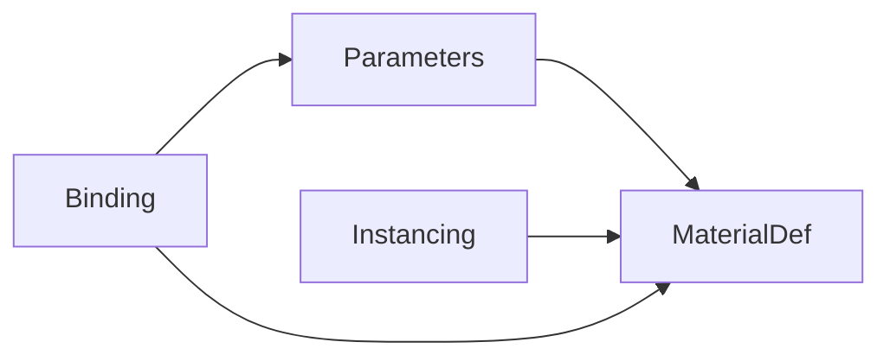
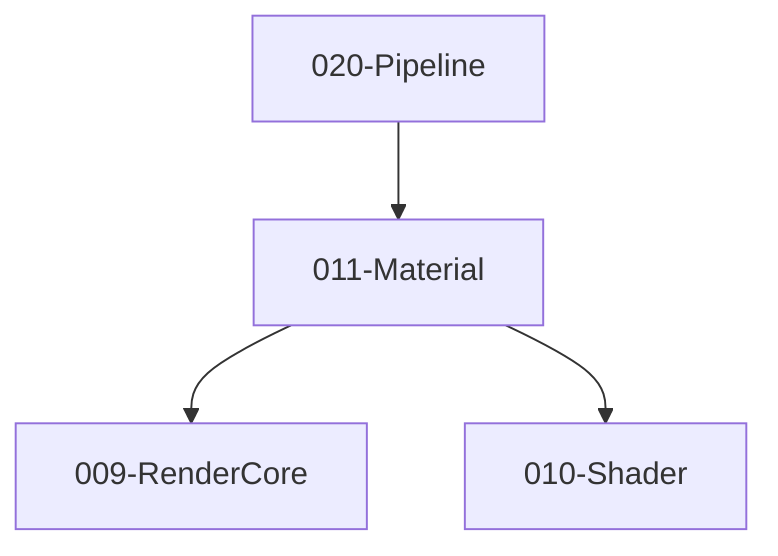

# 011-Material 模块描述

## 1. 模块简要说明

Material 提供**材质定义与 Shader 绑定**：材质资源、参数、与 Shader 绑定、材质实例，对应 Unreal 的 **Material**、Unity 的 **Material**。依赖 RenderCore、Shader。

## 2. 详细功能描述

- **材质定义**：材质资源、参数列表、与 Shader 的绑定、默认值。
- **参数**：标量/向量/纹理/缓冲等参数、与 Uniform 或绑定槽的映射。
- **与 Shader 绑定**：选择 Shader、选择变体、参数覆盖。
- **材质实例**：基于母材质实例化、运行时覆盖参数、与 Pipeline 的 DrawCall 对接。

## 3. 实现难度

**中**。与 RenderCore Uniform/纹理槽、Shader 变体、Pipeline 提交接口需一致；实例池与生命周期需清晰。

## 4. 操作的资源类型

- **内存/逻辑**：材质定义、参数表、实例数据、与 Resource 的材质/纹理引用（句柄）。
- **与 RHI/RenderCore**：通过 Pipeline 提交时绑定 PSO 与资源；本模块不直接持有 GPU 资源。

## 5. 是否有子模块

有。

### 5.1 子模块说明

| 子模块 | 职责 |
|--------|------|
| MaterialDef | 材质资源、参数定义、默认值、与 Shader 的引用 |
| Parameters | 参数类型、槽位映射、与 RenderCore Uniform/纹理槽对接 |
| Instancing | 材质实例、覆盖参数、实例池与生命周期 |
| Binding | 与 Shader 变体、与 RHI PSO 的绑定、与 Pipeline 的提交接口 |

### 5.2 具体功能

MaterialDef：Load、GetParameters、GetDefaultValues、GetShaderRef。  
Parameters：SetScalar、SetTexture、SetBuffer、GetSlotMapping。  
Instancing：CreateInstance、SetOverride、Release、Pool。  
Binding：BindToPSO、GetVariantKey、SubmitToPipeline。

### 5.3 子模块依赖图

## 6. 模块上下游

### 6.1 和上下游交互、传递的数据类型

- **上游**：RenderCore（Uniform 布局、纹理槽）、Shader（Handle、VariantKey、Bytecode）。  
- **下游**：Pipeline、Effects、Editor。向下游提供：MaterialHandle、MaterialInstanceHandle、ParameterOverrides、BindData。

### 6.2 上下游依赖图

## 7. 依赖的外部内容

| 类别 | 内容 |
|------|------|
| **RenderCore** | Uniform 布局、纹理槽位约定 |
| **Shader** | 变体选择、参数名与类型一致 |
| **Resource** | 材质资源加载、纹理/缓冲引用（通过句柄，可不直接依赖 Resource 模块） |
| **可选** | 材质图编辑（节点图）与 Shader Graph 联动 |
| **协议** | 无 |
