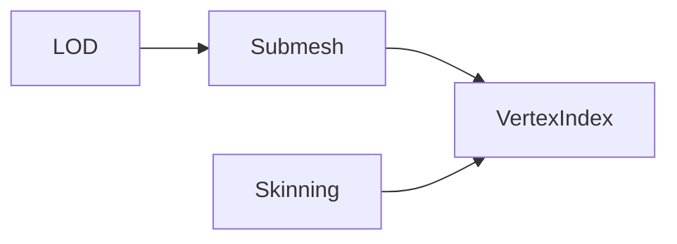
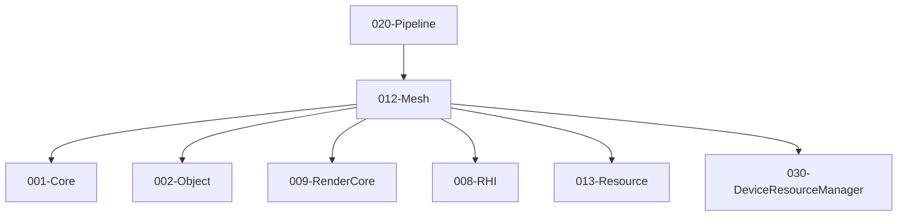

# 012-Mesh 模块描述

## 1. 模块简要说明

Mesh 提供**网格数据与几何**：顶点/索引缓冲、LOD、蒙皮、顶点格式，对应 Unreal 的 **StaticMesh/SkeletalMesh**、Unity 的 **Mesh/SkinnedMesh**。**Mesh 为可加载资产类型，继承自 IResource**；012 依赖 **013-Resource**（契约）。依赖 Core、Object、RenderCore、RHI、**Resource**、**DeviceResourceManager**（EnsureDeviceResources 时通过 030-DeviceResourceManager 调用 008-RHI 创建顶点/索引缓冲）。

## 2. 详细功能描述

- **来源格式**：Mesh 来源于**各种常用格式**的网格文件（如 OBJ、glTF、FBX），经 013 导入/加载并解析为引擎 .mesh 后，013 将**顶点/索引与子网格等内存数据**交本模块 **CreateMesh**；本模块通过导入器接口支持多种格式：fast_obj（OBJ）、cgltf（glTF/glB）、Assimp（通用格式）。DResource（顶点/索引缓冲）在 **EnsureDeviceResources** 时由本模块通过 030-DeviceResourceManager 调用 008-RHI 创建。
- **网格数据**：顶点缓冲、索引缓冲、顶点格式、子网格/段、LOD 级别、蒙皮数据（可选）。
- **资源管理**：MeshResource 实现 IMeshResource/IResource，提供 Load、LoadAsync、Save、Import、EnsureDeviceResources、EnsureDeviceResourcesAsync 等完整生命周期管理。
- **LOD**：多级 LOD、LOD 选择策略（基于距离或屏幕尺寸）、与 Resource 的流式配合（RequestStreaming）。
- **蒙皮**：骨骼索引与权重、BindPose 矩阵、与 Animation 的骨骼数据对接。
- **顶点/索引**：格式定义、与 RHI/RenderCore 的顶点布局对接；支持同步/异步 GPU 缓冲创建。
- **序列化**：MeshAssetDesc 通过 002-Object 注册类型，支持序列化/反序列化；.mesh 文件存储元数据，.meshdata 文件存储二进制数据。

## 3. 实现难度

**中**。顶点格式与 RenderCore/RHI 需一致；LOD 与流式、蒙皮与 Animation 的对接需清晰。

## 4. 操作的资源类型

- **输入**：013 读取并解析 .mesh（或由导入管线从 OBJ/glTF/FBX 等产出）后，将**顶点/索引、布局、子网格**等内存数据（MeshAssetDesc）交本模块 CreateMesh；本模块通过导入器接口支持外部格式导入。DResource 在 EnsureDeviceResources 时由 012 通过 030-DeviceResourceManager 调用 008-RHI 创建。
- **内存/缓冲**：顶点/索引数据、子网格描述、LOD 级别描述、蒙皮数据；与 RHI Buffer 的创建/绑定通过 030-DeviceResourceManager 和 Pipeline 或 RenderCore 桥接。
- **与 Resource**：012 依赖 013-Resource（Mesh 为可加载资产）；013 加载并解析 .mesh 后交 CreateMesh；LOD 流式通过 013 与句柄对接；可单独加载 Mesh 或经 Model 间接引用。
- **MeshAssetDesc 归属**：**MeshAssetDesc**（网格描述，含 formatVersion、顶点/索引布局、子网格等）归属 **012-Mesh**；.mesh 为 MeshAssetDesc 的序列化/磁盘格式（元数据），.meshdata 为二进制数据文件。013 解析 .mesh 得到 MeshAssetDesc 后交 012 CreateMesh。

## 5. 是否有子模块

有。

### 5.1 子模块说明

| 子模块 | 职责 |
|--------|------|
| VertexIndex | 顶点/索引格式、缓冲布局、与 RenderCore 格式映射 |
| Submesh | 子网格划分、材质槽位、DrawCall 批次 |
| LOD | LOD 级别、距离/屏幕尺寸选择、流式加载接口 |
| Skinning | 骨骼索引与权重、蒙皮数据、与 Animation 的骨骼矩阵对接 |

### 5.2 具体功能

VertexIndex：VertexFormat、IndexFormat、BufferLayout、与 RenderCore 对接；同步/异步 GPU 缓冲创建（EnsureDeviceResources、EnsureDeviceResourcesAsync）。  
Submesh：SubmeshCount、GetSubmesh、MaterialSlot、DrawCall 批次。  
LOD：LODCount、SelectLOD、RequestStreaming、与 Resource 对接。  
Skinning：BoneIndices、Weights、BindPose、与 Animation 骨骼矩阵对接。  
Resource：MeshResource 实现 IResource/IMeshResource；Load、LoadAsync、Save、Import、EnsureDeviceResources、EnsureDeviceResourcesAsync。  
Import：支持 OBJ（fast_obj）、glTF/glB（cgltf）、通用格式（Assimp）导入；通过 MeshResource::Import 调用。

### 5.3 子模块依赖图



## 6. 模块上下游

### 6.1 和上下游交互、传递的数据类型

- **上游**：Core（内存、容器、文件 I/O）、Object（类型注册、序列化/反序列化）、RenderCore（顶点格式、缓冲描述）、RHI（GPU 缓冲创建接口）、Resource（资源管理、加载/保存流程）、DeviceResourceManager（同步/异步 GPU 资源创建）。  
- **下游**：Pipeline、Terrain、Animation、013-Resource（013 调用 CreateMesh）。向下游提供：MeshHandle、VertexBufferHandle、IndexBufferHandle、SubmeshRange、LODLevel、SkinningData、MeshResource。

### 6.2 上下游依赖图



## 7. 文件结构设计

### 7.1 双文件分离

每个 Mesh 资源由两个文件组成：

- **AssetDesc 文件**：`resource.mesh`
  - 包含资源的元数据（formatVersion、vertexLayout、indexFormat、submeshes、lodLevels、skinningData 引用等）
  - 通过 002-Object 序列化/反序列化
  - vertexData 和 indexData 指针在序列化时设置为 nullptr（实际数据存储在 .meshdata 文件中）
- **数据文件**：`resource.meshdata`
  - 包含资源的实际数据（顶点数据 + 索引数据）
  - 二进制格式，布局：`[顶点数据] (vertexDataSize 字节) [索引数据] (indexDataSize 字节)`
  - 通过 001-Core 文件 I/O 读写

### 7.2 文件路径约定

- AssetDesc 文件：`path/to/resource.mesh`
- 数据文件：`path/to/resource.meshdata`
- 路径解析：ResourceManager 提供 ResolvePath(ResourceId) → 文件路径

## 8. MeshAssetDesc 设计

### 8.1 MeshAssetDesc 结构

```cpp
struct MeshAssetDesc {
  uint32_t formatVersion;              // 格式版本
  std::string debugDescription;         // 调试描述
  rendercore::VertexFormat vertexLayout; // 顶点格式
  void* vertexData;                    // 顶点数据指针（序列化时不保存）
  size_t vertexDataSize;               // 顶点数据大小
  void* indexData;                     // 索引数据指针（序列化时不保存）
  size_t indexDataSize;                // 索引数据大小
  rendercore::IndexFormat indexFormat; // 索引格式
  std::vector<SubmeshDesc> submeshes;  // 子网格列表
  std::vector<LODLevel> lodLevels;     // LOD 级别列表
  SkinningData* skinningData;          // 蒙皮数据（可选）
};
```

### 8.2 MeshAssetDesc 注册

在模块初始化时向 002-Object 注册 MeshAssetDesc 类型：

```cpp
// 在 InitializeMeshModule 中
TypeRegistry::RegisterType<MeshAssetDesc>(
    "MeshAssetDesc",
    TypeId::MeshAssetDesc,  // 0x01200001
    sizeof(MeshAssetDesc),
    // ... 属性描述符
);
```

## 9. 导入器架构

### 9.1 支持的格式

- **OBJ**：fast_obj（TENENGINE_USE_FAST_OBJ）或 Assimp 回退
- **glTF/glB**：cgltf（TENENGINE_USE_CGLTF）或 Assimp 回退
- **其他格式**：Assimp（TENENGINE_USE_ASSIMP）支持 FBX、3DS、DAE、BLEND 等

### 9.2 导入器接口

```cpp
// 导入器函数签名
bool ImportMeshFromFastObj(char const* sourcePath, MeshAssetDesc* outDesc);
bool ImportMeshFromCgltf(char const* sourcePath, MeshAssetDesc* outDesc);
bool ImportMeshFromAssimp(char const* sourcePath, MeshAssetDesc* outDesc);
```

### 9.3 导入流程

1. MeshResource::Import 检测文件格式（通过文件扩展名）
2. 根据格式选择对应的导入器（优先专用库，回退到 Assimp）
3. 导入器解析源文件，生成 MeshAssetDesc
4. 保存为引擎格式（.mesh + .meshdata）

## 10. GPU 资源创建

### 10.1 同步创建

```cpp
bool EnsureDeviceResources(MeshHandle h, rhi::IDevice* device);
```

通过 030-DeviceResourceManager::CreateDeviceBuffer 同步创建顶点和索引缓冲。

### 10.2 异步创建

```cpp
void EnsureDeviceResourcesAsync(MeshHandle h, rhi::IDevice* device,
                                void (*on_done)(void*), void* user_data);
```

通过 030-DeviceResourceManager::CreateDeviceBufferAsync 异步创建：
1. 异步创建顶点缓冲
2. 顶点缓冲完成后，异步创建索引缓冲
3. 索引缓冲完成后，调用用户回调

## 11. 依赖的外部内容

| 类别 | 内容 |
|------|------|
| **RenderCore** | 顶点格式、索引格式、缓冲描述 |
| **RHI** | GPU 缓冲创建接口（通过 030-DeviceResourceManager 调用） |
| **Resource** | 013 加载并解析 .mesh 后交 012 CreateMesh；LOD 流式通过句柄；Model 可引用多个 Mesh |
| **DeviceResourceManager** | 030-DeviceResourceManager 用于同步/异步创建 GPU 缓冲资源 |
| **Object** | 002-Object 用于 MeshAssetDesc 类型注册和序列化/反序列化 |
| **第三方库（可选）** | fast_obj（OBJ）、cgltf（glTF）、Assimp（通用格式） |
| **可选** | Mesh 优化/简化工具（LOD 生成）、蒙皮预计算 |
| **协议** | 无 |
