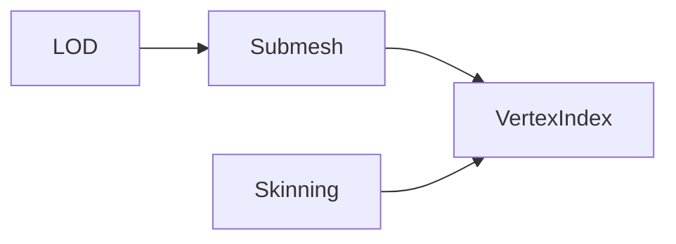
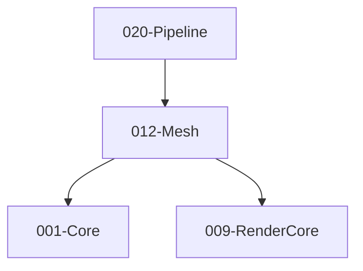

# 012-Mesh 模块描述

## 1. 模块简要说明

Mesh 提供**网格数据与几何**：顶点/索引缓冲、LOD、蒙皮、顶点格式，对应 Unreal 的 **StaticMesh/SkeletalMesh**、Unity 的 **Mesh/SkinnedMesh**。依赖 Core、RenderCore。

## 2. 详细功能描述

- **来源格式**：Mesh 来源于**各种常用格式**的网格文件，如 **OBJ**、**FBX** 等；由 Resource 按格式加载后，经本模块或导入管线转换为引擎顶点/索引与子网格表示。
- **网格数据**：顶点缓冲、索引缓冲、顶点格式、子网格/段。
- **LOD**：多级 LOD、LOD 选择策略、与 Resource 的流式配合。
- **蒙皮**：骨骼索引与权重、与 Animation 的骨骼数据对接。
- **顶点/索引**：格式定义、与 RHI/RenderCore 的顶点布局对接。

## 3. 实现难度

**中**。顶点格式与 RenderCore/RHI 需一致；LOD 与流式、蒙皮与 Animation 的对接需清晰。

## 4. 操作的资源类型

- **输入**：来自 **OBJ、FBX** 等常用格式的网格文件（或 Model 资源内的 Mesh 引用）；经 Resource 统一加载后由本模块解析为顶点/索引与子网格。
- **内存/缓冲**：顶点/索引数据、子网格描述、LOD 级别描述、蒙皮数据；与 RHI Buffer 的创建/绑定通过 Pipeline 或 RenderCore 桥接。
- **与 Resource**：网格资源加载、LOD 流式（通过句柄或接口）；可单独加载 Mesh 或通过 Model 资源间接引用。

## 5. 是否有子模块

有。

### 5.1 子模块说明

| 子模块 | 职责 |
|--------|------|
| VertexIndex | 顶点/索引格式、缓冲布局、与 RenderCore 格式映射 |
| Submesh | 子网格划分、材质槽位、DrawCall 批次 |
| LOD | LOD 级别、距离/屏幕尺寸选择、流式加载接口 |
| Skinning | 骨骼索引与权重、蒙皮数据、与 Animation 的骨骼矩阵对接 |

### 5.2 具体功能

VertexIndex：VertexFormat、IndexFormat、BufferLayout、与 RenderCore 对接。  
Submesh：SubmeshCount、GetSubmesh、MaterialSlot、DrawCall 批次。  
LOD：LODCount、SelectLOD、StreamingRequest、与 Resource 对接。  
Skinning：BoneIndices、Weights、BindPose、与 Animation 骨骼矩阵对接。

### 5.3 子模块依赖图

## 6. 模块上下游

### 6.1 和上下游交互、传递的数据类型

- **上游**：Core（内存、容器）、RenderCore（顶点格式、缓冲描述）。  
- **下游**：Pipeline、Terrain、Editor。向下游提供：MeshHandle、VertexBufferHandle、IndexBufferHandle、SubmeshRange、LODLevel、SkinningData。

### 6.2 上下游依赖图

## 7. 依赖的外部内容

| 类别 | 内容 |
|------|------|
| **RenderCore** | 顶点格式、缓冲描述 |
| **RHI** | 缓冲创建与绑定（通常经 Pipeline 使用） |
| **Resource** | 网格资源加载（OBJ/FBX 等格式）、LOD 流式（通过句柄或接口）；Model 资源可引用多个 Mesh |
| **可选** | Mesh 优化/简化工具（LOD 生成）、蒙皮预计算 |
| **协议** | 无 |

## 待办

- **待办**：需随 `001-Core` 契约变更做适配（契约变更日期：2026-01-29；变更摘要：契约由 plan 001-core-fullversion-001 同步，完整 7 子模块声明）。
