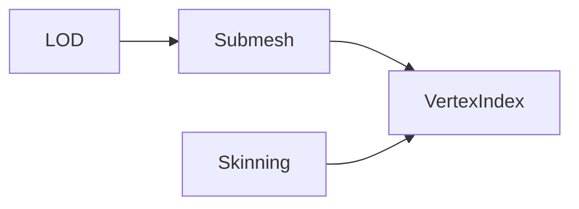
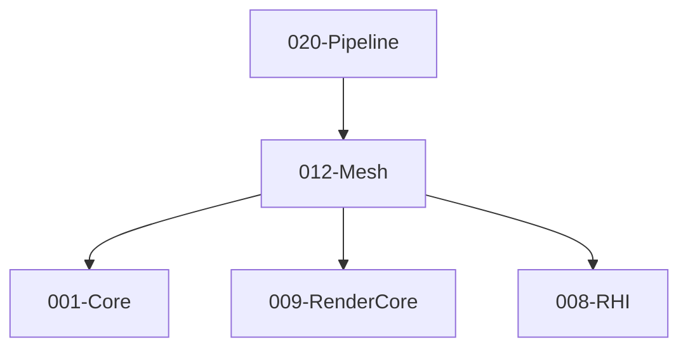

# 012-Mesh 模块描述

## 1. 模块简要说明

Mesh 提供**网格数据与几何**：顶点/索引缓冲、LOD、蒙皮、顶点格式，对应 Unreal 的 **StaticMesh/SkeletalMesh**、Unity 的 **Mesh/SkinnedMesh**。**Mesh 为可加载资产类型，继承自 IResource**；012 依赖 **013-Resource**（契约）。依赖 Core、RenderCore、RHI、**Resource**（EnsureDeviceResources 时由 012 调用 008 创建顶点/索引缓冲）。

## 2. 详细功能描述

- **来源格式**：Mesh 来源于**各种常用格式**的网格文件（如 OBJ、FBX），经 013 导入/加载并解析为引擎 .mesh 后，013 将**顶点/索引与子网格等内存数据**交本模块 **CreateMesh**；本模块不读文件、不解析格式，仅接受内存数据。DResource（顶点/索引缓冲）在 **EnsureDeviceResources** 时由本模块调用 008-RHI 创建。
- **网格数据**：顶点缓冲、索引缓冲、顶点格式、子网格/段。
- **LOD**：多级 LOD、LOD 选择策略、与 Resource 的流式配合。
- **蒙皮**：骨骼索引与权重、与 Animation 的骨骼数据对接。
- **顶点/索引**：格式定义、与 RHI/RenderCore 的顶点布局对接。

## 3. 实现难度

**中**。顶点格式与 RenderCore/RHI 需一致；LOD 与流式、蒙皮与 Animation 的对接需清晰。

## 4. 操作的资源类型

- **输入**：013 读取并解析 .mesh（或由导入管线从 OBJ/FBX 等产出）后，将**顶点/索引、布局、子网格**等内存数据交本模块 CreateMesh；本模块不解析文件。DResource 在 EnsureDeviceResources 时由 012 调用 008-RHI 创建。
- **内存/缓冲**：顶点/索引数据、子网格描述、LOD 级别描述、蒙皮数据；与 RHI Buffer 的创建/绑定通过 Pipeline 或 RenderCore 桥接。
- **与 Resource**：012 依赖 013-Resource（Mesh 为可加载资产）；013 加载并解析 .mesh 后交 CreateMesh；LOD 流式通过 013 与句柄对接；可单独加载 Mesh 或经 Model 间接引用。
- **MeshAssetDesc 归属**：**MeshAssetDesc**（网格描述，含 formatVersion、顶点/索引布局、子网格等）归属 **012-Mesh**；.mesh 为 MeshAssetDesc 的序列化/磁盘格式。013 解析 .mesh 得到 MeshAssetDesc 后交 012 CreateMesh。

## 5. 是否有子模块

有。

### 5.1 子模块说明

| 子模块 | 职责 |
|--------|------|
| VertexIndex | 顶点/索引格式、缓冲布局、与 RenderCore 格式映射 |
| Submesh | 子网格划分、材质槽位、DrawCall 批次 |
| LOD | LOD 级别、距离/屏幕尺寸选择、流式加载接口 |
| Skinning | 骨骼索引与权重、蒙皮数据、与 Animation 的骨骼矩阵对接 |

### 5.2 具体功能

VertexIndex：VertexFormat、IndexFormat、BufferLayout、与 RenderCore 对接。  
Submesh：SubmeshCount、GetSubmesh、MaterialSlot、DrawCall 批次。  
LOD：LODCount、SelectLOD、StreamingRequest、与 Resource 对接。  
Skinning：BoneIndices、Weights、BindPose、与 Animation 骨骼矩阵对接。

### 5.3 子模块依赖图

## 6. 模块上下游

### 6.1 和上下游交互、传递的数据类型

- **上游**：Core（内存、容器）、RenderCore（顶点格式、缓冲描述）、RHI（EnsureDeviceResources 时创建顶点/索引缓冲）。  
- **下游**：Pipeline、Terrain、Animation、013-Resource（013 调用 CreateMesh）。向下游提供：MeshHandle、VertexBufferHandle、IndexBufferHandle、SubmeshRange、LODLevel、SkinningData。

### 6.2 上下游依赖图

## 7. 依赖的外部内容

| 类别 | 内容 |
|------|------|
| **RenderCore** | 顶点格式、缓冲描述 |
| **RHI** | EnsureDeviceResources 时由 012 调用 008 创建顶点/索引缓冲（DResource） |
| **Resource** | 013 加载并解析 .mesh 后交 012 CreateMesh；LOD 流式通过句柄；Model 可引用多个 Mesh |
| **可选** | Mesh 优化/简化工具（LOD 生成）、蒙皮预计算 |
| **协议** | 无 |

## 待办

- **待办**：需随 `001-Core` 契约变更做适配（契约变更日期：2026-01-29；变更摘要：契约由 plan 001-core-fullversion-001 同步，完整 7 子模块声明）。
