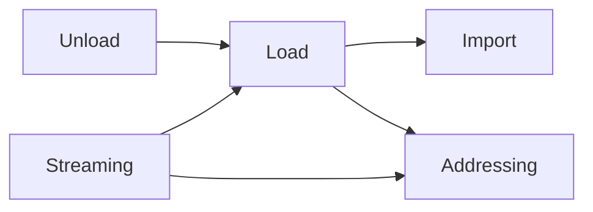
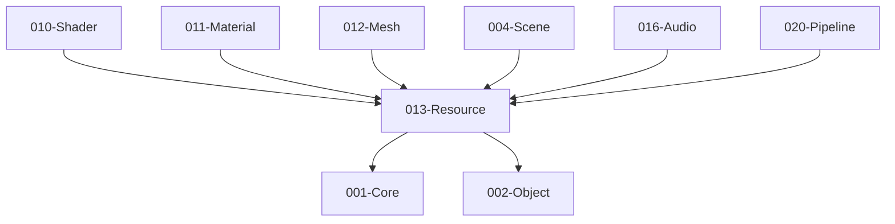

# 013-Resource 模块描述

## 1. 模块简要说明

Resource 提供**资源导入、加载与生命周期**：导入、同步/异步加载、卸载、流式与可寻址，对应 Unreal 的**资源系统/Asset Registry**、Unity 的 **Addressables/Asset Bundle** 与导入管线。

**重构核心**：
- **IResource 基类实现通用逻辑**：文件加载、GUID 管理、序列化调用、依赖解析等通用功能由 IResource 基类提供
- **各资源类型继承 IResource**：所有资源类型（Texture、Mesh、Material、Model 等）继承 IResource，实现具体的 Load、LoadAsync、Save、Import 方法
- **AssetDesc 与 Resource 组合**：Resource 持有 AssetDesc，两者都实现各自的序列化；AssetDesc 通过 002-Object 注册类型
- **双文件分离**：每个资源由 .desc（AssetDesc）和 .data（数据文件）两个文件组成
- **异步加载通过 LoadAsync**：IResource 提供 LoadAsync 方法，ResourceManager 调用
- **ResourceManager 简化为协调器**：ResourceManager 负责协调加载流程、缓存管理、异步调度，具体逻辑由 IResource 实现

**所有需要加载的资产类型均继承 IResource**（IMaterialResource、IMeshResource、ITextureResource、IModelResource、IShaderResource、ILevelResource : IResource）；**统一接口**：Load/Unload/Release/EnsureDeviceResources 等均针对 **IResource***（或对 ResourceId/句柄解析到 IResource），013 用同一套逻辑管理；**统一缓存**：013 的缓存存 **IResource***，按 **ResourceId** 查找，不为每种资源各写一套；**多态**：不同资源类型同一基类，代码更简单。**凡需加载或使用这些资源的模块均依赖 013-Resource**。**描述类型（*Desc）归属原本模块**：ShaderAssetDesc→010，MaterialAssetDesc→011，LevelAssetDesc/SceneNodeDesc→029-World，MeshAssetDesc→012，TextureAssetDesc→028-Texture。**013 仅依赖 Core、Object**；被 010-Shader、011-Material、012-Mesh、004-Scene、028-Texture、029-World 等资源类型模块依赖。各资源类型继承 IResource，实现 Load/Save/Import 方法，向 013 注册资源工厂。

## 2. 详细功能描述

### 2.1 IResource 基类职责

IResource 基类提供以下通用功能：

- **文件加载**：调用 001-Core 文件 I/O，读取 AssetDesc 文件和数据文件
- **GUID 管理**：调用 002-Object GUID 管理，生成、解析、映射 ResourceId
- **序列化协调**：调用 002-Object 序列化/反序列化接口，处理 AssetDesc
- **依赖解析**：解析资源依赖（GUID → ResourceId），递归加载依赖资源
- **异步加载支持**：提供异步加载的基础设施（线程、回调、状态管理）

### 2.2 各资源类型实现要求

各资源类型（如 MeshResource、TextureResource、MaterialResource）必须：

1. **继承 IResource 基类**
2. **实现 Load 方法**（同步加载）：
   - 调用基类的 `LoadAssetDesc` 读取并反序列化 AssetDesc（002-Object）
   - 调用基类的 `LoadDataFile` 读取数据文件（001-Core）
   - 调用基类的 `LoadDependency` 加载依赖资源（递归）
   - 实现资源特定的数据初始化逻辑
3. **实现 LoadAsync 方法**（异步加载）：
   - 在后台线程执行加载逻辑（与 Load 相同）
   - 使用基类提供的异步加载基础设施（线程管理、回调调度）
   - 在约定线程调用完成回调
4. **实现 Save 方法**：
   - 调用 002-Object 序列化 AssetDesc
   - 调用基类的 `SaveAssetDesc` 保存 AssetDesc 文件（001-Core）
   - 调用基类的 `SaveDataFile` 保存数据文件（001-Core）
   - 调用基类的 `GenerateGUID` 生成 GUID（如果需要）
5. **实现 Import 方法**（可选）：
   - 检测源文件格式
   - 转换源文件为引擎格式
   - 生成 AssetDesc（通过 002-Object 创建实例）
   - 调用基类的 `GenerateGUID` 生成 GUID
   - 调用基类的 `SaveAssetDesc` 和 `SaveDataFile` 保存文件

### 2.3 ResourceManager 职责

ResourceManager 简化为协调器和缓存管理器：

- **协调加载流程**：调用 IResource::Load（同步）或 IResource::LoadAsync（异步），管理加载队列和异步调度
- **缓存管理**：按 ResourceId 缓存 IResource*，提供 GetCached 查询
- **GUID 解析**：ResourceId → 路径解析，维护 GUID 映射表
- **异步调度**：管理加载线程、回调、状态跟踪（通过调用 IResource::LoadAsync）

### 2.4 资源导入、加载、卸载流程

- **资源导入**：导入器注册、格式检测、转换、元数据与依赖记录。由 IResource::Import 实现。
- **同步加载**：加载请求、依赖解析、加载队列与优先级。由 IResource::Load 实现，ResourceManager 协调。
- **异步加载**：加载请求、完成回调、依赖解析、加载队列与优先级。由 IResource::LoadAsync 实现，ResourceManager 协调异步调度。
- **卸载**：引用计数或 GC、卸载策略、与各模块资源句柄协调。由 IResource::Release 实现。

### 2.5 流式与可寻址

- **流式加载**：按需加载、地址/ID 寻址、与 Asset Bundle 风格打包。ResourceManager 提供 RequestStreaming、SetPriority。
- **可寻址**：ResourceId、GUID、可寻址路径、BundleMapping。ResourceManager 提供 ResolvePath。

**资源三态与引用方式（便于管理）**：所有资源可有三种形态，统一管理。  
- **FResource（硬盘形态）**：在**硬盘上**；由 AssetDesc 文件（.desc）和数据文件（.data）组成；**硬盘加载使用 FResource**。引用其他资源时，通过**全局唯一的 GUID** 引用（FResource 内不存指针，只存 GUID）。  
- **RResource（运行时/内存形态）**：**内存引用使用 RResource**；即实现 IResource 的对象。根据 FResource 的引用关系，在内存中通过**指针**引用其他资源（RResource 持有对其它 RResource 的指针）。**013 不创建 DResource**；DResource 槽位由 011/012/008 在 **EnsureDeviceResources** 时填充。  
- **DResource（GPU 形态）**：**GPU 类型资源**；由 **008/011/012 在 EnsureDeviceResources 时创建**，对 013 不可见；保存在 RResource 内部，由 RResource 管理生命周期与绑定。  
- **单形态资源**：部分资源可能**只存在某一形态**（例如仅 FResource 的元数据、仅 RResource 的运行时生成数据、或仅作为 RResource 内 DResource 的 GPU 资源），按需定义即可。

**模型相关资源层级**：**硬盘上的 Model 资源**引用 **Material** 和 **Mesh**（即 Model 资源文件内声明对若干 Material 与若干 Mesh 的引用）。**Material 资源**（引擎自有格式）引用**贴图**、**材质参数**与 **Shader**；材质当中保存了 Shader，并引用渲染 Shader 所需的参数值与贴图。Mesh 来源于 OBJ、FBX 等常用格式，可单独加载或经 Model 资源间接引用。模型渲染即 Mesh 与 Material 的组织：Model 资源组织「用哪些 Mesh、用哪些 Material」，Material 组织「用哪个 Shader、哪些贴图与参数」。

## 3. 实现难度

**高**。异步加载与依赖图、流式与 LOD/地形协同、与各模块句柄生命周期协同复杂；导入管线与多格式需扩展性设计。

## 4. 操作的资源类型

- **FResource**：硬盘上的资源表示；由 AssetDesc 文件（.desc）和数据文件（.data）组成；引用通过 **GUID**；硬盘加载时使用 FResource。
- **RResource**：内存中的资源表示；即实现 IResource 的对象；根据 FResource 的引用通过**指针**引用其他 RResource；**DResource 保存在 RResource 内部**。
- **DResource**：GPU 资源；由 **008/011/012 在 EnsureDeviceResources 时创建**，013 不创建、不持有；创建后由 RResource 内部持有，不单独跨对象引用。
- **文件/内存**：原始资源文件、导入产物、Bundle 文件；加载缓冲、元数据、依赖图、引用计数。部分资源可能只存在某一形态（仅 F、仅 R、或仅 R 内 D）。

## 5. 是否有子模块

有。

### 5.1 子模块说明

| 子模块 | 职责 |
|--------|------|
| Import | 导入器注册、格式检测、转换、元数据与依赖记录（由 IResource::Import 实现） |
| Load | 同步/异步加载 API、依赖解析、加载队列与优先级（由 IResource::Load/LoadAsync 实现，ResourceManager 协调） |
| Unload | 引用计数、GC 或显式卸载、与各模块资源句柄协调（由 IResource::Release 实现） |
| Streaming | 流式请求、优先级、与 LOD/地形等按需加载对接（ResourceManager 提供） |
| Addressing | 资源 ID/GUID、可寻址路径、与打包/Bundle 对应（ResourceManager 提供） |

### 5.2 具体功能

Import：IResource::Import、DetectFormat、Convert、Metadata、Dependencies。  
Load：IResource::Load（同步）、IResource::LoadAsync（异步）、ResourceManager::LoadSync、ResourceManager::RequestLoadAsync、ResolveDependencies、Queue、Priority。  
Unload：IResource::Release、GC、UnloadPolicy、与句柄协调。  
Streaming：RequestStreaming、SetPriority、与 LOD/Terrain 对接。  
Addressing：ResourceId、GUID、Address、BundleMapping。

### 5.3 子模块依赖图



## 6. 模块上下游

### 6.1 和上下游交互、传递的数据类型

- **上游（013 依赖谁）**：仅 **001-Core**（文件、内存、异步）、**002-Object**（序列化、反射、GUID/引用解析）。013 不依赖 010/011/012/004/028；各资源类型继承 IResource，实现 Load/Save/Import 方法。  
- **下游（谁依赖 013）**：**010-Shader、004-Scene、011-Material、012-Mesh、028-Texture、029-World**（资源类型实现 IResource，向 013 注册资源工厂）；016-Audio、020-Pipeline、022-2D、023-Terrain、024-Editor（调用 013 Load/GetCached 获取资源；仅持 ResourceId/句柄，不长期持有 IResource*）。向下游提供：ResourceId、LoadHandle、AsyncResult、StreamingHandle、Metadata。**数据归属**：IResource* 仅 013 内部持有或缓存。

### 6.2 上下游依赖图



## 7. 文件结构设计

### 7.1 双文件分离

每个资源由两个文件组成：

- **AssetDesc 文件**：`resource.mesh`（或 `.texture`、`.material` 等）
  - 包含资源的元数据（GUID、依赖列表、格式信息等）
  - 通过 002-Object 序列化/反序列化
- **数据文件**：`resource.mesh.data`（或 `.texture.data`、`.material.data` 等）
  - 包含资源的实际数据（顶点、纹理像素等）
  - 二进制格式，通过 001-Core 文件 I/O 读写

### 7.2 文件路径约定

- AssetDesc 文件：`path/to/resource.mesh`
- 数据文件：`path/to/resource.mesh.data`
- 路径解析：ResourceManager 提供 ResolvePath(ResourceId) → 文件路径

## 8. AssetDesc 设计

### 8.1 AssetDesc 与 Resource 的关系

- **组合关系**：Resource 持有 AssetDesc 指针或值
- **独立序列化**：AssetDesc 通过 002-Object 注册类型，实现序列化
- **Resource 序列化**：Resource 在 Save 时序列化 AssetDesc，在 Load 时反序列化 AssetDesc

### 8.2 AssetDesc 结构示例

```cpp
// 示例：MeshAssetDesc（归属 012-Mesh）
struct MeshAssetDesc {
    GUID guid;
    std::vector<GUID> materialDependencies;  // 依赖的 Material GUID
    std::vector<GUID> textureDependencies;  // 依赖的 Texture GUID
    // ... 其他元数据
    // 通过 002-Object 注册，支持序列化
};
```

### 8.3 AssetDesc 注册

各资源类型模块在初始化时向 002-Object 注册 AssetDesc 类型：

```cpp
// 在模块初始化时
TypeRegistry::RegisterType<MeshAssetDesc>(
    "MeshAssetDesc",
    TypeId::MeshAssetDesc,
    sizeof(MeshAssetDesc),
    // ... 其他参数
);
```

## 9. 依赖的外部内容

| 类别 | 内容 |
|------|------|
| **Object** | 序列化、反射、GUID/引用解析（IResource 调用 ISerializer::Serialize/Deserialize） |
| **平台** | 文件 I/O、异步 I/O（Core.Platform 或 OS API，IResource 调用） |
| **可选** | 压缩库、加密、资源包格式（自定义或现成格式） |
| **工具** | 资源管线、打包工具、与 Tools 模块联动 |
| **协议** | 资源包格式、可寻址路径约定 |

## 待办

- **待办**：需随 `001-Core` 契约变更做适配（契约变更日期：2026-01-29；变更摘要：契约由 plan 001-core-fullversion-001 同步，完整 7 子模块声明）。
