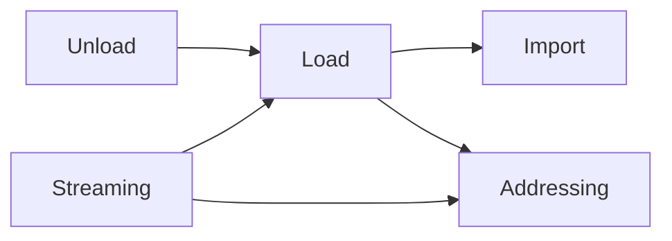
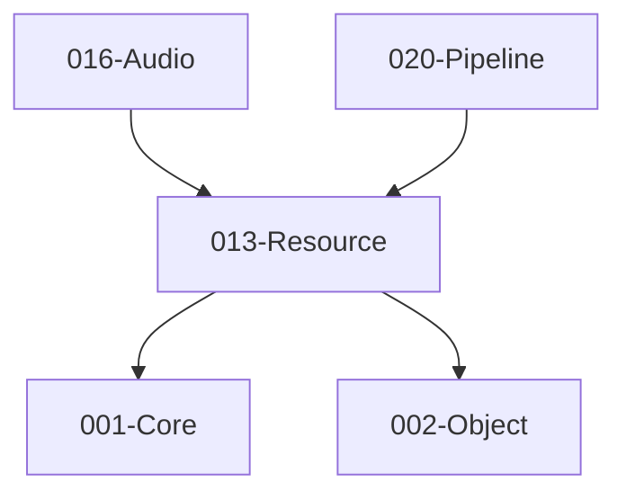

# 013-Resource 模块描述

## 1. 模块简要说明

Resource 提供**资源导入、加载与生命周期**：导入、同步/异步加载、卸载、流式与可寻址，对应 Unreal 的**资源系统/Asset Registry**、Unity 的 **Addressables/Asset Bundle** 与导入管线。依赖 Core、Object。

## 2. 详细功能描述

- **资源导入**：导入器注册、格式检测、转换、元数据与依赖记录。
- **同步/异步加载**：加载请求、完成回调、依赖解析、加载队列与优先级。
- **卸载**：引用计数或 GC、卸载策略、与各模块资源句柄协调。
- **流式与可寻址**：按需加载、地址/ID 寻址、与 Asset Bundle 风格打包。

## 3. 实现难度

**高**。异步加载与依赖图、流式与 LOD/地形协同、与各模块句柄生命周期协同复杂；导入管线与多格式需扩展性设计。

## 4. 操作的资源类型

- **文件**：原始资源文件、导入产物、Bundle 文件。
- **内存**：加载缓冲、元数据、依赖图、引用计数。
- **无直接 GPU**：纹理/网格等由各模块通过句柄向 RHI/Pipeline 申请；Resource 管理生命周期与加载状态。

## 5. 是否有子模块

有。

### 5.1 子模块说明

| 子模块 | 职责 |
|--------|------|
| Import | 导入器注册、格式检测、转换、元数据与依赖记录 |
| Load | 同步/异步加载 API、依赖解析、加载队列与优先级 |
| Unload | 引用计数、GC 或显式卸载、与各模块资源句柄协调 |
| Streaming | 流式请求、优先级、与 LOD/地形等按需加载对接 |
| Addressing | 资源 ID/GUID、可寻址路径、与打包/Bundle 对应 |

### 5.2 具体功能

Import：RegisterImporter、DetectFormat、Convert、Metadata、Dependencies。  
Load：LoadSync、LoadAsync、ResolveDependencies、Queue、Priority。  
Unload：Release、GC、UnloadPolicy、与句柄协调。  
Streaming：RequestStreaming、SetPriority、与 LOD/Terrain 对接。  
Addressing：ResourceId、GUID、Address、BundleMapping。

### 5.3 子模块依赖图

## 6. 模块上下游

### 6.1 和上下游交互、传递的数据类型

- **上游**：Core（文件、内存、异步）、Object（序列化、反射、GUID/引用解析）。  
- **下游**：Audio、Pipeline、2D、Terrain、Editor。向下游提供：ResourceId、LoadHandle、AsyncResult、StreamingHandle、Metadata。

### 6.2 上下游依赖图

## 7. 依赖的外部内容

| 类别 | 内容 |
|------|------|
| **Object** | 序列化、反射、GUID/引用解析 |
| **平台** | 文件 I/O、异步 I/O（Core.Platform 或 OS API） |
| **可选** | 压缩库、加密、资源包格式（自定义或现成格式） |
| **工具** | 资源管线、打包工具、与 Tools 模块联动 |
| **协议** | 资源包格式、可寻址路径约定 |
