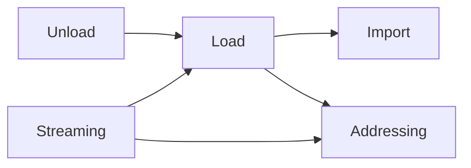
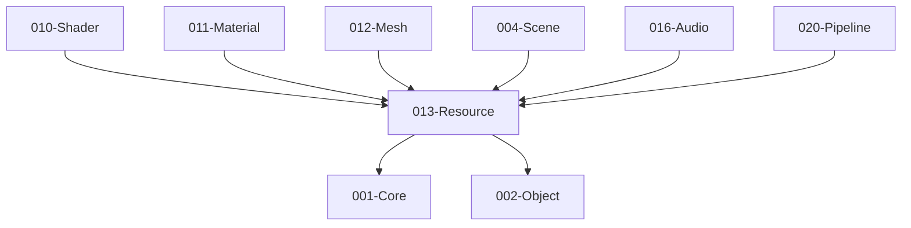

# 013-Resource 模块描述

## 1. 模块简要说明

Resource 提供**资源导入、加载与生命周期**：导入、同步/异步加载、卸载、流式与可寻址，对应 Unreal 的**资源系统/Asset Registry**、Unity 的 **Addressables/Asset Bundle** 与导入管线。**所有需要加载的资产类型均继承/实现 IResource**（IMaterialResource、IMeshResource、ITextureResource、IModelResource、IShaderResource、ILevelResource : IResource）；**统一接口**：Load/Unload/Release/EnsureDeviceResources 等均针对 **IResource***（或对 ResourceId/句柄解析到 IResource），013 用同一套逻辑管理；**统一缓存**：013 的缓存存 **IResource***，按 **ResourceId** 查找，不为每种资源各写一套；**多态**：不同资源类型同一基类，代码更简单。**凡需加载或使用这些资源的模块均依赖 013-Resource**。**描述类型（*Desc）归属原本模块**：013 拥有 ModelAssetDesc、TextureAssetDesc；ShaderAssetDesc→010，MaterialAssetDesc→011，LevelAssetDesc/SceneNodeDesc→029-World，MeshAssetDesc→012。**013 仅依赖 Core、Object**；被 010-Shader、011-Material、012-Mesh、004-Scene 等资源类型模块依赖。Load 阶段由各模块向 013 注册的 Create*/Loader 提供实现，013 将内存/句柄交其初始化，获句柄后由 013 组装 RResource。

## 2. 详细功能描述

- **资源导入**：导入器注册、格式检测、转换、元数据与依赖记录。
- **同步/异步加载**：加载请求、完成回调、依赖解析、加载队列与优先级。
- **卸载**：引用计数或 GC、卸载策略、与各模块资源句柄协调。
- **流式与可寻址**：按需加载、地址/ID 寻址、与 Asset Bundle 风格打包。

**资源三态与引用方式（便于管理）**：所有资源可有三种形态，统一管理。  
- **FResource（硬盘形态）**：在**硬盘上**；**硬盘加载使用 FResource**。引用其他资源时，通过**全局唯一的 GUID** 引用（FResource 内不存指针，只存 GUID）。  
- **RResource（运行时/内存形态）**：**内存引用使用 RResource**。根据 FResource 的引用关系，在内存中通过**指针**引用其他资源（RResource 持有对其它 RResource 的指针）。**013 不创建 DResource**；DResource 槽位由 011/012/008 在 **EnsureDeviceResources** 时填充。  
- **DResource（GPU 形态）**：**GPU 类型资源**；由 **008/011/012 在 EnsureDeviceResources 时创建**，对 013 不可见；保存在 RResource 内部，由 RResource 管理生命周期与绑定。  
- **单形态资源**：部分资源可能**只存在某一形态**（例如仅 FResource 的元数据、仅 RResource 的运行时生成数据、或仅作为 RResource 内 DResource 的 GPU 资源），按需定义即可。

**模型相关资源层级**：**硬盘上的 Model 资源**引用 **Material** 和 **Mesh**（即 Model 资源文件内声明对若干 Material 与若干 Mesh 的引用）。**Material 资源**（引擎自有格式）引用**贴图**、**材质参数**与 **Shader**；材质当中保存了 Shader，并引用渲染 Shader 所需的参数值与贴图。Mesh 来源于 OBJ、FBX 等常用格式，可单独加载或经 Model 资源间接引用。模型渲染即 Mesh 与 Material 的组织：Model 资源组织「用哪些 Mesh、用哪些 Material」，Material 组织「用哪个 Shader、哪些贴图与参数」。

## 3. 实现难度

**高**。异步加载与依赖图、流式与 LOD/地形协同、与各模块句柄生命周期协同复杂；导入管线与多格式需扩展性设计。

## 4. 操作的资源类型

- **FResource**：硬盘上的资源表示；引用通过 **GUID**；硬盘加载时使用 FResource。
- **RResource**：内存中的资源表示；根据 FResource 的引用通过**指针**引用其他 RResource；**DResource 保存在 RResource 内部**。
- **DResource**：GPU 资源；由 **008/011/012 在 EnsureDeviceResources 时创建**，013 不创建、不持有；创建后由 RResource 内部持有，不单独跨对象引用。
- **文件/内存**：原始资源文件、导入产物、Bundle 文件；加载缓冲、元数据、依赖图、引用计数。部分资源可能只存在某一形态（仅 F、仅 R、或仅 R 内 D）。

## 5. 是否有子模块

有。

### 5.1 子模块说明

| 子模块 | 职责 |
|--------|------|
| Import | 导入器注册、格式检测、转换、元数据与依赖记录 |
| Load | 同步/异步加载 API、依赖解析、加载队列与优先级 |
| Unload | 引用计数、GC 或显式卸载、与各模块资源句柄协调 |
| Streaming | 流式请求、优先级、与 LOD/地形等按需加载对接 |
| Addressing | 资源 ID/GUID、可寻址路径、与打包/Bundle 对应 |

### 5.2 具体功能

Import：RegisterImporter、DetectFormat、Convert、Metadata、Dependencies。  
Load：LoadSync、LoadAsync、ResolveDependencies、Queue、Priority。  
Unload：Release、GC、UnloadPolicy、与句柄协调。  
Streaming：RequestStreaming、SetPriority、与 LOD/Terrain 对接。  
Addressing：ResourceId、GUID、Address、BundleMapping。

### 5.3 子模块依赖图

## 6. 模块上下游

### 6.1 和上下游交互、传递的数据类型

- **上游（013 依赖谁）**：仅 **001-Core**（文件、内存、异步）、**002-Object**（序列化、反射、GUID/引用解析）。013 不依赖 010/011/012/004；Load 时通过各模块向 013 **注册**的 Create*/Loader 由 010/011/012/004 提供实现。  
- **下游（谁依赖 013）**：**010-Shader、004-Scene、011-Material、012-Mesh**（可加载资源类型所在模块，依赖 013 契约并向 013 注册 Create*/Loader）；016-Audio、020-Pipeline、022-2D、023-Terrain、024-Editor（调用 013 Load/GetCached 获取资源；仅持 ResourceId/句柄，不长期持有 IResource*）。向下游提供：ResourceId、LoadHandle、AsyncResult、StreamingHandle、Metadata。**数据归属**：IResource* 仅 013 内部持有或缓存。

### 6.2 上下游依赖图

## 7. 依赖的外部内容

| 类别 | 内容 |
|------|------|
| **Object** | 序列化、反射、GUID/引用解析 |
| **平台** | 文件 I/O、异步 I/O（Core.Platform 或 OS API） |
| **可选** | 压缩库、加密、资源包格式（自定义或现成格式） |
| **工具** | 资源管线、打包工具、与 Tools 模块联动 |
| **协议** | 资源包格式、可寻址路径约定 |

## 待办

- **待办**：需随 `001-Core` 契约变更做适配（契约变更日期：2026-01-29；变更摘要：契约由 plan 001-core-fullversion-001 同步，完整 7 子模块声明）。
