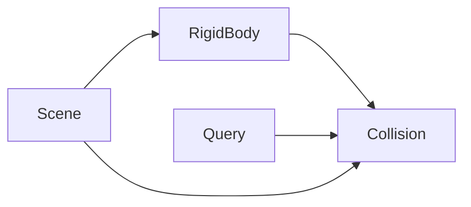
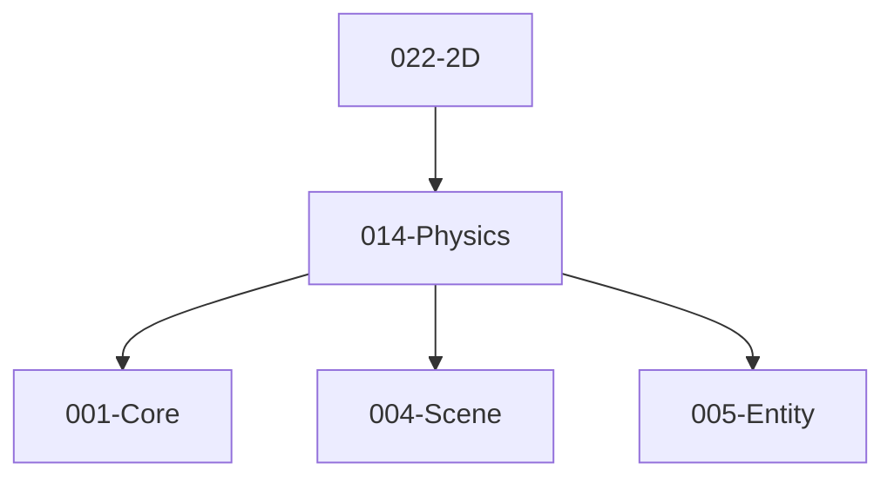

# 014-Physics 模块描述

## 1. 模块简要说明

Physics 提供**碰撞、刚体与查询**（2D/3D），对应 Unreal 的 **Chaos/PhysX**、Unity 的 **Physics/Physics2D** 与 Havok 等。依赖 Core、Scene、Entity。

## 2. 详细功能描述

- **碰撞**：碰撞体形状、碰撞检测、碰撞事件、与 Entity/Scene 的变换同步。
- **刚体**：刚体动力学、质量、力、约束（铰链、弹簧等）。
- **查询**：射线、形状扫描、重叠查询、与游戏逻辑对接。
- **2D/3D**：2D 与 3D 物理可选或统一 API。

## 3. 实现难度

**中高**。与 Scene/Entity 变换同步、多物理引擎抽象（PhysX/Bullet/Jolt/Box2D）需统一接口；约束与性能调优复杂。

## 4. 操作的资源类型

- **内存**：形状数据、刚体状态、约束、场景 BVH/空间划分。
- **无直接 GPU**：调试绘制可由 Pipeline 或独立 DebugDraw 接口完成。

## 5. 是否有子模块

有。

### 5.1 子模块说明

| 子模块 | 职责 |
|--------|------|
| Collision | 形状（盒/球/胶囊/网格等）、碰撞检测、碰撞事件与过滤 |
| RigidBody | 刚体、质量属性、力/冲量、约束、积分器 |
| Query | 射线、形状扫描、重叠查询、过滤与分组 |
| Scene | 物理场景、与 Scene/Entity 的同步、步长与子步 |

### 5.2 具体功能

Collision：CreateShape、CollisionEvent、Filter、Layer。  
RigidBody：CreateRigidBody、SetMass、AddForce、Constraint、Integrate。  
Query：Raycast、ShapeCast、Overlap、Filter、Group。  
Scene：CreateScene、SyncFromScene、Step、Substep。

### 5.3 子模块依赖图

## 6. 模块上下游

### 6.1 和上下游交互、传递的数据类型

- **上游**：Core（数学、内存）、Scene（节点、变换、层级）、Entity（实体 ID、变换组件）。  
- **下游**：2D、Editor。向下游提供：PhysicsSceneRef、RigidBodyHandle、CollisionEvent、RaycastResult、OverlapResult。

### 6.2 上下游依赖图

## 7. 依赖的外部内容

| 类别 | 内容 |
|------|------|
| **物理引擎** | PhysX、Bullet、Jolt、Box2D（2D）、Chaos（UE）等，通过 Physics 抽象对外 |
| **Scene/Entity** | 变换同步、实体与碰撞体/刚体绑定 |
| **可选** | 物理调试渲染、与 Pipeline 的调试绘制接口 |
| **协议** | 无 |
