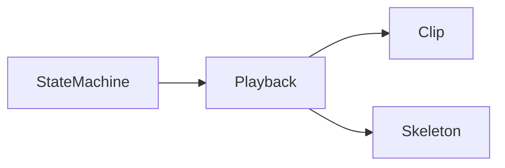
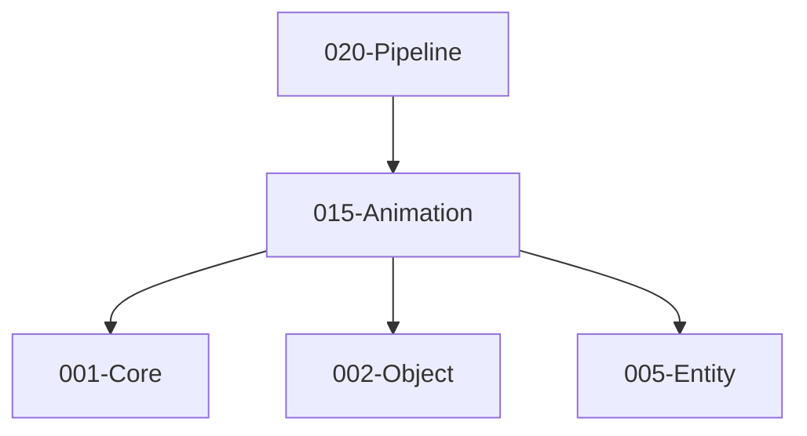

# 015-Animation 模块描述

## 1. 模块简要说明

Animation 提供**动画剪辑与播放**：关键帧、骨骼动画、Timeline、可选状态机，对应 Unreal 的 **Animation/ControlRig/Sequencer**、Unity 的 **Animation/Timeline/Animator**。依赖 Core、Object、Entity。

## 2. 详细功能描述

- **动画剪辑**：关键帧数据、骨骼/属性轨道、采样与插值、循环与裁剪。
- **骨骼动画**：骨骼层级、蒙皮矩阵、与 Mesh 蒙皮数据对接。
- **Timeline**：时间轴、多轨道、与 Sequencer/Cutscene 风格对接。
- **状态机（可选）**：动画状态机、混合树、过渡、与 Entity 状态联动。

## 3. 实现难度

**中高**。与 Mesh 骨骼/蒙皮、Entity 组件、Pipeline 蒙皮矩阵提交需协同；状态机与混合树增加逻辑复杂度。

## 4. 操作的资源类型

- **内存**：关键帧数据、骨骼层级、混合树、播放状态。
- **与 Mesh**：骨骼名称/索引对应、蒙皮数据；与 Pipeline 传递蒙皮矩阵（Uniform 或缓冲）。

## 5. 是否有子模块

有。

### 5.1 子模块说明

| 子模块 | 职责 |
|--------|------|
| Clip | 关键帧、轨道、采样、插值、循环与裁剪 |
| Skeleton | 骨骼层级、绑定姿态、与 Mesh 骨骼索引对应 |
| Playback | 播放控制、时间、混合、与 Entity 挂接 |
| StateMachine（可选） | 状态、过渡、混合树、参数驱动 |

### 5.2 具体功能

Clip：LoadClip、Sample、Interpolate、Loop、ClipRange。  
Skeleton：GetBoneHierarchy、BindPose、BoneIndexFromName、与 Mesh 对应。  
Playback：Play、Pause、SetTime、Blend、AttachToEntity。  
StateMachine：AddState、AddTransition、SetParameter、BlendTree。

### 5.3 子模块依赖图

## 6. 模块上下游

### 6.1 和上下游交互、传递的数据类型

- **上游**：Core（数学、内存）、Object（动画资源序列化、反射）、Entity（实体、变换组件）。  
- **下游**：Pipeline（蒙皮矩阵与渲染）、Editor。向下游提供：AnimationClipHandle、SkeletonHandle、PlaybackState、SkinningMatrices。

### 6.2 上下游依赖图

## 7. 依赖的外部内容

| 类别 | 内容 |
|------|------|
| **Object** | 动画资源序列化、反射与属性 |
| **Mesh** | 骨骼名称/索引对应、蒙皮数据 |
| **Entity** | 动画组件挂载、播放驱动 |
| **可选** | 动画压缩、LOD、IK/ControlRig 等扩展 |
| **协议** | 无 |

## 待办

- **待办**：需随 `001-Core` 契约变更做适配（契约变更日期：2026-01-29；变更摘要：API 雏形由 plan 001-core-fullversion-001 同步，完整 7 子模块声明）。
- **待办**：需随 `002-object` 契约变更做适配（契约变更日期：2026-01-29；变更摘要：API 雏形由 plan 002-object-minimal 同步（类型注册 + 简单序列化），及 plan 002-object-fullversion-001 同步（完整功能集））。
