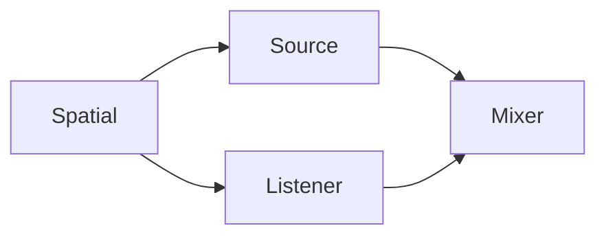
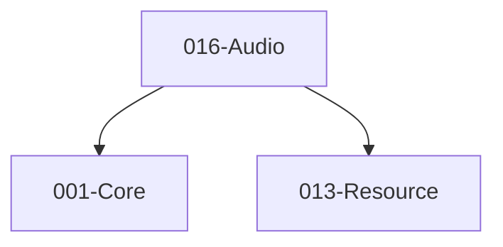

# 016-Audio 模块描述

## 1. 模块简要说明

Audio 提供**音源、监听与混音**（含空间音效），对应 Unreal 的 **Audio**、Unity 的 **Audio/Audio Mixer**。依赖 Core、Resource。

## 2. 详细功能描述

- **音源**：3D/2D 音源、播放控制、与 Entity/Scene 位置绑定。
- **监听**：听众位置与朝向、与相机或实体绑定。
- **混音**：混音组、音量/效果、主总线与子总线。
- **空间音效**：衰减、遮挡、空间化（可选）。

## 3. 实现难度

**中**。与 Resource 音频资源、平台/第三方音频 API 的抽象需统一；空间音效与混音路由可逐步扩展。

## 4. 操作的资源类型

- **内存**：播放状态、混音路由、效果参数。
- **与 Resource**：音频资源句柄（WAV/OGG 等）、流式播放缓冲。
- **与平台/第三方**：音频设备、缓冲、通过抽象层对接。

## 5. 是否有子模块

有。

### 5.1 子模块说明

| 子模块 | 职责 |
|--------|------|
| Source | 音源创建、播放/暂停/停止、循环、与 Resource 音频资源对接 |
| Listener | 听众设置、与 Scene/Entity 变换同步 |
| Mixer | 总线、音量、静音、效果槽（可选） |
| Spatial | 3D 定位、衰减曲线、遮挡（可选） |

### 5.2 具体功能

Source：CreateSource、Play、Pause、Stop、SetLoop、SetResource。  
Listener：SetPosition、SetOrientation、BindToEntity。  
Mixer：CreateBus、SetVolume、Mute、EffectSlot。  
Spatial：SetPosition、Attenuation、Occlusion。

### 5.3 子模块依赖图

## 6. 模块上下游

### 6.1 和上下游交互、传递的数据类型

- **上游**：Core（内存、数学）、Resource（音频资源加载、句柄）。  
- **下游**：Editor（音频预览与混音器 UI）、可选与 Entity 的音频组件联动。向下游提供：AudioSourceHandle、ListenerHandle、BusHandle、PlaybackState。

### 6.2 上下游依赖图

## 7. 依赖的外部内容

| 类别 | 内容 |
|------|------|
| **Resource** | 音频资源加载（WAV/OGG 等） |
| **平台/第三方** | 平台音频 API（WASAPI/ALSA/CoreAudio）或 FMOD、Wwise、OpenAL 等，通过 Audio 抽象对外 |
| **可选** | DSP 效果、编解码、空间音频中间件 |
| **协议** | 无 |

## 待办

- **待办**：需随 `001-Core` 契约变更做适配（契约变更日期：2026-01-29；变更摘要：API 雏形由 plan 001-core-fullversion-001 同步，完整 7 子模块声明）。
