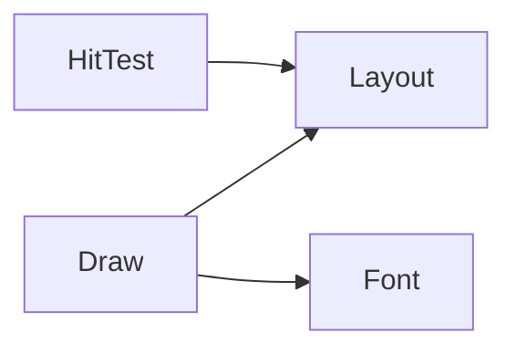
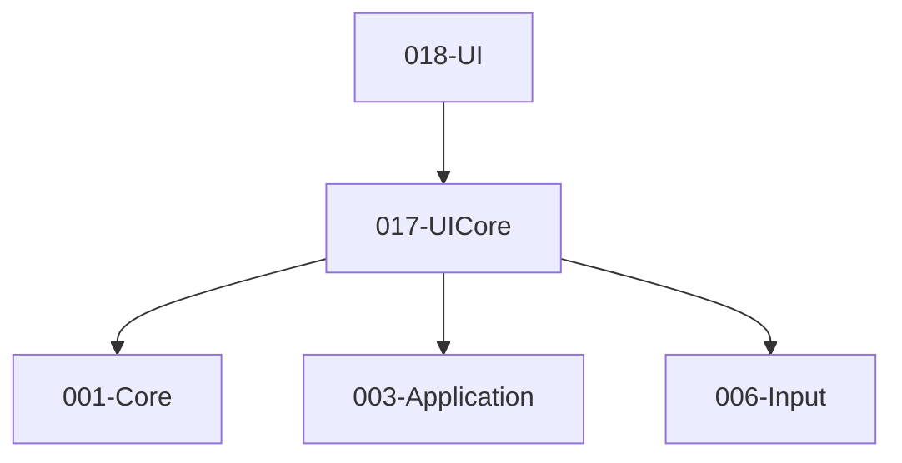

# 017-UICore 模块描述

## 1. 模块简要说明

UICore 提供**UI 布局、绘制与输入路由**：布局算法、绘制命令、命中检测与焦点，对应 Unreal 的 **SlateCore**、Unity 的 **Canvas 与布局** 部分。依赖 Core、Application、Input。

## 2. 详细功能描述

- **布局**：布局算法（锚点、网格、流式等）、脏区域、与分辨率/DPI 适配。
- **绘制**：绘制命令生成、与 Pipeline 的 2D 或 Overlay 绘制对接、字体/图集。
- **输入路由**：命中检测、焦点、事件路由（点击/拖拽等）到控件。
- **字体**：字体加载、字形、图集、与 Resource 对接。

## 3. 实现难度

**中**。与 Application 窗口/DPI、Input 事件、Pipeline 绘制接口需清晰；字体与多语言可扩展。

## 4. 操作的资源类型

- **内存**：布局树、绘制列表、命中区域、焦点链。
- **与 Resource**：字体、图集（通过句柄）。
- **与 Pipeline**：绘制命令或 Overlay 层（由 Pipeline 消费）。

## 5. 是否有子模块

有。

### 5.1 子模块说明

| 子模块 | 职责 |
|--------|------|
| Layout | 布局规则、测量与排列、脏标记、DPI 缩放 |
| Draw | 绘制列表/命令、矩形/纹理/文本、与渲染后端接口 |
| HitTest | 命中检测、焦点链、与 Input 事件对接 |
| Font | 字体加载、字形、图集、与 Resource 对接 |

### 5.2 具体功能

Layout：Measure、Arrange、SetDirty、DPIScale。  
Draw：DrawRect、DrawTexture、DrawText、SubmitToPipeline。  
HitTest：HitTest、GetFocus、SetFocus、RouteEvent。  
Font：LoadFont、GetGlyph、Atlas、与 Resource 对接。

### 5.3 子模块依赖图

## 6. 模块上下游

### 6.1 和上下游交互、传递的数据类型

- **上游**：Core（数学、容器）、Application（窗口、DPI、消息循环）、Input（鼠标/触摸/键盘事件）。  
- **下游**：UI（控件与画布）、Editor。向下游提供：LayoutNode、DrawCommandList、HitTestResult、FocusChain、FontHandle。

### 6.2 上下游依赖图

## 7. 依赖的外部内容

| 类别 | 内容 |
|------|------|
| **Application** | 窗口与消息循环、DPI |
| **Input** | 鼠标/触摸/键盘事件 |
| **可选** | 字体库（FreeType、HarfBuzz）、文本整形；与 Pipeline 的 2D/Overlay 绘制接口 |
| **协议** | 无 |

## 待办

- **待办**：需随 `001-Core` 契约变更做适配（契约变更日期：2026-01-29；变更摘要：API 雏形由 plan 001-core-fullversion-001 同步，完整 7 子模块声明）。
