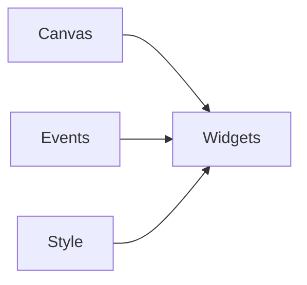
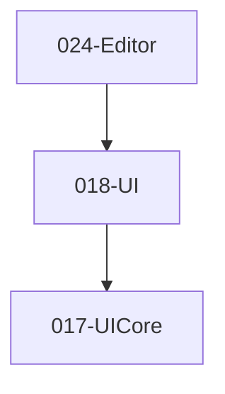

# 018-UI 模块描述

## 1. 模块简要说明

UI 提供**控件、画布与事件**：按钮、滑块、文本、列表等控件，画布树，事件与样式，对应 Unreal 的 **Slate**、Unity 的 **uGUI/UI Toolkit**。仅依赖 UICore。

## 2. 详细功能描述

- **控件**：按钮、滑块、文本、列表、容器等基础与复合控件。
- **画布**：画布树、与 UICore 布局与绘制的对接、样式/主题。
- **事件**：点击、拖拽、输入等事件、与 UICore 输入路由对接。
- **样式**：主题、颜色/字体/边距、与 Resource 资源引用。

## 3. 实现难度

**中**。控件库与 UICore 的布局/绘制/事件需一一对应；主题与无障碍可扩展。

## 4. 操作的资源类型

- **内存**：控件树、样式表、事件回调。
- **与 Resource**：纹理/图集、字体（通过 UICore 或直接）。
- **与 UICore**：布局节点、绘制命令、命中与焦点。

## 5. 是否有子模块

有。

### 5.1 子模块说明

| 子模块 | 职责 |
|--------|------|
| Widgets | 基础控件（Button、Slider、Text、Image 等）、复合控件、样式 |
| Canvas | 画布树、根节点、与 UICore 的布局/绘制/命中对接 |
| Events | 事件类型、回调、冒泡/捕获、与 Input 解耦的抽象事件 |
| Style | 主题、颜色/字体/边距、与 Resource 资源引用 |

### 5.2 具体功能

Widgets：Button、Slider、Text、Image、List、Container、SetStyle。  
Canvas：CreateCanvas、AddChild、与 UICore Layout/Draw/HitTest 对接。  
Events：OnClick、OnDrag、OnInput、Bubble、Capture。  
Style：Theme、Color、Font、Margin、ResourceRef。

### 5.3 子模块依赖图

## 6. 模块上下游

### 6.1 和上下游交互、传递的数据类型

- **上游**：UICore（布局、绘制、输入路由）。  
- **下游**：Editor、Pipeline（UI 渲染层，若由 Pipeline 绘制）。向下游提供：CanvasHandle、WidgetTree、EventCallback、StyleRef。

### 6.2 上下游依赖图

## 7. 依赖的外部内容

| 类别 | 内容 |
|------|------|
| **UICore** | 布局、绘制、输入路由 |
| **Resource** | 纹理/图集、字体（通过 UICore 或直接） |
| **可选** | UI 描述格式（JSON/XML）、UI 动画、无障碍 |
| **协议** | 无 |

## 待办

- **待办**：需随 `001-Core` 契约变更做适配（契约变更日期：2026-01-29；变更摘要：契约由 plan 001-core-fullversion-001 同步，完整 7 子模块声明）。
