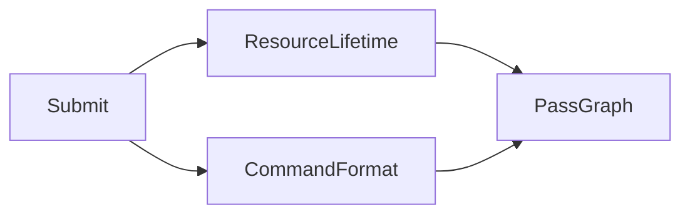
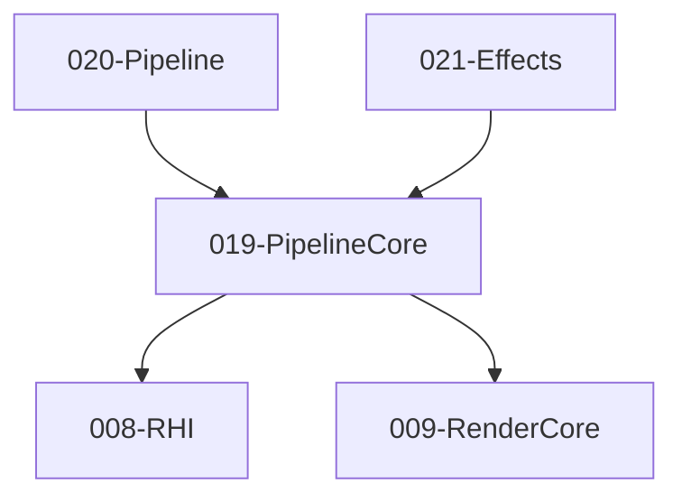

# 019-PipelineCore 模块描述

## 1. 模块简要说明

PipelineCore 提供**管线协议与命令缓冲约定**：命令缓冲格式、Pass 图协议（RDG 风格）、与 RHI 提交约定，对应 Unreal 的 **RDG 协议**、Unity 的 **SRP Core 管线协议**。依赖 RHI、RenderCore。

## 2. 详细功能描述

- **命令缓冲格式**：Pass 产出/消费的资源声明、生命周期、与 RHI 提交的约定。
- **Pass 图协议**：RDG 风格 Pass 图、资源依赖、执行顺序、与 RHI 命令列表的映射。
- **与 RHI 提交约定**：何时提交、资源屏障、多队列（可选）。
- **资源生命周期**：资源创建/使用/释放时机、别名与环缓冲。

## 3. 实现难度

**高**。Pass 图与资源生命周期、屏障插入、与 RHI 多后端协同复杂；RDG 风格需与 RenderCore Pass 协议一致。

## 4. 操作的资源类型

- **逻辑资源**：Pass 节点、资源声明、依赖图、命令缓冲抽象（最终映射到 RHI CommandList）。
- **与 RHI**：命令列表、资源屏障、提交队列；不直接持有 GPU 资源，仅声明与调度。

## 5. 是否有子模块

有。

### 5.1 子模块说明

| 子模块 | 职责 |
|--------|------|
| PassGraph | Pass 节点、输入/输出资源、依赖边、拓扑排序 |
| ResourceLifetime | 资源创建/使用/释放时机、别名与环缓冲 |
| CommandFormat | 命令缓冲抽象、与 RHI 命令列表的映射、屏障插入 |
| Submit | 提交时机、与 RHI 队列的对接、同步点 |

### 5.2 具体功能

PassGraph：AddPass、DeclareRead、DeclareWrite、TopologicalSort、ExecuteOrder。  
ResourceLifetime：AllocateTransient、Alias、RingBuffer、ReleaseAfterPass。  
CommandFormat：RecordPass、MapToRHI、InsertBarrier、与 RHI 对接。  
Submit：SubmitQueue、SyncPoint、MultiQueue（可选）。

### 5.3 子模块依赖图

## 6. 模块上下游

### 6.1 和上下游交互、传递的数据类型

- **上游**：RHI（CommandList、Resource、Barrier、Queue）、RenderCore（Pass 输入/输出声明、Uniform 与资源描述）。  
- **下游**：Pipeline、Effects。向下游提供：PassGraphBuilder、PassContext、ResourceHandle、SubmitContext。

### 6.2 上下游依赖图

## 7. 依赖的外部内容

| 类别 | 内容 |
|------|------|
| **RHI** | 命令列表、资源、屏障、提交 |
| **RenderCore** | Pass 输入/输出声明、Uniform 与资源描述 |
| **可选** | RDG 调试、Pass 图可视化、性能分析 |
| **协议** | 无 |
