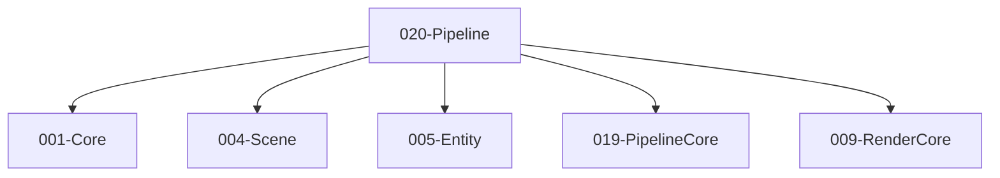

# 020-Pipeline 模块描述

## 1. 模块简要说明

Pipeline 提供**渲染管线实现**（场景到屏幕）：场景收集、剔除、DrawCall、命令缓冲生成与提交，对应 Unreal 的 **Renderer（RDG 使用）**、Unity 的 **URP/HDRP**。依赖 Core、Scene、Entity、PipelineCore、RenderCore、Shader、Material、Mesh、Resource。

## 2. 详细功能描述

- **渲染模式**：渲染支持 **Debug**、**Hybrid**、**Resource** 三种模式（如 Debug=全量校验/调试绘制，Hybrid=部分校验，Resource=发布/最小校验）；可通过编译选项或运行时配置选择，与统一 Check 宏的启用程度协同。
- **场景收集**：可见实体/组件收集、与 Scene/Entity 对接。
- **剔除**：视锥剔除、遮挡剔除（可选）、LOD 选择。
- **DrawCall**：批次、材质/网格/变换、与 Material/Mesh/Shader 对接、实例化与合批。
- **命令缓冲生成与提交**：按 PipelineCore 协议构建 Pass 图、提交到 RHI、与 SwapChain/XR 对接。**渲染资源显式控制位置**：**创建逻辑渲染资源**（CreateRenderItem）见 019-PipelineCore；**收集逻辑 CommandBuffer**（CollectCommandBuffer）见 019-PipelineCore；**提交到实际 GPU Command**（**SubmitCommandBuffer**，即 submitLogicalCommandBuffer / executeLogicalCommandBuffer）；**准备渲染资源**（PrepareRenderMaterial、PrepareRenderMesh、prepareRenderResources）见 019-PipelineCore；**创建/更新 GPU 资源**（CreateDeviceResource、UpdateDeviceResource）见 008-RHI。

## 3. 实现难度

**高**。与 PipelineCore、RenderCore、Shader、Material、Mesh、Resource 的接口多；剔除与合批、多 Pass 执行顺序需严格；与 Editor/XR 的视口与交换链对接需清晰。

## 4. 操作的资源类型

- **GPU 资源**：通过 RHI 创建的 RT、DS、Buffer、PSO；与 RenderCore/Shader/Material/Mesh 的句柄对接。
- **与 Resource**：经 013 将节点/实体的 ResourceId/句柄解析为可绘制数据；不长期持有 IResource*；LOD 流式。
- **与 Scene/Entity**：变换、可见性、组件数据；**场景遍历入口在 004**，Pipeline 调用 004 的 GetCurrentWorld、GetRootNodes、Traverse 等。

## 5. 是否有子模块

有。

### 5.1 子模块说明

| 子模块 | 职责 |
|--------|------|
| Culling | 视锥剔除、遮挡查询（可选）、LOD 选择、与 Scene/Entity 对接 |
| Batching | 批次划分、材质/网格/变换、实例化与合批 |
| PassExecution | Pass 实现（GBuffer、光照、后处理等）、与 PipelineCore 图对接 |
| Submit | 命令缓冲生成、与 RHI 提交、与 SwapChain/XR 对接 |

### 5.2 具体功能

Culling：CollectVisible、FrustumCull、OcclusionQuery（可选）、SelectLOD。  
Batching：BuildBatches、MaterialSlot、MeshSlot、Transform、Instancing、MergeBatch。  
PassExecution：ExecutePass、GBuffer、Lighting、PostProcess、与 PipelineCore 对接。  
Submit：BuildCommandBuffer、SubmitToRHI、Present、XRSubmit（可选）。

### 5.3 子模块依赖图

## 6. 模块上下游

### 6.1 和上下游交互、传递的数据类型

- **上游**：Core、Scene、Entity、PipelineCore、RenderCore、Shader、Material、Mesh、Resource（见 000-module-dependency-map）。**调用关系**：场景遍历**调用 004**（GetCurrentWorld、GetRootNodes、Traverse）；从节点/实体取 ResourceId/句柄后**经 013** LoadSync/GetCached 解析，不长期持有 IResource*。向下游提供：VisibleSet、BatchList、PassGraph、CommandBuffer、PresentTarget。  
- **下游**：Effects、2D、Terrain、Editor、XR。向下游提供：PipelineContext、RenderTargetHandle、DrawCall 接口。

### 6.2 上下游依赖图

## 7. 依赖的外部内容

| 类别 | 内容 |
|------|------|
| **PipelineCore** | Pass 图协议、资源生命周期 |
| **RHI** | 命令列表、资源、PSO、提交 |
| **RenderCore/Shader/Material/Mesh** | 绘制参数与资源 |
| **Resource** | 经 013 将节点/实体的 ResourceId/句柄解析为可绘制数据；不长期持有 IResource*；LOD 流式 |
| **可选** | 遮挡剔除库、GPU Driven、光线追踪扩展 |
| **协议** | 无 |

## 待办

- **待办**：需随 `001-Core` 契约变更做适配（契约变更日期：2026-01-29；变更摘要：契约由 plan 001-core-fullversion-001 同步，完整 7 子模块声明）。
- **待办**：需随 `004-scene` 契约变更做适配（契约变更日期：2026-01-29；变更摘要：契约由 plan 004-scene-fullversion-001 同步）。
