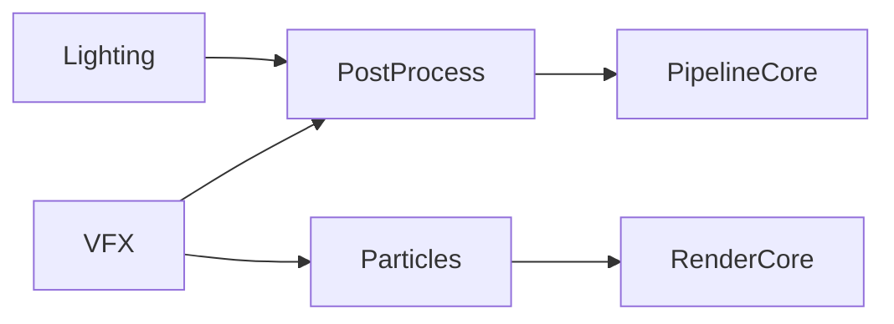
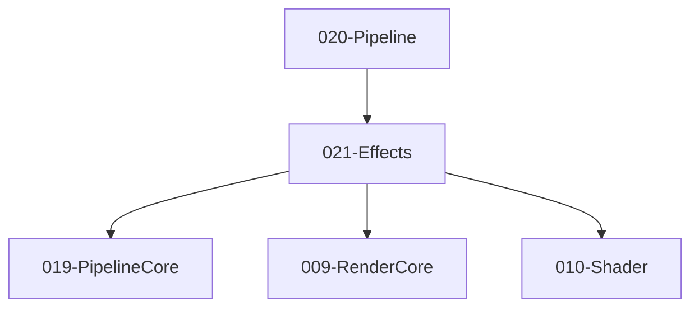

# 021-Effects 模块描述

## 1. 模块简要说明

Effects 提供**后处理、粒子与光照后处理**：Bloom、TAA、粒子/VFX、体积光等，对应 Unreal 的 **PostProcess、Niagara 部分**、Unity 的 **Post Processing、VFX Graph**。依赖 PipelineCore、RenderCore、Shader。

## 2. 详细功能描述

对外接口以 **ABI** 为准：`specs/_contracts/021-effects-ABI.md`；契约：`specs/_contracts/021-effects-public-api.md`。

- **后处理**：IPostProcessStack::AddPass、SetIntensity；EffectParams、PostProcessPassType；Bloom、TAA、色调映射、景深；与 Pipeline Fullscreen Pass 对接；RenderingConfig 由 Pipeline 下发。
- **粒子/VFX**：IParticleSystem::Emit、Update、GetParticleBuffer、GetAtlas；CreateParticleSystem；与 Pipeline 粒子绘制、RenderCore 对接。
- **光照后处理**：体积光、光晕等与光照管线配合的效果（可选）。
- **VFX**：IVFXGraph、RegisterCustomPass（可选）；与 Shader Graph 或自定义 Pass 对接。

## 3. 实现难度

**中高**。与 PipelineCore Fullscreen Pass、RenderCore/Shader 的对接需一致；粒子与后处理算法可逐步扩展；可选 VFX Graph 增加工具链。

## 4. 操作的资源类型

- **GPU 资源**：通过 PipelineCore/RHI 的 RT、Buffer、PSO；粒子缓冲、纹理图集。
- **内存**：粒子状态、发射器参数、后处理参数。

## 5. 是否有子模块

有。

### 5.1 子模块说明

| 子模块 | 职责 |
|--------|------|
| PostProcess | 后处理栈、Pass 顺序、与 PipelineCore 的 Fullscreen Pass、参数（强度等） |
| Particles | 粒子发射、更新、与 Shader/RenderCore 的粒子绘制、纹理图集 |
| VFX | 高级 VFX（可选）、与 Shader Graph 或自定义 Pass 对接 |
| Lighting | 体积光、光晕等与光照管线配合的 Pass（可选） |

### 5.2 具体功能（与 ABI 表一致）

PostProcess：IPostProcessStack::AddPass、SetIntensity；EffectParams、PostProcessPassType；RenderingConfig 由 Pipeline 下发。  
Particles：IParticleSystem::Emit、Update、GetParticleBuffer、GetAtlas；CreateParticleSystem；与 RenderCore 对接。  
VFX：IVFXGraph、RegisterCustomPass；与 Shader 对接。  
Lighting：VolumetricLight、Bloom、与 Pipeline 对接。

### 5.3 子模块依赖图

## 6. 模块上下游

### 6.1 和上下游交互、传递的数据类型

- **上游**：PipelineCore（Pass 图、资源声明）、RenderCore（格式、Uniform）、Shader（Fullscreen/粒子 Shader）。  
- **下游**：Pipeline（将 Effects Pass 纳入管线）、Editor。向下游提供：PostProcessStack、ParticleSystemHandle、VFXHandle、EffectParams。

### 6.2 上下游依赖图

## 7. 依赖的外部内容

| 类别 | 内容 |
|------|------|
| **PipelineCore** | Fullscreen Pass、资源声明 |
| **Shader** | 后处理/粒子 Shader、变体 |
| **可选** | TAA/景深等算法库、粒子/Niagara 风格中间件 |
| **协议** | 无 |

## 待办

- **待办**：需随 `001-Core` 契约变更做适配（契约变更日期：2026-01-29；变更摘要：契约由 plan 001-core-fullversion-001 同步，完整 7 子模块声明）。
