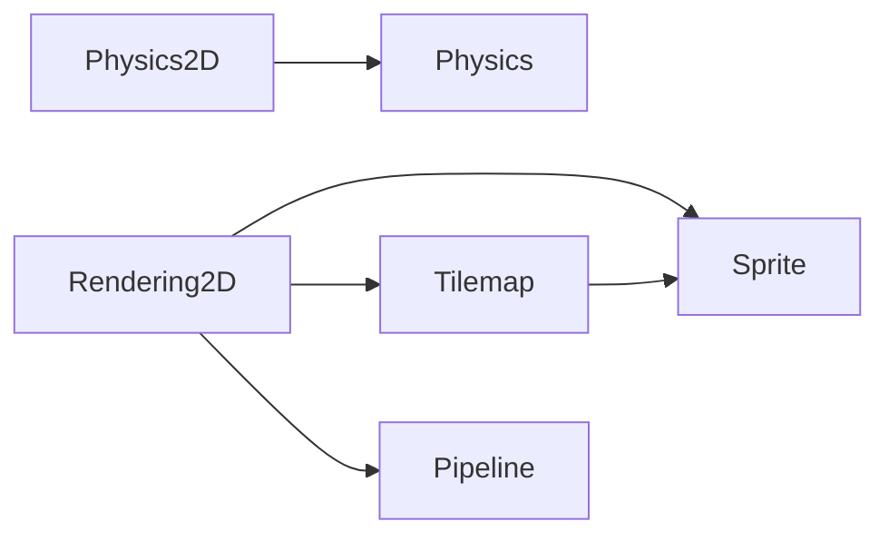
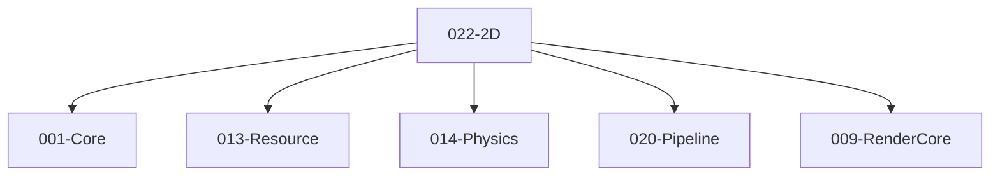

# 022-2D 模块描述

## 1. 模块简要说明

2D 提供**精灵、Tilemap 与 2D 渲染**：精灵资源与图集、瓦片地图、2D 物理、2D 渲染 Pass，对应 Unreal 的 **Paper2D**、Unity 的 **2D Sprite、Tilemap、2D Physics**。依赖 Core、Resource、Physics、Pipeline、RenderCore。

## 2. 详细功能描述

- **精灵**：精灵资源、图集、排序、与 Pipeline 的 2D 绘制对接。
- **Tilemap**：瓦片地图、瓦片集、层、与 Pipeline 的 Tilemap 绘制。
- **2D 物理**：与 Physics 模块的 2D 碰撞/刚体对接。
- **2D 渲染**：2D 相机、排序层、与 RenderCore/Pipeline 的 2D Pass。

## 3. 实现难度

**中**。与 Resource、Physics、Pipeline、RenderCore 的接口需清晰；Tilemap 格式与工具可扩展。

## 4. 操作的资源类型

- **与 Resource**：精灵/图集/瓦片集资源句柄。
- **与 Physics**：2D 碰撞体/刚体句柄。
- **与 Pipeline**：2D Pass、排序与绘制命令；与 RenderCore 顶点/格式对接。

## 5. 是否有子模块

有。

### 5.1 子模块说明

| 子模块 | 职责 |
|--------|------|
| Sprite | 精灵资源、图集、裁剪、与 Resource 对接、与 Pipeline 2D 绘制 |
| Tilemap | 瓦片集、瓦片地图、层、碰撞层、与 Pipeline 绘制 |
| Physics2D | 2D 碰撞体/刚体桥接、与 Physics 模块对接 |
| Rendering2D | 2D 相机、排序、与 Pipeline 的 2D Pass、与 RenderCore 格式对接 |

### 5.2 具体功能

Sprite：LoadSprite、Atlas、Slice、SortOrder、SubmitToPipeline。  
Tilemap：TileSet、Tilemap、Layer、CollisionLayer、Draw。  
Physics2D：Create2DBody、Create2DShape、与 Physics 对接。  
Rendering2D：Camera2D、SortingLayer、2DPass、与 RenderCore 对接。

### 5.3 子模块依赖图

## 6. 模块上下游

### 6.1 和上下游交互、传递的数据类型

- **上游**：Core、Resource（精灵/图集/瓦片集）、Physics（2D 碰撞/刚体）、Pipeline（2D Pass）、RenderCore（顶点格式）。  
- **下游**：Editor。向下游提供：SpriteHandle、TilemapHandle、Physics2DHandle、2DCamera、SortingLayer。

### 6.2 上下游依赖图

## 7. 依赖的外部内容

| 类别 | 内容 |
|------|------|
| **Resource** | 精灵/图集/瓦片集资源加载 |
| **Physics** | 2D 碰撞与刚体 |
| **Pipeline** | 2D Pass、排序与绘制 |
| **可选** | Tilemap 格式（Tiled 等）、精灵图集工具 |
| **协议** | 无 |

## 待办

- **待办**：需随 `001-Core` 契约变更做适配（契约变更日期：2026-01-29；变更摘要：契约由 plan 001-core-fullversion-001 同步，完整 7 子模块声明）。
