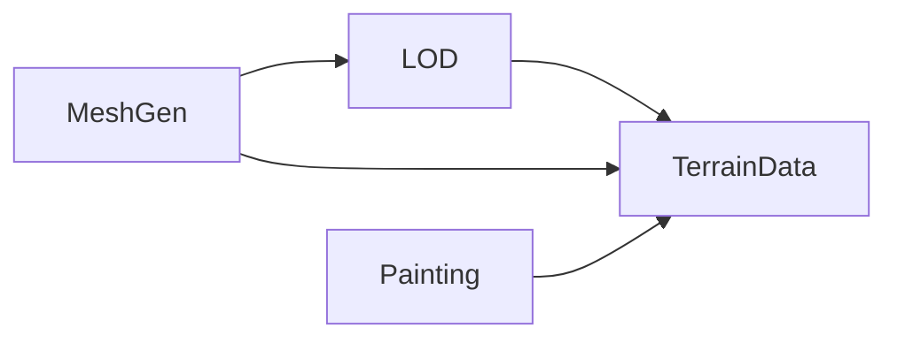
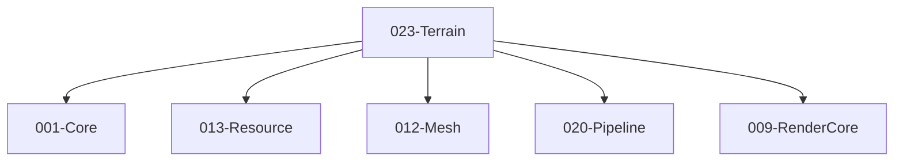

# 023-Terrain 模块描述

## 1. 模块简要说明

Terrain 提供**地形数据、LOD 与绘制/刷**：地形高度图、LOD、绘制与刷工具接口，对应 Unreal 的 **Landscape**、Unity 的 **Terrain、Terrain Tools**。依赖 Core、Resource、Mesh、Pipeline、RenderCore。

## 2. 详细功能描述

- **地形数据**：高度图、分层材质、细节/法线、与 Resource 的流式配合。
- **LOD**：地形 LOD 级别、距离/屏幕尺寸选择、块流式加载。
- **绘制/刷**：高度绘制、纹理绘制、与 Editor 的刷工具对接（可选）。
- **网格**：地形网格生成、与 Mesh 格式对接、与 Pipeline 绘制。

## 3. 实现难度

**高**。地形 LOD 与块流式、与 Mesh/Pipeline/RenderCore 的格式需一致；大世界地形与编辑器的刷需性能与扩展性设计。

## 4. 操作的资源类型

- **与 Resource**：地形块资源、高度图、分层纹理、流式句柄。
- **与 Mesh**：地形网格数据、顶点格式与 RenderCore 对接。
- **与 Pipeline**：地形 Pass、DrawCall、LOD 选择。

## 5. 是否有子模块

有。

### 5.1 子模块说明

| 子模块 | 职责 |
|--------|------|
| TerrainData | 高度图、分层、细节、与 Resource 流式 |
| LOD | 地形 LOD 级别、块选择、流式请求 |
| MeshGen | 地形网格生成、与 Mesh 格式对接、与 RenderCore 顶点格式 |
| Painting（可选） | 高度/纹理刷、与 Editor 对接 |

### 5.2 具体功能（与 ABI 表一致）

TerrainData：ITerrain::GetHeightMap、GetLayerCount、GetLayer、GetDetailMap、RequestStreaming；CreateTerrain。  
LOD：ITerrainPatch::GetLODLevel、SetLODLevel；ITerrain::GetPatch、SelectLOD、StreamBlock；与 Resource 对接。  
MeshGen：GeneratePatch、VertexFormat、与 Mesh/RenderCore 对接。  
Painting：IPaintBrush::PaintHeight、PaintTexture；PaintBrushParams、与 Editor 对接。

### 5.3 子模块依赖图

## 6. 模块上下游

### 6.1 和上下游交互、传递的数据类型

- **上游**：Core、Resource（地形块、流式）、Mesh（顶点格式）、Pipeline（绘制接口）、RenderCore（格式）。  
- **下游**：Editor（地形编辑与刷）。向下游提供：TerrainHandle、TerrainPatchHandle、LODLevel、PaintBrush。

### 6.2 上下游依赖图

## 7. 依赖的外部内容

| 类别 | 内容 |
|------|------|
| **Resource** | 地形块、高度图、分层纹理、流式 |
| **Mesh** | 顶点格式、块网格 |
| **Pipeline** | 地形 Pass、DrawCall |
| **可选** | 地形格式（如 Unity Terrain、Landscape 兼容）、刷与编辑工具 |
| **协议** | 无 |

## 待办

- **待办**：需随 `001-Core` 契约变更做适配（契约变更日期：2026-01-29；变更摘要：契约由 plan 001-core-fullversion-001 同步，完整 7 子模块声明）。
