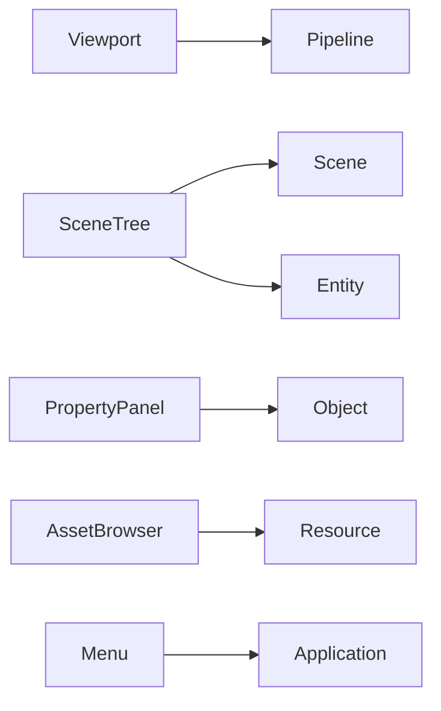
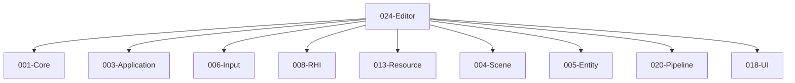

# 024-Editor 模块描述

## 1. 模块简要说明

Editor 提供**视口、场景树、属性面板、资源编辑与菜单**：编辑器 UI 与工作流，对应 Unreal 的 **UnrealEd、Slate、LevelEditor**、Unity 的 **Editor、各编辑器窗口**。依赖 Core、Application、Input、RHI、Resource、Scene、Entity、Pipeline、UI。

## 2. 详细功能描述

对外接口以 **ABI** 为准：`specs/_contracts/024-editor-ABI.md`；契约：`specs/_contracts/024-editor-public-api.md`。

**编辑器布局**（便于统一交互）：
- **左侧**：**场景资源管理器**（场景层级、Entity 树、与 Scene/Entity 对接）；支持选择、拖拽、复制/粘贴；可从本处拖入资源到渲染窗口。
- **下方**：**资源浏览器**（资源列表、预览、与 Resource 对接）；支持导入、查看、引用；可从此处**拖入**资源（如模型、预制体）到**渲染窗口**或场景资源管理器。
- **右侧**：**属性面板**；**可显示各种 Component 的属性**（与 Object 反射/属性联动）；绑定到当前选中的 Entity 或资源，编辑属性与撤销。
- **中间**：**渲染窗口**（3D/2D 视口、相机控制、Gizmo、与 Pipeline/RHI 对接）；**渲染窗口当中的模型可以点击拾取**（选中对应 Entity）；支持**从资源管理器拖入**资源（如模型）到场景。

- **视口**：即中间渲染窗口；3D/2D 视口、相机控制、Gizmo、与 Pipeline 的渲染对接、与 RHI 的离屏/窗口 RT；**点击拾取**、**拖入放置**。
- **场景树**：即左侧场景资源管理器；层级视图、与 Scene/Entity 对接、选择、拖拽、复制/粘贴。
- **属性面板**：即右侧属性面板；与 Object 反射/属性联动、**显示各 Component 属性**、编辑与撤销。
- **资源编辑**：即下方资源浏览器；与 Resource 对接、预览、导入设置；支持拖入到渲染窗口或场景。
- **菜单**：主菜单、工具栏、快捷键、与 Application/Input 对接。

## 3. 实现难度

**高**。依赖模块多；视口与 Pipeline/RHI、场景树与 Scene/Entity、属性与 Object 的协同复杂；撤销/重做与多窗口需统一设计。

## 4. 操作的资源类型

- **与 RHI**：视口 RT、离屏渲染、多视口。
- **与 Resource**：资源列表、预览、引用、导入。
- **与 Scene/Entity**：节点树、选择集、复制/粘贴缓冲。
- **与 UI**：窗口、面板、菜单、控件。

## 5. 是否有子模块

有。

### 5.1 子模块说明

| 子模块 | 职责 |
|--------|------|
| Viewport | 视口窗口、相机、Gizmo、与 Pipeline/RHI 对接 |
| SceneTree | 层级视图、选择、拖拽、复制/粘贴、与 Scene/Entity 对接 |
| PropertyPanel | 属性编辑、与 Object 反射联动、撤销 |
| AssetBrowser | 资源列表、预览、导入、与 Resource 对接 |
| Menu | 主菜单、工具栏、快捷键、与 Application/Input 对接 |

### 5.2 具体功能

Viewport：CreateViewport、SetCamera、Gizmo、Render、与 Pipeline 对接。  
SceneTree：ShowHierarchy、Select、DragDrop、CopyPaste、与 Scene/Entity 对接。  
PropertyPanel：BindObject、EditProperty、UndoRedo、与 Object 对接。  
AssetBrowser：ListAssets、Preview、Import、与 Resource 对接。  
Menu：MainMenu、Toolbar、Shortcut、与 Application/Input 对接。

### 5.3 子模块依赖图

## 6. 模块上下游

### 6.1 和上下游交互、传递的数据类型

- **上游**：Core、Application、Input、RHI、Resource、Scene、Entity、Pipeline、UI。  
- **下游**：无（Editor 为 L4 消费端）。向下游（无）提供：Editor 仅消费各模块 API；向用户提供：视口、场景树、属性、资源浏览器、菜单。

### 6.2 上下游依赖图

## 7. 依赖的外部内容

| 类别 | 内容 |
|------|------|
| **技术** | 多窗口、DPI、高 DPI 缩放 |
| **Object** | 反射、属性、序列化、撤销 |
| **RHI** | 视口 RT、多 RT、离屏 |
| **Pipeline** | 视口渲染、Gizmo 绘制 |
| **可选** | 插件系统、脚本绑定（与 Tools 联动） |
| **协议** | 无 |

## 待办

- **待办**：需随 `001-Core` 契约变更做适配（契约变更日期：2026-01-29；变更摘要：契约由 plan 001-core-fullversion-001 同步，完整 7 子模块声明）。
- **待办**：需随 `004-scene` 契约变更做适配（契约变更日期：2026-01-29；变更摘要：契约由 plan 004-scene-fullversion-001 同步）。
