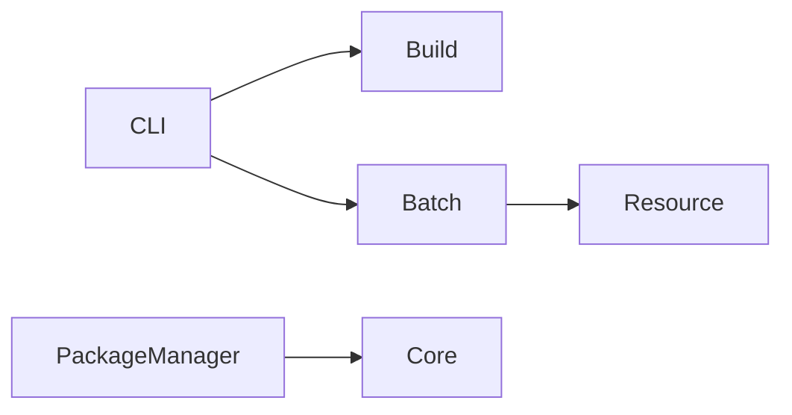
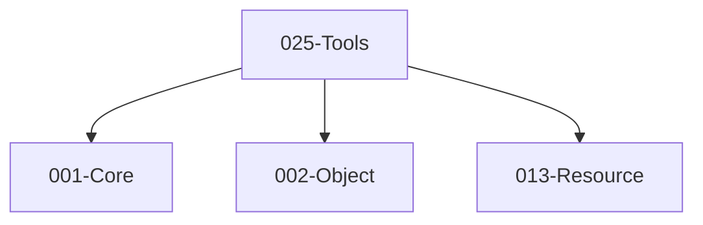

# 025-Tools 模块描述

## 1. 模块简要说明

Tools 提供**构建、批处理、CLI 与插件/包管理**：编译与打包、命令行工具、插件与包管理，对应 Unreal 的 **UBT、插件**、Unity 的 **Scriptable Build Pipeline、Package Manager**。依赖按需（通常 Core、Object、Resource 等）。

## 2. 详细功能描述

对外接口以 **ABI** 为准：`specs/_contracts/025-tools-ABI.md`；契约：`specs/_contracts/025-tools-public-api.md`。

- **构建**：IBuildSystem::Configure、Compile；BuildConfig；GetBuildSystem；与 CMake/MSBuild 等对接。
- **批处理**：IBatchProcessor::BatchImport、BatchProcess；BatchJob；与 Resource 导入管线对接。
- **CLI**：ParseArgs、RunCommand、InvokeOfflineAPI；CLIResult；与各模块的离线 API 对接。
- **插件/包管理**：IPluginManager::DiscoverPlugins、ResolveDeps、LoadPlugin；PluginDescriptor；与 Subsystems/ModuleLoad 对接。

## 3. 实现难度

**中高**。构建与多平台/多配置、资源管线与批处理、插件/包依赖解析需统一设计；与 CI/CD 对接可扩展。

## 4. 操作的资源类型

- **文件**：项目配置、构建产物、资源文件、插件包。
- **与 Resource**：导入管线、批量加载/转换。
- **与 Core**：模块加载、路径、平台检测。

## 5. 是否有子模块

有。

### 5.1 子模块说明

| 子模块 | 职责 |
|--------|------|
| Build | 项目编译、依赖、多目标、与构建系统对接 |
| Batch | 批量导入、批量处理、与 Resource 对接 |
| CLI | 命令行、子命令、离线 API |
| PackageManager | 插件/包发现、版本、依赖、与 ModuleLoad 对接 |

### 5.2 具体功能（与 ABI 表一致）

Build：IBuildSystem::Configure、Compile；BuildConfig；GetBuildSystem；与 CMake/MSBuild 对接。  
Batch：IBatchProcessor::BatchImport、BatchProcess；BatchJob；与 Resource 对接。  
CLI：ParseArgs、RunCommand、InvokeOfflineAPI；CLIResult。  
PackageManager：IPluginManager::DiscoverPlugins、ResolveDeps、LoadPlugin；PluginDescriptor；与 ModuleLoad 对接。

### 5.3 子模块依赖图

## 6. 模块上下游

### 6.1 和上下游交互、传递的数据类型

- **上游**：按需 Core、Object、Resource 等。  
- **下游**：无（Tools 为 L4 消费端）。向用户/CI 提供：构建产物、批处理结果、CLI 输出、插件列表。

### 6.2 上下游依赖图

（依赖按实际实现可增删。）

## 7. 依赖的外部内容

| 类别 | 内容 |
|------|------|
| **构建系统** | CMake、MSBuild、Ninja 等 |
| **平台** | 编译器、SDK、各平台构建脚本 |
| **Resource** | 导入管线、批量 API |
| **可选** | 包格式（NuGet 风格等）、CI 集成 |
| **协议** | 构建脚本约定、包依赖格式 |

## 待办

- **待办**：需随 `001-Core` 契约变更做适配（契约变更日期：2026-01-29；变更摘要：契约由 plan 001-core-fullversion-001 同步，完整 7 子模块声明）。
