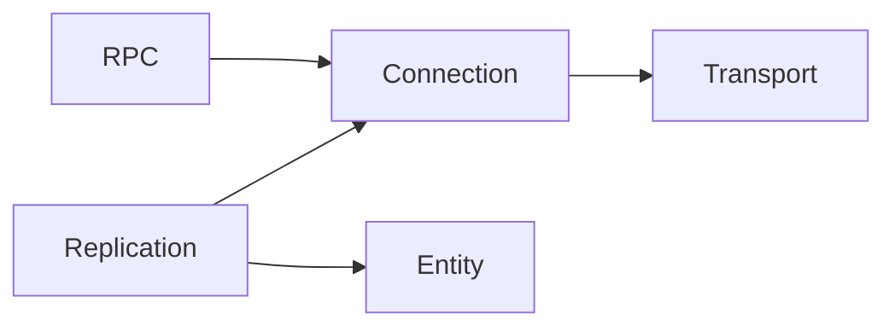
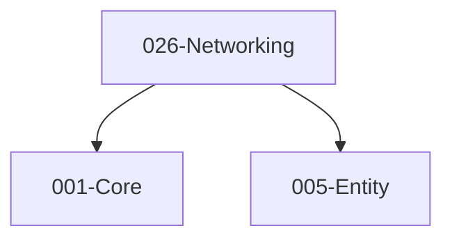

# 026-Networking 模块描述

## 1. 模块简要说明

Networking 提供**复制、RPC 与客户端/服务端**：实体/组件复制、RPC、网络角色与权威，对应 Unreal 的 **NetDriver、复制**、Unity 的 **Netcode、MLAPI**。依赖 Core、Entity。

## 2. 详细功能描述

- **复制**：实体/组件状态同步、属性复制、与 Entity 对接、插值与预测（可选）。
- **RPC**：远程过程调用、客户端/服务端/多播、与 Entity/脚本对接。
- **客户端/服务端**：网络角色、权威、连接管理、与主循环 Tick 对接。
- **可选**：匹配、大厅、中继等（可扩展）。

## 3. 实现难度

**高**。复制与 Entity 组件、RPC 与序列化、权威与预测需一致；延迟与丢包、安全与反作弊可扩展。

## 4. 操作的资源类型

- **网络**：套接字、连接、数据包、序列化缓冲。
- **与 Entity**：实体 ID、组件快照、复制属性表。
- **与 Object**：序列化/反序列化（通过接口或直接依赖 Object）。

## 5. 是否有子模块

有。

### 5.1 子模块说明

| 子模块 | 职责 |
|--------|------|
| Replication | 实体/组件复制、属性表、插值/预测（可选） |
| RPC | RPC 注册、调用、客户端/服务端/多播 |
| Connection | 连接管理、角色、权威、与主循环 Tick |
| Transport（可选） | 传输层抽象、UDP/TCP、中继（可选） |

### 5.2 具体功能

Replication：RegisterReplicated、SerializeSnapshot、ApplySnapshot、Interpolate。  
RPC：RegisterRPC、Invoke、Client/Server/Multicast。  
Connection：Connect、Disconnect、GetRole、SetAuthority、Tick。  
Transport：Send、Receive、SetTransport、UDP/TCP/Relay。

### 5.3 子模块依赖图

## 6. 模块上下游

### 6.1 和上下游交互、传递的数据类型

- **上游**：Core（内存、容器、平台套接字可选）、Entity（实体 ID、组件、快照）。  
- **下游**：无（Networking 为 L4 消费端）。向游戏逻辑提供：NetworkManager、ReplicationHandle、RPC 接口、Connection 状态。

### 6.2 上下游依赖图

## 7. 依赖的外部内容

| 类别 | 内容 |
|------|------|
| **技术** | 套接字 API、序列化、时钟同步 |
| **平台** | BSD Sockets、WinSock、或跨平台封装 |
| **Object** | 序列化/反序列化（可选，或自研二进制协议） |
| **可选** | ENet、yojimbo、Steamworks、中继服务、加密与反作弊 |
| **协议** | 应用层协议（复制格式、RPC 格式）、可选可靠 UDP 等 |
