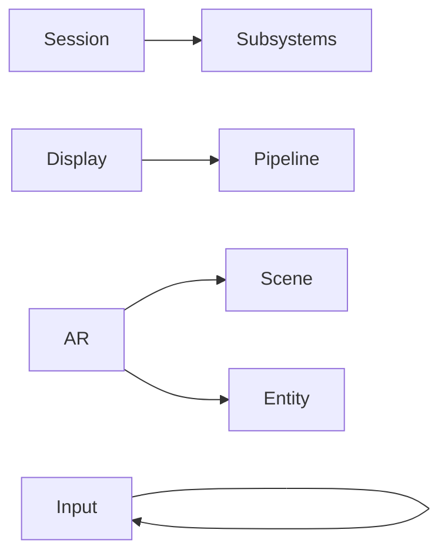
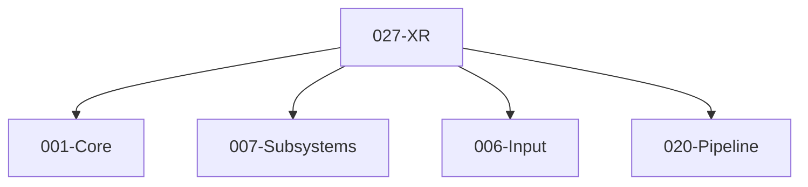

# 027-XR 模块描述

## 1. 模块简要说明

XR 提供**AR/VR 子系统、头显与手柄**：XR 运行时、追踪、渲染到 XR 交换链、输入，对应 Unreal 的 **XR 插件**、Unity 的 **XR、AR Foundation**。依赖 Core、Subsystems、Input、Pipeline。

## 2. 详细功能描述

- **XR 子系统**：作为 Subsystems 挂接、初始化 XR 运行时、会话生命周期。
- **头显**：视野、追踪、与 Pipeline 的双眼渲染、提交到 XR 交换链。
- **手柄/输入**：手柄追踪、按钮/扳机、与 Input 融合、可选手部追踪。
- **AR（可选）**：平面检测、锚点、与 Scene/Entity 对接。

## 3. 实现难度

**高**。多 XR 运行时（OpenXR 等）抽象、与 Pipeline 的双眼渲染与提交、与 Input/Subsystems 的协同需清晰；AR 与平面/锚点可扩展。

## 4. 操作的资源类型

- **与 Pipeline**：XR 交换链、双眼 RT、提交时机。
- **与 RHI**：通过 Pipeline 提交到 XR 后端；部分运行时需 RHI 扩展（如 Vulkan 的 XR 扩展）。
- **与 Input**：手柄/手部输入事件、与 Input 融合。
- **与 Subsystems**：XR 作为子系统实例、生命周期。

## 5. 是否有子模块

有。

### 5.1 子模块说明

| 子模块 | 职责 |
|--------|------|
| Session | XR 会话、初始化、生命周期、与 Subsystems 对接 |
| Display | 头显视野、追踪、双眼渲染、与 Pipeline 对接、提交到 XR 交换链 |
| Input | 手柄/手部追踪、按钮/扳机、与 Input 模块融合 |
| AR（可选） | 平面检测、锚点、与 Scene/Entity 对接 |

### 5.2 具体功能

Session：Init、Start、Stop、Shutdown、与 Subsystems 对接。  
Display：GetView、GetPose、SubmitFrame、与 Pipeline 双眼渲染与提交对接。  
Input：GetControllerPose、GetButton、GetAxis、MergeToInput。  
AR：DetectPlane、CreateAnchor、与 Scene/Entity 对接。

### 5.3 子模块依赖图

## 6. 模块上下游

### 6.1 和上下游交互、传递的数据类型

- **上游**：Core、Subsystems（作为子系统）、Input（融合手柄/手部）、Pipeline（双眼渲染、提交）。  
- **下游**：无（XR 为 L4 消费端）。向游戏逻辑提供：XRSession、ViewPose、ControllerState、ARPlane/Anchor。

### 6.2 上下游依赖图

## 7. 依赖的外部内容

| 类别 | 内容 |
|------|------|
| **XR 运行时** | OpenXR、Oculus SDK、SteamVR、ARKit/ARCore 等，通过 XR 抽象对外 |
| **图形** | Vulkan XR 扩展、D3D12 XR、Metal XR；与 RHI/Pipeline 对接 |
| **Subsystems** | 作为可插拔子系统挂接 |
| **Input** | 手柄/手部输入融合 |
| **可选** | 手部追踪、眼动、空间锚点、平面检测 |
| **协议** | OpenXR 等标准、各厂商扩展 |
