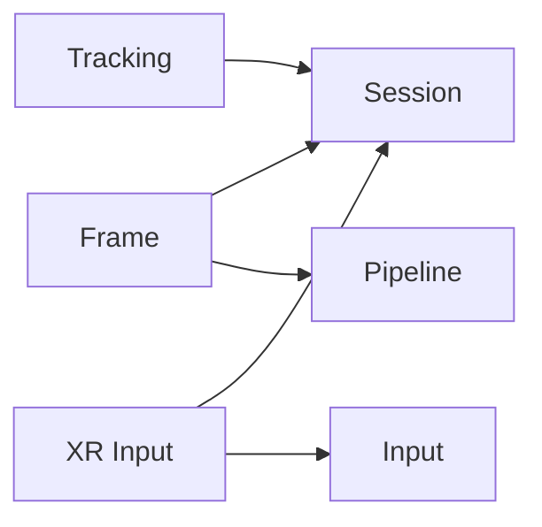
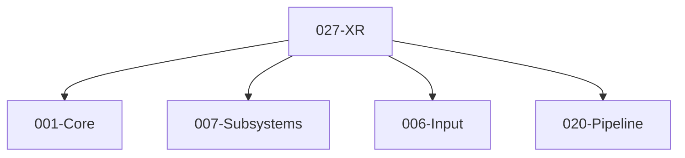

# 027-XR 模块描述

## 1. 模块简要说明

XR 提供 **AR/VR 子系统、头显与手柄** 支持：会话与帧生命周期、空间追踪、输入映射，对应 Unreal 的 **XR 插件**、Unity 的 **XR、AR Foundation**。依赖 Core、Subsystems、Input、Pipeline。

## 2. 详细功能描述

- **会话与帧**：XR 会话创建/销毁、帧循环、与 Pipeline 提交同步、多视点（双眼）与 Foveation（可选）。
- **空间追踪**：头显/手柄位姿、空间锚点、平面/网格检测（可选）、与 Entity/场景对接。
- **输入映射**：XR 输入抽象、与 Input 模块对接、手柄按键/触控/扳机、手部追踪（可选）。

## 3. 实现难度

**高**。平台 SDK 差异（OpenXR、各厂商）、与 Subsystems 生命周期、Pipeline 提交时序需统一；可选功能（手部追踪、Foveation）可扩展。

## 4. 操作的资源类型

- **XR 资源**：会话、帧、视图、交换链、空间锚点。
- **与 Input**：手柄/头显输入事件、位姿流。
- **与 Pipeline**：提交前/后扩展点、多视点渲染、深度/模板复用。

## 5. 是否有子模块

有。

### 5.1 子模块说明

| 子模块 | 职责 |
|--------|------|
| Session | XR 会话生命周期、平台初始化、与 Subsystems 对接 |
| Frame | 帧循环、视图配置、与 Pipeline 提交同步 |
| Tracking | 头显/手柄位姿、空间锚点、平面/网格检测（可选） |
| Input | XR 输入抽象、与 Input 模块映射、手柄/手部 |

### 5.2 具体功能

Session：CreateSession、DestroySession、GetSessionState。  
Frame：BeginFrame、EndFrame、GetViewConfig、Submit。  
Tracking：GetHeadPose、GetControllerPose、CreateAnchor、QueryPlanes。  
Input：MapXRToInput、GetControllerButton、HandTracking（可选）。

### 5.3 子模块依赖图

## 6. 模块上下游

### 6.1 和上下游交互、传递的数据类型

- **上游**：Core（基础类型、平台）、Subsystems（XR 子系统描述符与实例）、Input（输入路由）、Pipeline（提交、视口、多视点）。
- **下游**：无（XR 为 L4 消费端）。向应用/编辑器提供：XR 会话、帧、追踪、输入 API。

### 6.2 上下游依赖图

## 7. 依赖的外部内容

| 类别 | 内容 |
|------|------|
| **技术** | OpenXR 或平台 XR SDK（SteamVR、Oculus、ARKit 等） |
| **工具** | 各平台 XR 运行时、头显/手柄驱动 |
| **平台** | 依目标平台（PC VR、移动 AR、Standalone） |

## 8. Dependencies

- **直接依赖**：001-Core、007-Subsystems、006-Input、020-Pipeline。
- **契约**：`specs/_contracts/027-xr-public-api.md`；上游 `007-subsystems-public-api`、`006-input-public-api`、`020-pipeline-public-api`（或管线扩展约定）。
